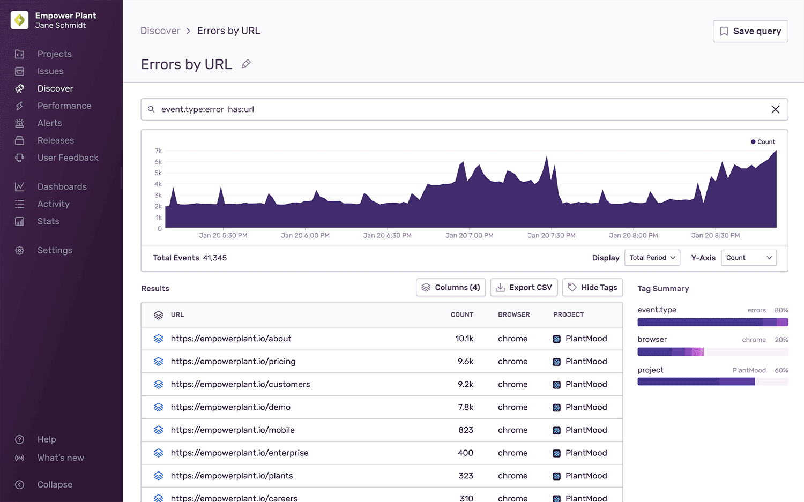

<Note>

This feature is available only if your organization is on either a Business or Trial Plan, with the exception of the ["All Events" pre-built query](/product/discover-queries/#pre-built-queries), which is available on Team plans or higher.

</Note>

<SandboxLink scenario="discover" projectSlug="react">Discover</SandboxLink> provides visibility into your data across environments by building upon and enriching your error data. You can <SandboxLink scenario="oneDiscoverQuery" projectSlug="react">query</SandboxLink> and unlock insights into the health of your entire system and get answers to critical business questions — all in one place. Use <b>Discover</b> to view comprehensive information sent to Sentry.

The <SandboxLink scenario="discover" projectSlug="react">Discover</SandboxLink> homepage displays the query builder where you can immediately begin creating a new query. By default, the page shows the pre-built "All Events" query, but you can customize the homepage and [set the custom version as your default](#set-as-default). To navigate back to the query management page, where you can find [pre-built](#pre-built-queries) and [saved](#saved-queries) queries, click the "Saved Queries" button.

The query management page offers views of all your saved and pre-built queries so you can quickly see areas that need immediate attention. For example, if a query on errors shows a spike has occurred in the past 24 hours, you might want to investigate that first. Each query is saved as a card that displays a summarized view of the following data:

- Display Name
- Search Conditions
- Creator
- Graph Snapshot
- Date Range
- Last Edited

## Pre-built Queries

Pre-built queries can be accessed by clicking the "Saved Queries" button on the discover homepage. Query cards with Sentry avatars are pre-built and cannot be removed.

- All Events: Users can see the raw error stream for any group of projects. This replaces the Events feature and gives users the ability to add additional columns and change groupings to achieve their desired breakdown.
- Errors by Title: Users can see their most frequently occurring errors by the total number of raw errors, as well as the total number of users affected.
- Errors by URL: Users can see the pages that generated the most errors and different types of issues. As a reminder, issues are a group of fingerprinted Events. For more details, see the [full documentation on fingerprinting](/product/data-management-settings/event-grouping/fingerprint-rules/).

## Saved Queries

Saved queries can be accessed by clicking the "Saved Queries" button on the discover homepage. Query cards with a user avatar indicate saved queries. The user who created a saved query will have their avatar display on the query card. Saved Queries are viewable by anyone in your organization and **are not** scoped to the user's account.

### Build a New Query

From the **Discover** page, you can build a <SandboxLink scenario="oneDiscoverQuery" projectSlug="react">query</SandboxLink> in three ways.

- Click on "Build a new query"
- Click on the ellipsis of an existing saved query card to "Duplicate"
- Go into any existing query
  1. Click on "Save as..." in the top right
  2. Enter a display name
  3. Click "Save"

Apply new search conditions or table columns to modify the results of the query. Save the query and assign a custom display name. For the full details, see [documentation on the Query Builder](/product/discover-queries/query-builder/).

### Search for a Query

Looking for a specific query? Use the search bar on the homepage to find the query name.

### Sort Queries

The dropdown in the top right will allow you to sort by attributes.

- Recently Edited (Default)
- My Queries
- Query Name (A-Z)
- Date Created (Newest)
- Date Created (Oldest)
- Most Outdated

### Edit Queries

If you need to edit any of these queries, go into the query, make the desired changes and a button will appear in the top right asking you to save/update the query. Keep in mind, edits to the query conditions **will not** be automatically saved.

To rename a saved query, click on the pencil icon by the header and enter the desired display name. Click "enter" or outside of the area to save the updated name.

### Share Queries

Share your queries as often as you want. You can share URLs with other users who also have access to the same organization. As each part of the query is built, the results update and the URL is updated so that in-progress searches can be shared in an email, chat, and so forth.

### Delete Queries

On the **Discover** page, each saved query card has an ellipsis that will open a context menu. From here, you can delete the query. This action is irreversible. You can also delete the query within the [query results](#query-results) view by clicking the "Delete Saved Query" option in the context menu.

### Add to Dashboard

Queries can also be added to <SandboxLink scenario="dashboards" projectSlug="react">custom dashboards</SandboxLink> as widgets. You can find the "Add to Dashboard" button by opening the context menu in the **Discover** page or within the context menu of the [query results](#query-results) view. When you click "Add to Dashboard", a form opens where you can name your widget, select your target dashboard, and make other changes before saving your new widget.

### Set as Default

When you navigate to **Discover**, the homepage opens the query builder where you can immediately begin creating a new query. By default, the page displays the pre-built "All Events" query.

You can customize your homepage by changing the query, choosing which columns are displayed, and how charts appear, and then clicking the "Set as Default" button. Navigating to **Discover** will now open the query builder with this configuration pre-loaded. The "Set as Default" button is also available on both saved and pre-built queries, which you can find by clicking the "Saved Queries" button.

If you don't want to use this configuration as your default homepage anymore, click "Remove Default", and the homepage will revert to the "All Events" query.

To navigate to the query management page, where you can find pre-built and saved queries, click the "Saved Queries" button.

## Query Results

To view query results, click on any query card. You'll find a graph, table, and toggleable tag summary (or facet map). The search bar at the top enables you to see the search conditions entered. The table reflects the events with sortable columns.

Each table cell has a dynamic context menu that allows you to continue exploring your data by automatically updating the search bar or the table columns, according to your selection. Actions like, adding or excluding values from the filter, opening a selected release, or viewing the underlying stack of issues:

If the first column shows an icon (as seen above), it means the events have been stacked. Click on the icon to view the full list of events. Each event will have an event ID you can click on for more details. Hovering over fields in the "Issue", "Release", and "Event ID" columns displays additional information like issue statuses, release authors, and stack traces for errors.

For more about how to build a query, go to [the Query Builder](/product/discover-queries/query-builder/).

## Event Details

Navigate to the Event Details page from **Discover > [Saved Query] > Event Detail**. You'll find all the relevant details about a single event. For every event, you will see the ID, timestamp, and link to view the normalized JSON payload that Sentry received.

The Event Detail view varies depending on event type (error, transaction, csp). [Transaction event details](/product/performance/event-detail/) may have an entirely different view from error event details (as shown above). For example, errors may have a related issue shown in the sidebar. This gives you a quick glance at the event volume for that issue and lets you quickly navigate to the related issue. You may also find stack traces, breadcrumbs, and more in these views.
