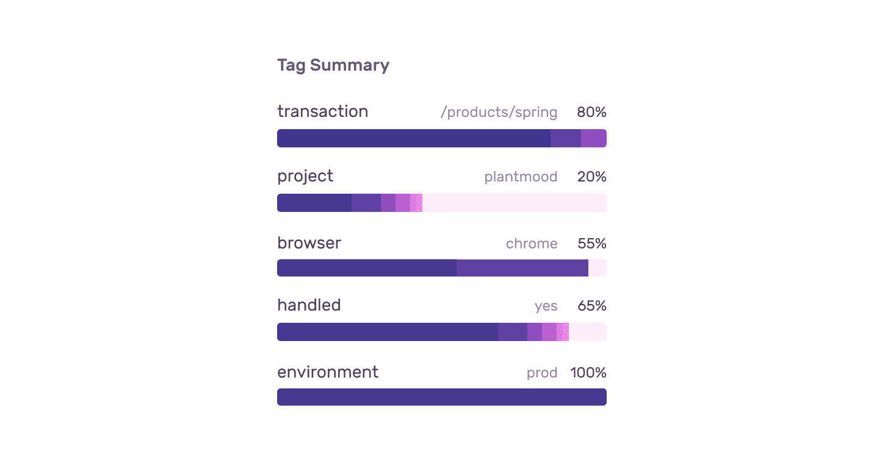
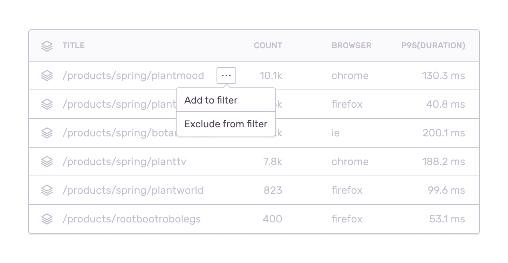

From the Discover Homepage, you can build a query in three ways.

- Click on "Build a new query"
- Click on the ellipsis of an existing saved query card to "Duplicate"
- Go into any existing query
  1. Click on "Save as..." in the top right
  2. Enter a new display name
  3. Click "Save"

There are four main building blocks that impact the results of your saved query. You can use a combination of these to narrow down your search.

1. Global Selection Header
2. Search Conditions
3. Interactive Graph
4. Table Columns

## Filter by Global Selection Header

Specify which projects, environments, and date range you want to zoom in on at the top of the page. This can also be found in other parts of Sentry as a top level filter.

## Filter by Search Conditions

All events have built-in key fields or custom tags. Use the search bar to enter these keys and assign them values. This will filter down your list of events. Here are the built-in key fields.

import standardFields from "./standard-fields.json";

<ParamTable fields={standardFields} />

### Syntax

The Query Builder syntax is identical to [Sentry's Search syntax](/product/sentry-basics/search/). After you enter a key field from above or a custom tag, you can use any of the referenced syntax. For example, `count(id)` gives you the number of times an event occurs. This can be written in the following ways:

- Exact match (is equal to): `count(id):99`
- Upper bounds (is less than or equal to): `count(id):<99` or `count(id):<=99`
- Lower bounds (is more than or equal to): `count(id):>99` or `count(id):>=99`
- Multiple bounds (is more and less than): `count(id):>10 count(id):<20`

Use `OR` and `AND` search conditions between filters. However `OR` cannot be used between aggregate and non-aggregate filters. For more details about these conditions, see [Using `OR` and `AND`](/product/sentry-basics/search/#using-or-and-and).

### Tag Summary Filters

Every event has a list of tag values. The tag summary (or facet map) is a visualization of the top 10 keys sorted by frequency. The most common tag value is listed directly above the bar in the description and percentage. Hover over each section in a bar to see the exact distribution for that tag.

Click on any of these sections to further refine your search. For example, clicking on a section that represents Chrome in a browser bar will automatically update the tag summary and then add Chrome to the search conditions.



## Filter by Interactive Graph

Each query has a interactive graph that reflects the data presented in the table below. To zoom in, simply click and drag over the area you want to investigate. You can also customize the display and the Y-Axis. This will be saved with your query.

### Display Options

- Total Period
- Previous Period
- Release Markers
- Top 5 Period
- Total Daily
- Top 5 Daily

### Y-Axis Options

- Count
- Average Transaction Duration
- p75
- p95
- Unique User Count

## Filter by Table Columns

Above the table, click "Columns" to open a modal. This will show you a list of all the columns in the results table. You can add, delete and move basic key field columns or custom tags columns. With the same view, you can also stack events with any of the following functions:

### Stacking Functions

- `avg(...)`
- `count(...)`
- `count_unique(...)`
- `max(...)`
- `min(...)`
- `sum(...)`

Each function will ask you to assign a parameter. Some are required while others are optional. Functions will stack events based on the same values. If no functions are applied, the events in your Query Results will remain individually listed. Once you are done editing the columns, click "Apply" and results will be reflected in the Query Results. Keep in mind, the table may horizontall scroll if too many columns are added.

### Resizing Columns

You can resize columns by hovering over the column boundary, and clicking & dragging the boundary to resize the column to the desired width.

### Sorting Columns

Click on the column header you would like to sort. A down arrow sorts the column in descending order and an up arrow sorts the column in ascending order. This may refresh the table.

### Export CSV

If you want to take the data elsewhere, click on "Export" for a CSV file.

<Alert>
  Depending on the amount of data, the wait times can vary. The results are
  limited to 10 million rows or 1GB, whichever comes first.
</Alert>

For a large export, you'll receive an email with the download link once it's ready. This will require further verification on the Sentry Download page. This contains a `SHA1` checksum of the file, which you can use to verify its integrity with the following command:

```bash
echo "<SHA1 checksum> <downloaded CSV name>" | sha1sum -c -
```

### Cell Filters

Each cell in the table will have an ellipsis appear on hover. This will open a context menu with additional filtering capabilities depending on the value type. For example, you can selectively target a transaction to the search conditions bar by clicking on "Add to filter".



## Additional Query Actions

### Edit Queries

If you need to edit any of these queries, go into the query, make the desired changes and a button will appear in the top right asking you to save/update the query. Keep in mind, edits to the query conditions **will not** be automatically saved.

To rename a saved query, click on the pencil icon by the header and enter the desired display name. Click "enter" or outside of the area to confirm.

### Share Queries

Share your queries as often as you want. You can share URLs with other users who also have access to the same organization. As each part of the query is built, the results update, and the URL is updated so that in-progress searches can be shared in email, chat, etc.

### Deleting queries

<Alert>Deleting a saved query is irreversible.</Alert>

On the Discover Homepage, each saved query card has an ellipsis that will open a context menu. Delete the query from here. You can also delete the query within Query Results view by clicking the trash can in the upper right.

For more details on how to view saved queries, see the [full documentation on Discover](/product/discover-queries/)
