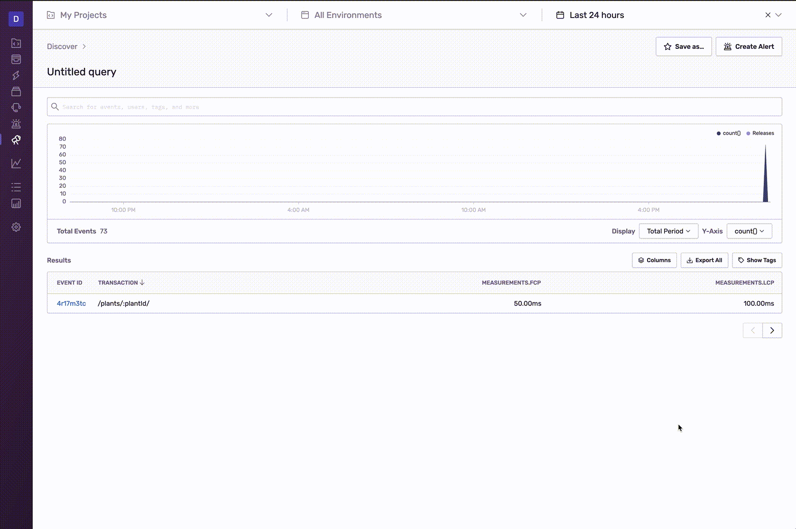

<Note>

This feature is available only if your organization is on either a Business or Trial Plan.

</Note>

In **Discover**, you can add equations based on your query columns. Each column acts like a variable since it represents the numeric result of the query, and this number is used in the equation.

For example, let's take an equation that calculates the ratio of a transaction's first contentful paint (`measurements.fcp`) to the transaction's largest contentful paint (`measurements.lcp`):

equation = `measurements.fcp / measurements.lcp`

The equation will use the result of each of those query columns to calculate the ratio. In this case, the results of those query columns are:

- measurements.fcp = 50
- measurements.lcp = 100

The equation becomes:

`50 / 100`

The result of the equation is then displayed in the updated table as shown in the recording below:

These equations can help you calculate things like:

- [The percentage of transactions that completed within a threshold](#calculate-the-percentage-of-transactions-completed)
- [A custom Apdex score](#calculate-a-custom-apdex)
- [The largest average non-database times](#find-largest-average-non-database-times)

## Add an Equation

To add an equation to a query

1. Click the "Columns" button to open the column editor.
2. If they aren't already included in your query, add the columns you need for your equation.
3. Click "Add an Equation".
4. Enter your equation by selecting columns, entering numbers (if needed), and adding operators.
5. Click "Apply".

## Guidelines for Equations

Equations must:

- Contain at least one field or function
- Contain at least one operator
- Have explicit operators. For example, `a(a+b)` is invalid; instead, you should enter `a * (a + b)`

Equations cannot:

- Contain a mix of fields and functions
- Contain exponents, which aren't supported

Equations will follow expected order of operations, resolving brackets first, division and multiplication next followed by addition and subtraction. Equations can also include negative numbers.

Equations can only operate on numeric columns and functions, which includes:

- Functions:
  - count
  - count_unique
  - count_if
  - count_web_vitals
  - failure_count
  - avg
  - sum
  - percentiles (p50, p75 etc.)
  - apdex
  - user_misery
  - eps() and epm()
- Fields
  - transaction.duration
  - measurements.fp
  - measurements.fcp
  - measurements.lcp
  - measurements.fid
  - measurements.cls
  - measurements.ttfb
  - spans.browser
  - spans.http
  - spans.db
  - spans.resource

## Example Equations

### Calculate the percentage of transactions completed

Get the percentage of transactions that completed within a threshold

1. Create a new query with the following three columns:
   - Column 1:
     - Function `count_if`
     - Field `transaction.duration`
     - Condition `is less than or equal to`
     - Set final parameter to a threshold (like 300)
   - Column 2:
     - Function `count`
   - Column 3:
     - Field `transaction`
2. Add an equation and enter `count_if(transaction.duration,lessOrEquals,300) / count() * 100` in the equation field.

### Calculate a custom Apdex

[Apdex](/product/performance/metrics/#apdex) is defined as `(satisfied + tolerable*0.5 + frustrated*0)/total`. If you wanted to change the the weight of tolerable to 0.2, you would create the following query and equation.

1. Create a new query with the following four columns:
   - Column 1:
     - Function `count_if`
     - Field `transaction.duration`
     - Condition `is less than or equal to`
     - Set the final parameter to a Satisfied threshold (like 300)
   - Column 2:
     - Function `count_if`
     - Field `transaction.duration`
     - Condition `is less than or equal to`
     - Set the final parameter to a Tolerable threshold (like 1200)
   - Column 3:
     - Function `Count()`
   - Column 4:
     - Field `transaction`
2. Add an equation and enter the following in the equation field:

   `(count_if(transaction.duration,lessOrEquals,300) + (count_if(transaction.duration,lessOrEquals,1200) - count_if(transaction.duration,lessOrEquals,300)) * 0.2)/count()`

### Find largest average non-database times

Find the transactions that have the largest time that weren't from database calls.

1. Create a new query with the following two columns:
   - Column 1:
     - Function `avg`
     - Field `transaction.duration`
   - Column 2:
     - Function `avg`
     - Field `spans.db`
2. Add an equation and enter `avg(transaction.duration) - avg(spans.db)` in the equation field.
3. Sort by this new equation.
