<Note>

This feature is available only if your organization is on either a Business or Trial Plan.

</Note>

**Discover** is a powerful query engine that allows you to query all your error metadata across projects and applications. As you've probably noticed, the Sentry SDKs installed in your applications capture huge amounts of events, each enriched with contextual data about the underlying error, platform, device, user, and more. We also highly encourage enriching your error data through the SDK by adding custom tags and configuring the release and environment. For more information see [Event Data](/product/sentry-basics/enrich-data/).

Let's go over some examples of how to work with all this data to gain some useful insights into the health and stability of your applications.

<Note>

Some table column options may be repeated if you’ve set up a tag with the same name as a Sentry field. For the examples that follow, use the table column option marked “field.”

</Note>

## Discover Through Issues

Sentry notifies you in real-time when your application breaks, and then provides the information and tools to triage and resolve the error. With **Discover**, you can take a more proactive approach to find the major issues that break your apps. Building that query might look like this:

1. Navigate to **Discover** and click on "Build a new query".

2. Select the projects, environments, and date range of errors you'd like to query.

3. Sentry monitors different types of events for errors and performance. To query issues, filter by `event.type:error` in the search bar.

   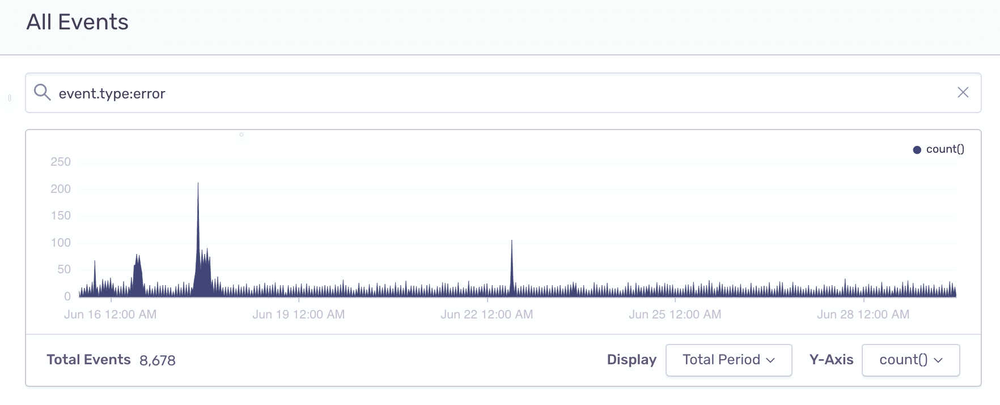

4. Edit the "Results" table columns to show the number of events [`count()`], impacted users [`count_unique(user)`], and unique issues [`count_unique(issue)`] per project.

   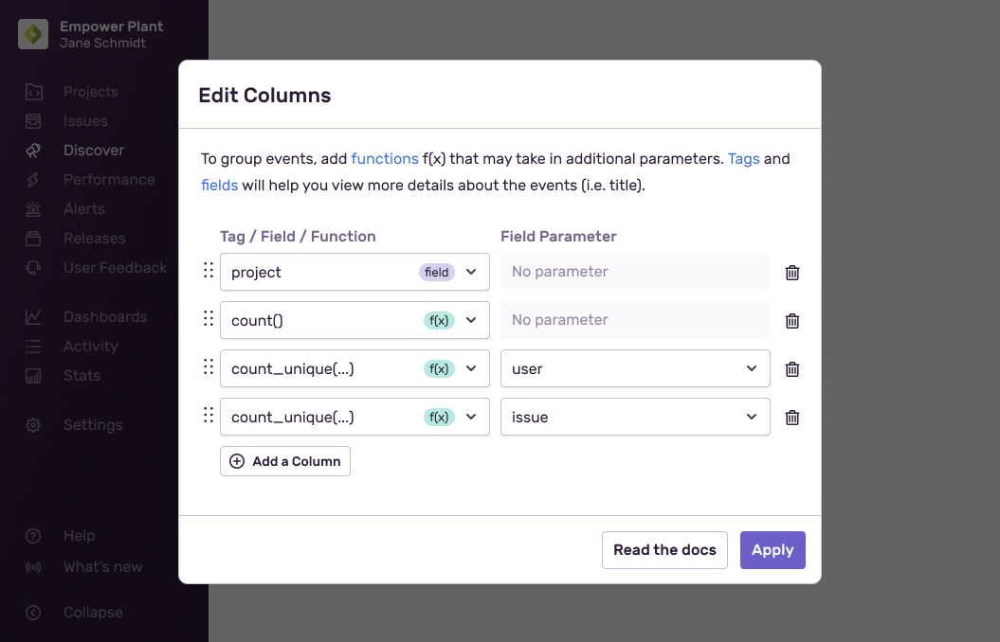

5. With these columns set, you might want to look for the project with the most issues. Click on the `COUNT_UNIQUE(ISSUE)` column header to order the line items accordingly.

6. Hover your cursor over the top project line item, click on the actions icon that displays, and select "Add to filter". This will narrow your results even more so that you can continue looking into the issues of that specific project.

   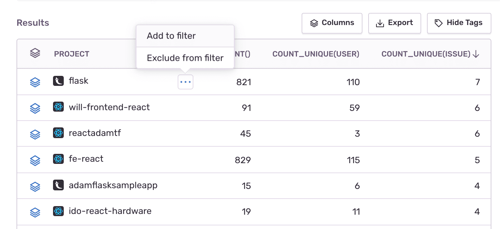

7. Now let's see what those issues are. Change the table columns to display:

   - `issue` (the issue id)
   - `title` (issue title)
   - `count()` (number of events)
   - `count_unique(user)` (number of unique users impacted by the issue)

8. On each line item/issue, you can click on the issue name to open the **Issue Details** page and triage the issue. You can also click on the Open Group icon to continue querying through the events stack in the context of a specific issue.

   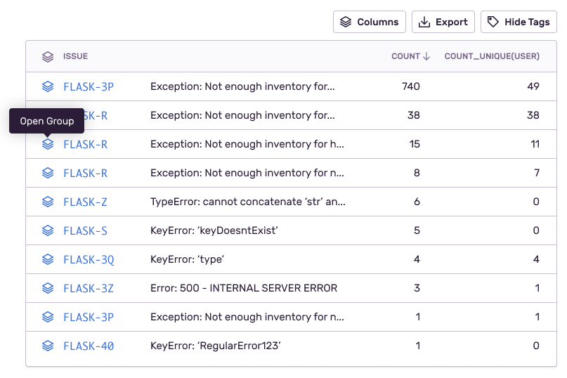

## Discover Through Errors

The true power of **Discover** lies in its ability to query through all your error metadata, so you're no longer restricted to the context of issues or projects, and can reveal trends and insights across all your applications. Let's look at some examples.

### Errors by URLs

Create a report looking into all the errors occurring in the URL endpoints across your applications.

- Search condition: `event.type:error has:url`
- Table columns: `url`, `platform.name`, `count()`

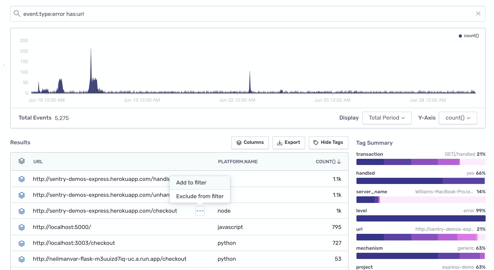

- Look into any one of the URL endpoints by clicking on "Add to filter" and changing the table columns.
- Alternatively, filter URL patterns using wild cards:

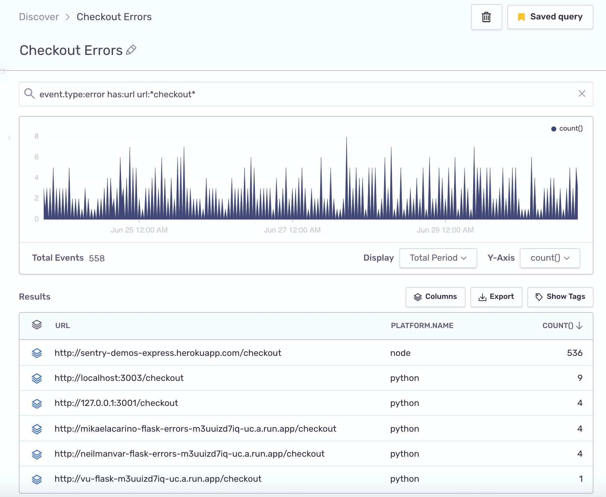

### Unhandled Errors

Whether your code is running on mobile, in browser, or on a server, an unhandled fatal error might crash your application. To find out where those crashes are happening, run the following query in **Discover**:

- Search condition: `event.type:error handled:no level:fatal`
- Table columns: `mechanism`, `platform.name`, `count()`

  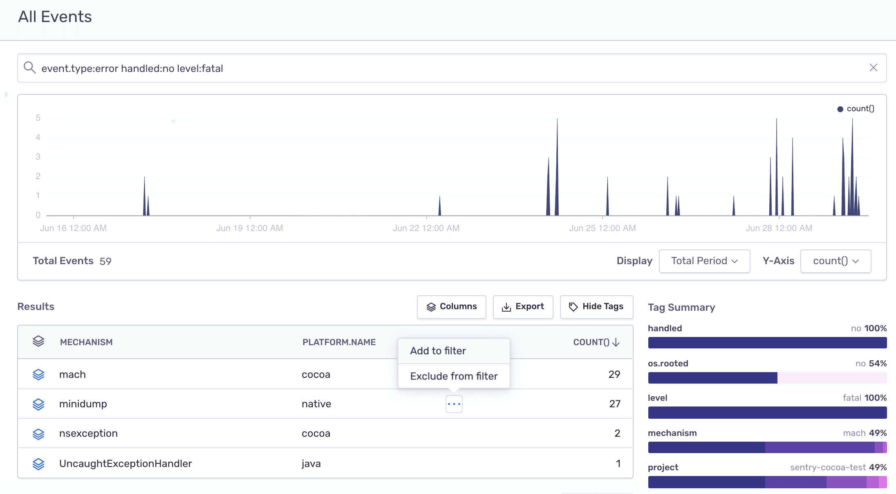

To look deeper into one of the crash types:

- Select one of the line item values and add it to the filter.
- Modify the table columns to show the crash `message` and `count()`.

  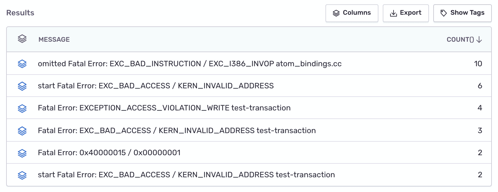

### Files With Most Errors

To find out which files in your codebase are generating the most errors, run the following query in **Discover**:

- Search condition: `event.type:error has:stack.filename`
- Table columns: `stack.filename`, `count()`, `count_unique(issue)`

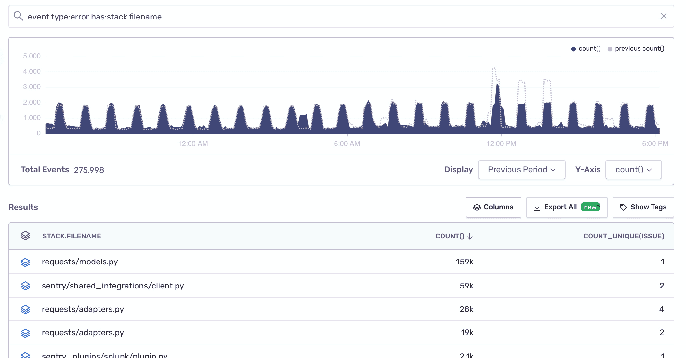

Change your "Display" selection to compare the current period to the previous one.

You can continue exploring a specific filename by adding it to the filter and changing the table columns to display the major error culprits in that file:

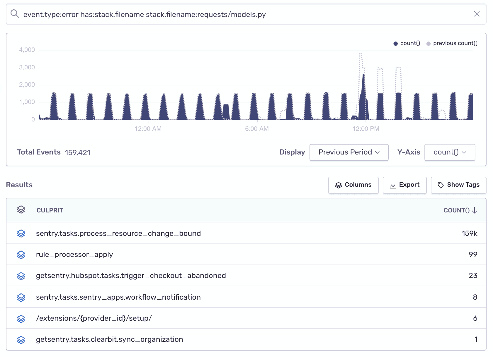

### Errors per Release

To find out how the health of a specific project is improving (or not) over time as you release new versions, create the following query:

- Search condition: `event.type:error`
- Table columns: `release`, `count()`, `count_unique(issue)`

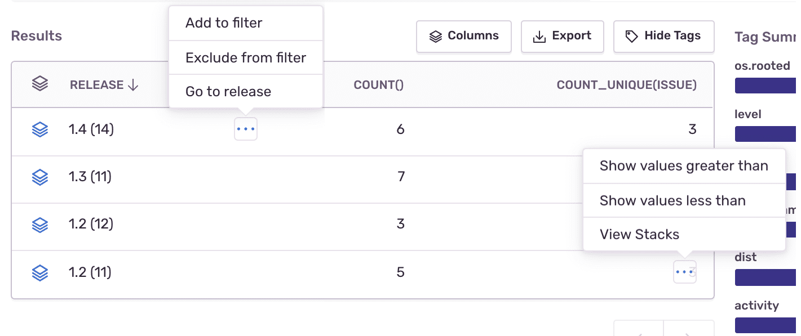

From here you can add a release as a filter and change the columns to `count()` and `title` to see similar errors. Then you can click the "Open Group" icon to drill down to individual events. You can also open the release in **Releases** from the "Results" table.

### Errors by Hour or Day

The `timestamp.to_hour` and `timestamp.to_day` fields round down the timestamp to the last hour or day respectively. For example, an event with a `timestamp` value of Mar 12, 2021 2:26:50 PM UTC will have a `timestamp.to_hour` value of Mar 12, 2021 2:00:00 PM UTC and `timestamp.to_day` value of Mar 12, 2021 12:00:00 AM UTC. This allows you to group events. For example, you can show hourly hit counts for errors hit at least twice per hour:

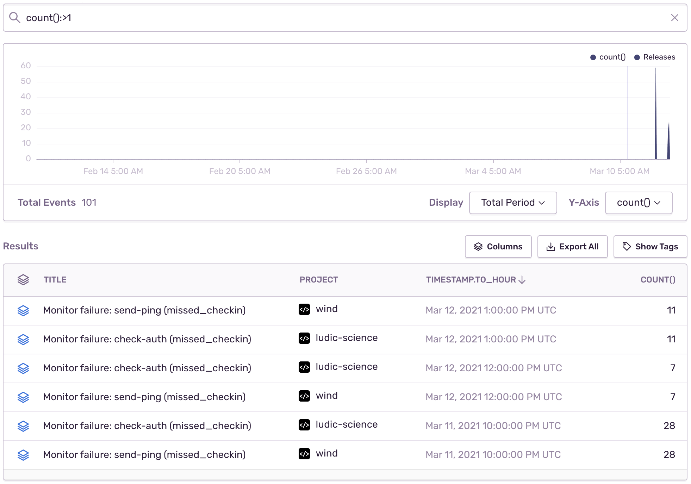

All timestamps are displayed in your preferred timezone based on your user settings in **User Settings > Account > Account Details**.

## Additional Use Cases

As you've probably noticed by now, **Discover** is extremely useful in gaining visibility and insights into your errors. For additional use cases take a look at:

- [What issues are consuming my quota?](/product/accounts/quotas/manage-event-stream-guide/#-what-issues-are-consuming-my-quota)
- [Spike Protection was activated — what should I do?](/product/accounts/quotas/manage-event-stream-guide/#-spike-protection-was-activated----what-should-i-do)
