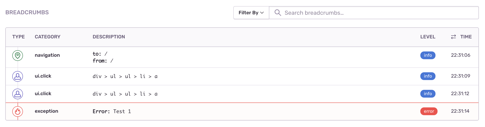
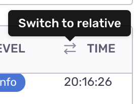
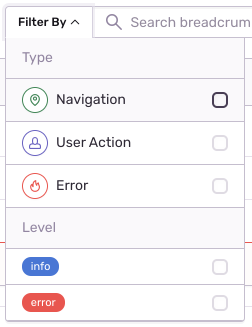

Sentry uses _breadcrumbs_ to create a trail of events that happened prior to an issue. These events are very similar to traditional logs, but can record more rich structured data.

SDKs automatically start recording breadcrumbs by enabling integrations. To learn how to do this for your platform, select the platform from the sidebar, then dive into the breadcrumbs documentation for that platform.

If an error event provides a trail, sentry.io will display the breadcrumbs on the **Issue Details** page:

## Breadcrumbs Display

Each part of the breadcrumb displays in a separate row in one of five columns: `type`, `category`, `description`, `level`, and `time`.

Type

: A semi-internal attribute `type` can control the type of the breadcrumb. By default all breadcrumbs are recorded as `default`, which makes them appear as a `Debug` entry, but Sentry provides other [types](https://develop.sentry.dev/sdk/event-payloads/breadcrumbs/#breadcrumb-types) that influence how the breadcrumbs are rendered.

Category

: A category under which to label the event. This data is similar to a logger name, and will let you more easily understand the area an event took place, such as auth.

Description

: A description is either:

- Message: A string describing the event rendered as text with all whitespace preserved. Often used as a drop-in for a traditional log message.

- Data: A key-value mapping of metadata around the event. This is often used instead of message, but may be used in addition. Sentry.io will display all the data sent.

Level

: The severity of an event. The level is set to one of five values, which are, in order of severity `fatal`, `error`, `warning`, `info` and `debug`

Time

: A timestamp representing when the breadcrumb occurred. The format is either a string as defined in RFC 3339 or a numeric (integer or float) value representing the number of seconds that have elapsed since the Unix epoch. By default, sentry.io displays the timestamp as an absolute time; click the toggle button to update the display to relative time:

You can read more about the breadcrumb's data in detail in the developer documentation [Breadcrumbs Interface](https://develop.sentry.dev/sdk/event-payloads/breadcrumbs/).

## Filtering the Display

The provided types and levels are displayed as options in this filter. The list will be filtered according to the selected options:

### Full-Text Search

When typing anything in the input field, sentry.io filters out all fragmented data, trying to find a match to the search criteria. If a match is found, it will be highlighted. Full-text search also works in conjunction with option to ‘Filter By’.
