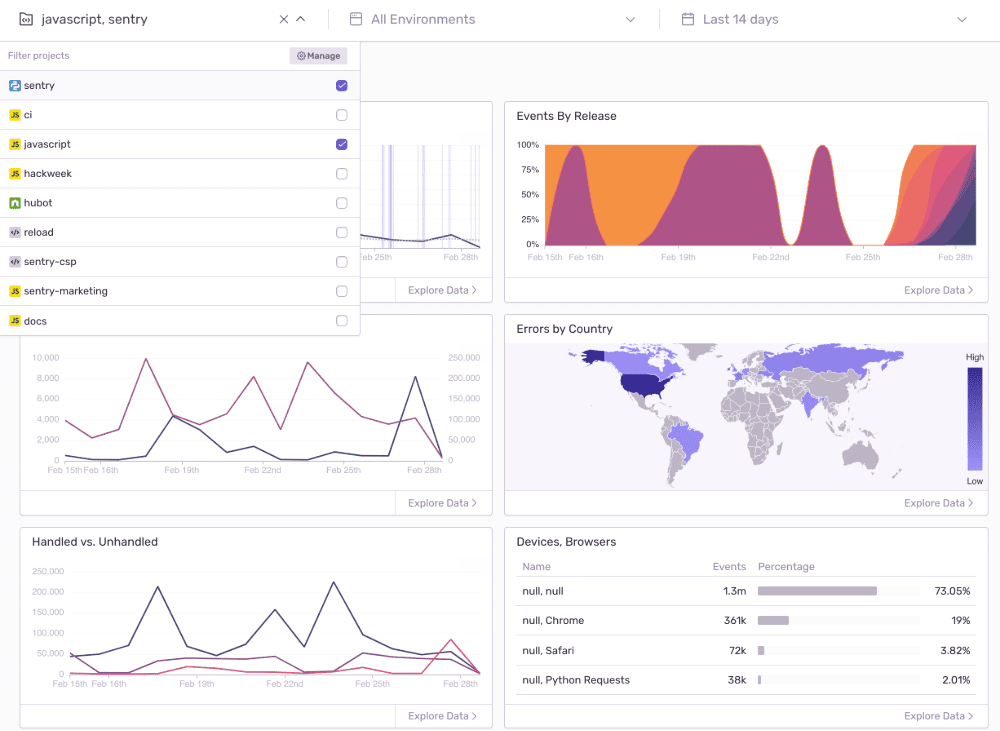
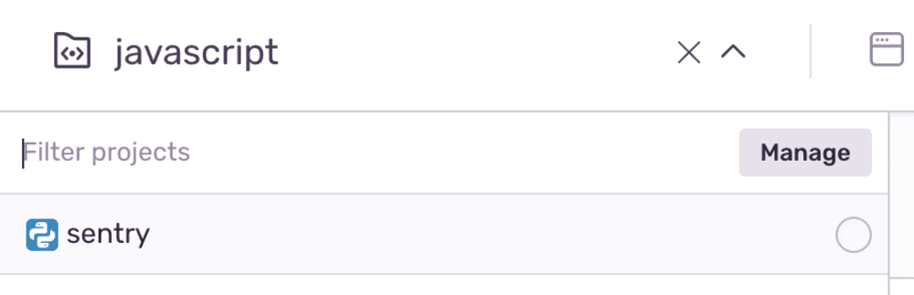
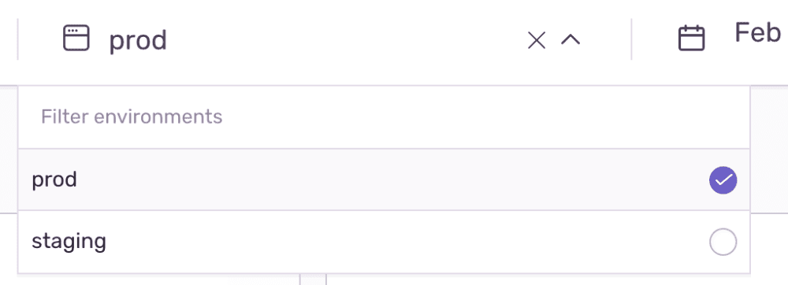
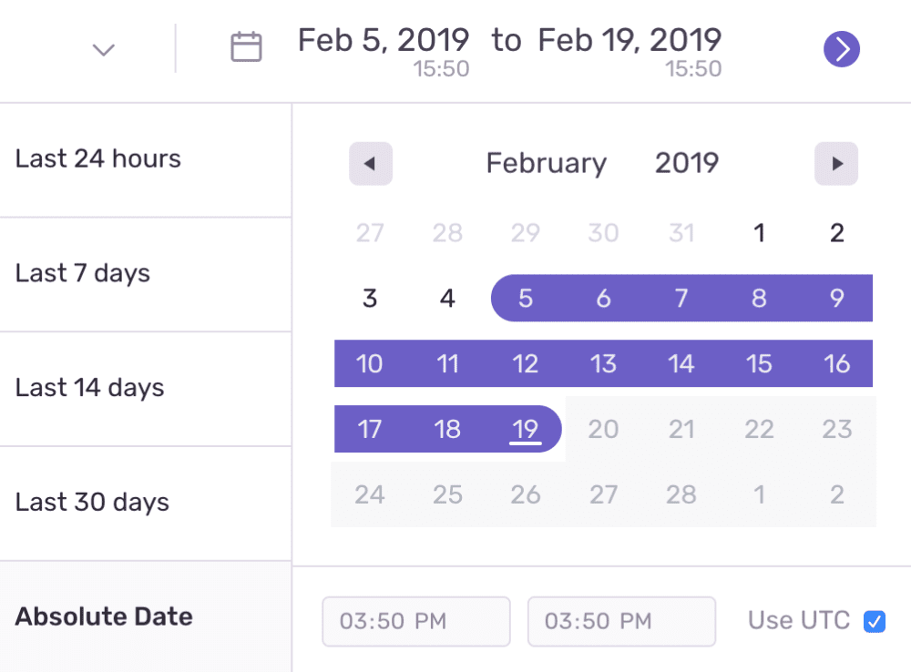

Sentry's Dashboards help you gain detailed perspectives of your application's health by providing filtering tools to navigate your issues across multiple projects in a single view.

<Alert title="Note" level="info">
  Available if you're on a Business plan or a Trial.
</Alert>

Dashboards are various data visualizations of your errors across your organization --- including graphs of your errors, geographic mapping, and lists of browsers. Dashboards allow you to drill into data by selecting points of interest.

### Overall View of Application

Each graph and visualization helps uncover crucial patterns and trends about where your customers are hitting errors.

### Dive into Specific Projects

Filter your data with project-specific parameters.

### Filter by Environment

Distill needs by choosing explicit environments.

### Refine by Time Period

Define distinct time periods for a more clear-cut glimpse.

