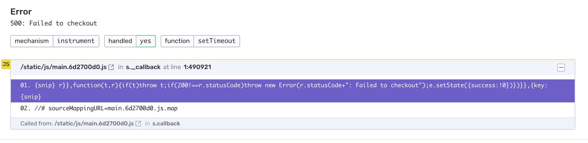
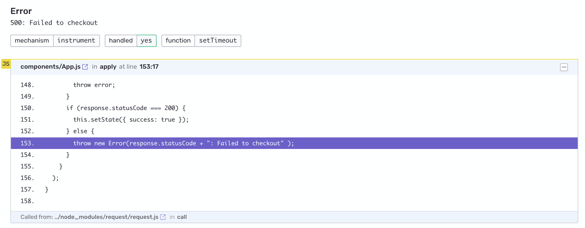

Sentry provides several methods to filter data server-side. Using sentry.io to filter events is a simple method since you don't have to [configure and deploy your SDK to filter projects](/platforms/javascript/configuration/filtering).

### Inbound Data Filters

Inbound data filters allow you to determine which errors, if any, Sentry should ignore. Explore these by navigating to **[Project] » Project Settings » Inbound Filters.**

Inbound filters include:

- Common browser extension errors
- Events coming from localhost
- Known legacy browsers errors
- Known web crawlers
- By their error message
- From specific release versions of your code
- From certain IP addresses.

Once applied, you can track the filtered events (numbers and cause) using the graph provided at the top of the Inbound Data Filters view.

### Proper Event Grouping

Proper event grouping maintains a meaningful issue stream and reduces redundant notifications. Sentry groups similar *events* into unique *issues* based on their *fingerprint*. An event’s fingerprint relies firstly on its **stack trace**.

For example, with JavaScript errors, a minified source code can result in a nondeterministic stack trace that could interfere with event grouping, which can be avoided by ensuring Sentry has access to your [Source Maps](/platforms/javascript/sourcemaps/) and minified artifacts.

### Apply Workflows

Event streams with inbound filter and proper event grouping can be made more efficient by practicing good development hygiene. When Sentry alerts you to an issue in your code, resolve it, or discard.

### Rate Limit

Rate limits allow you to set the maximum volume of events a project will accept during a period of time. This type of limit can be useful for managing your monthly error event quota, but once a defined threshold is crossed, **subsequent error events will be dropped**. You shouldn't constantly hit your rate limit. Instead, regard it as a ceiling intended to protect you from unexpected spikes.

Under *[Project Settings] » Client Keys » Configure*, you can create multiple DSN keys per-project and assign different (or no) limits to each key. This will allow you to dynamically allocate keys (with varying thresholds) depending on Release, Environment, and so forth.

For example, you may have a project in production that generates many alerts. A rate limit allows you to set the maximum amount of data to 500 events per minute, for instance. Additionally, you can create a second key for the same project for your staging environment, which is unlimited, ensuring your QA process is still untouched.
