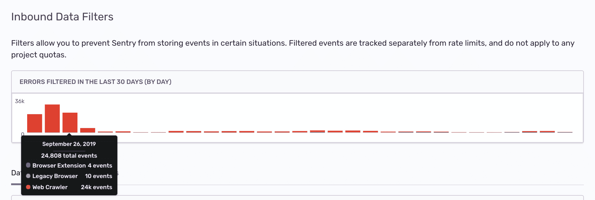

Sentry provides several methods to filter data in your project. Using sentry.io to filter events is a simple method since you don't have to <PlatformLink to="/configuration/filtering/">configure and deploy your SDK to filter projects</PlatformLink>.

## Inbound Data Filters

Inbound data filters allow you to determine which errors, if any, Sentry should ignore. Explore these by navigating to **[Project] > Project Settings > Inbound Filters.**

These filters are exclusively applied at ingest time and not later in processing. This, for instance, lets you discard an error by error message when the error is ingested through the JSON API. On the other hand, this filter doesn't apply to ingested minidumps.

Inbound filters include:

- Common browser extension errors
- Events coming from localhost
- Known legacy browsers errors
- Known web crawlers
- By their error message
- From specific release versions of your code
- From certain IP addresses

Once applied, you can track the filtered events (numbers and cause) using the graph provided at the top of the Inbound Data Filters view.

## Filtering for Session Events

Data filters are only partially supported for session events, and they work slightly differently:

### Equivalent Filters

Release Filter

: This filter discards events of a particular release. If sessions are started or updated and would match this filter, sessions are silently discarded entirely. This is consistent with error events.

Web Crawler Filter

: When session events send their user agent, they are discarded the same way as error events are. There might be a slight difference in the fallback case where the user agent of the sending SDK is used (browser JavaScript).

Legacy Browsers

: This works exactly like the web crawler filter. No sessions are created or updated for legacy browsers when enabled.

IP Filter

: Throws away sessions of a specific IP.

### Unsupported Filters

Error Message Filter

: This filter does not apply for sessions. Even if a user is discarding such errors, they will count against their stability score. An alternative measure _could be_ to discard such sessions entirely if an error of this type is filtered out, but we believe this would make the system harder to understand.

Browser Extensions

: Since the logic for detecting such errors requires all the error information, we cannot support this filter at the session ingest time. If we want to improve this case, we could retroactively discard such sessions entirely once we identify such an error case.
