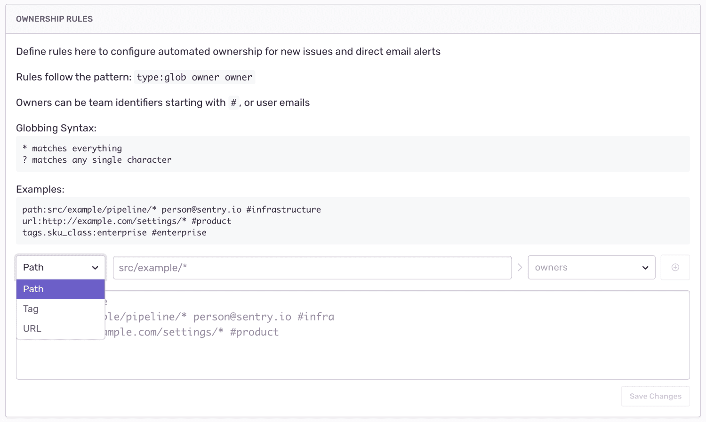
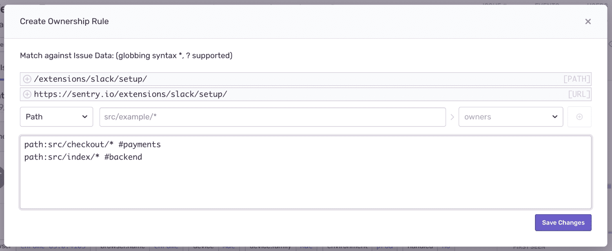
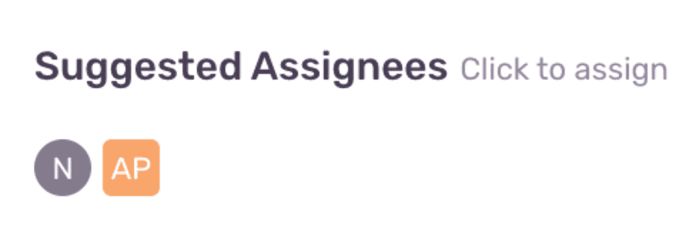
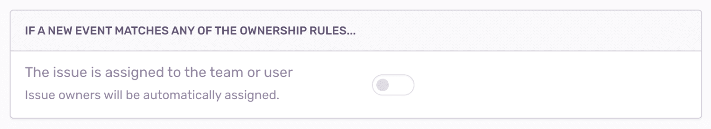
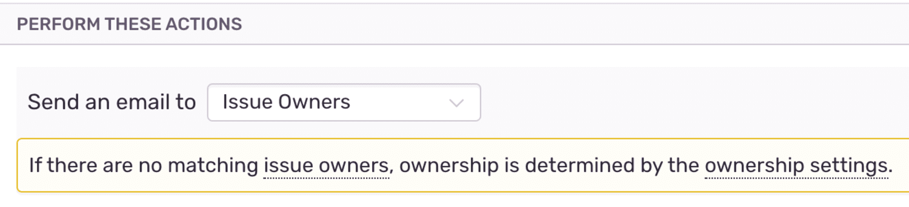
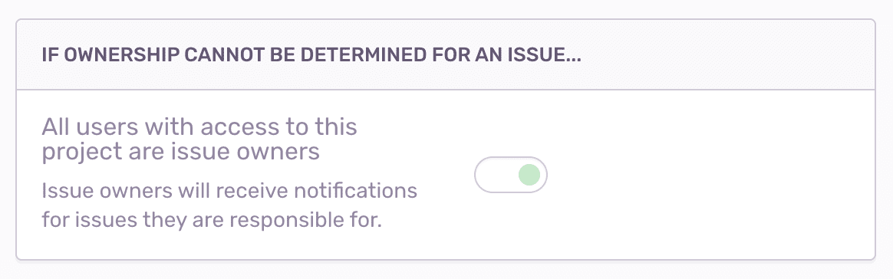

The Issue Owners feature allows you to create rules to decide which user or team should own an [Issue](/platform-redirect/?next=/data-management/event-grouping/). These rules resemble a typical code owners file in a repository, and can match on file paths of files in the stack trace, URL of the request, or event tags. You can automatically assign issues to their respective owners, or alert the owners about the issue, allowing you to find the developer with the most context about a fix.

## How It Works

Sentry matches ownership rules against individual events in an issue. This matching is relied upon in other areas of Sentry, described in the following sections. One key item: Issue owners are set for an issue, not a project or organization.

### Creating Rules

You define ownership rules per project. To configure ownership rules, navigate to your **Project Settings > Issue Owners**, or click on the "Create Ownership Rule" button on an issue details page.

Types of matchers available:

1. Path: matches against all file paths in the event's stack trace
2. URL: matches against the event's `url` tag
3. Tag: matches against event tags

The general format of a rule is: `type:pattern owners`

`type`

: Can be either `path`, which matches on paths, `url`, which matches the specified URL, or `tags.TAG_NAME` which matches the specified tag.

`pattern`

: The pattern you're matching on. For example, `src/javascript/*` for `path`, `[https://www.example.io/checkout](https://www.example.io/checkout)` for `url`, or `Chrome 81.0.*` for `tags.browser`.

: `pattern` matching supports unix-style [glob syntax](<https://en.wikipedia.org/wiki/Glob_(programming)>). For example, `*` to match anything and `?` to match a single character. *This is not a regex.*

`owners`

: The owner, or list of owners, identified by either the email of the Sentry user or the name of the team, prefixed with `#`. Thus, the owner may be example@company.com or example1@company.com example2@company.com or `#backend-team`. A space separates each owner in the list of owners.

: Teams _must_ have access to the project to become owners. To grant a team access to a project, navigate to **Project Settings > Project Teams**, and click 'Add Team to [project]'.

: To grant a user access to a project, the user must be a member of a team with access to the project. To add a user to a team, navigate to **Settings > Teams**, select a team, then click "Add Member".

Adding a rule from project settings:

Adding a rule from an issue page:

When creating a rule from the issue page, you'll see some suggested paths and URLs based on the events in the issue. Note that Sentry doesn't suggest tags.

### Suggested Assignees

On the issue page, you'll see suggested assignees based on ownership rules matching the event you're looking at (by default, the issue page shows the latest event). Suggested assignees can also be based on [suspect commits](/product/releases/#after-associating-commits). You can assign the _issue_ to a suggested assignee by clicking on the suggestion. An event can have multiple suggested assignees if it matches multiple ownership rules.

### Auto-Assign

You can automatically assign issues to their owners by enabling the following setting in **Project Settings > Issue Owners**.

If an issue is already assigned, a new event for that issue will not re-assign the issue even if it has a different owner. If an issue is not assigned, but a new event has multiple owners, Sentry assigns it to the owner matching the longest `pattern` in the rules that matched (regardless of the rule `type`).

### Issue Alerts

You can send [Issue Alerts](/product/alerts-notifications/issue-alerts/) to issue owners. Issue alerts are event-driven: when Sentry receives an event, it evaluates issue alert rules for the issue for that event. If the alert conditions match, Sentry sends an alert to the _owners of the event that triggered the alert_.

If no ownership rules match the event, the alert will either be sent to nobody or all members of the project, depending on the following setting in **Project Settings > Issue Owners:**

Alerts sent to Issue Owners only support email.

## Troubleshooting

- Make sure that all teams and users have access to the project; if they do not have the correct access, the Issue Owners rules will fail to save. To grant a team access to a project, navigate to **Project Settings > Project Teams**, and click 'Add Team to [project]'. To grant a user access to a project, the user must have at least member access to a team associated with the project. To add a user to a project's team, navigate to **Settings > Teams**, select a team, then click "Add Member".
