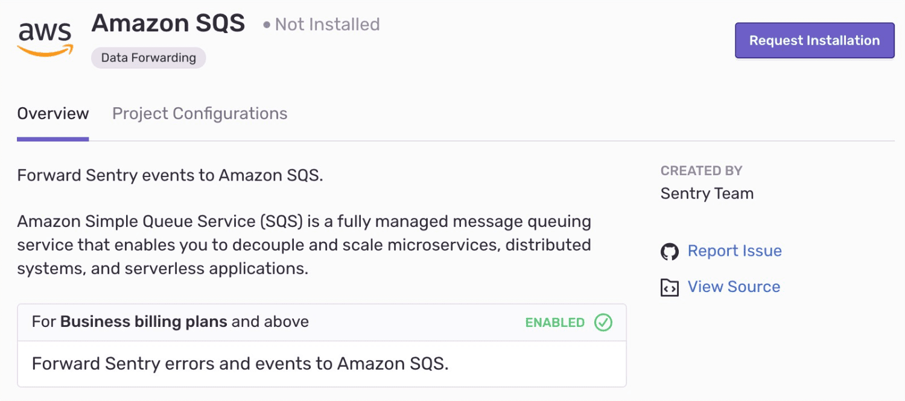

Amazon SQS is useful for a more in-depth analysis of exceptions making it quick and easy to pipe exceptions back into your own systems. Or, use it to empower other teams, such as a Business Intelligence function.  

This integration is set up once per project, and is only usable in projects in which it has been set up. It is maintained and supported by the [Sentry community](https://forum.sentry.io/).

## Install and Configure

<Alert title="Note" level="info">
Sentry owner or manager permissions permissions are required to install this integration.
</Alert>

Navigate to **Settings > [Organization] > Integrations > Integration Details**

### Data Forwarding
Configuring [Data Forwarding](/data-management/data-forwarding/) is done by visiting **[Project] > Settings > Data Forwarding** and filling in the required information for the given integration.

The payload for Amazon is identical to our standard API event payload and will evolve over time. For more details on the format of this data, see our [API documentation](/api/events/get-project-event-details/).
