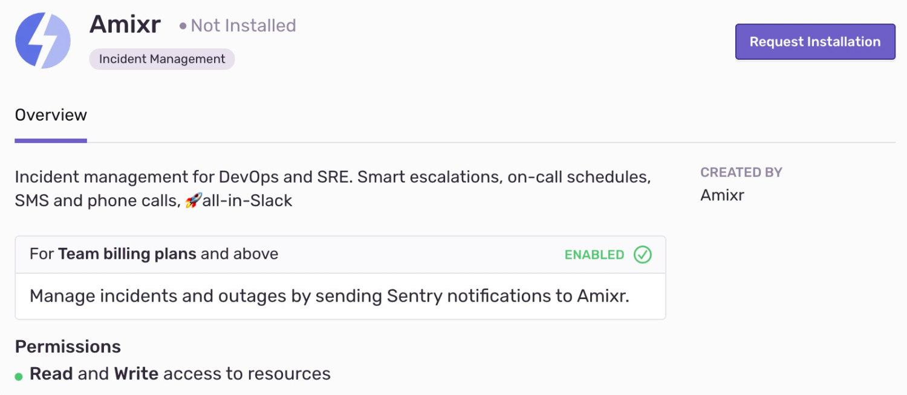

In Amixr, issues from Sentry get stored as well as alerts from other sources like Grafana or Alertmanager. The Amixr integration synchronizes issue statuses between Amixr and Sentry. Issues get posted to your Slack, and users can change the statuses of those issues by clicking on buttons within the message.

This integration is set up once per organization, and is then usable in all projects. It is maintained and supported by the company that created it. For more details, see [Integration Platform](product/integrations/integration-platform/).

On this page:
- [Install and Configure](#install-and-configure)

## Install and Configure

<Alert title="Note" level="info">
Sentry owner or manager permissions permissions are required to install this integration. 

Amixr **won't** work with self-hosted Sentry.
</Alert>

1. Navigate to **Settings > [Organization] > Integrations > Integration Details**

    

2. Then, follow the full [Amixr installation instructions](https://docs.amixr.io/#/integrations/sentry).
