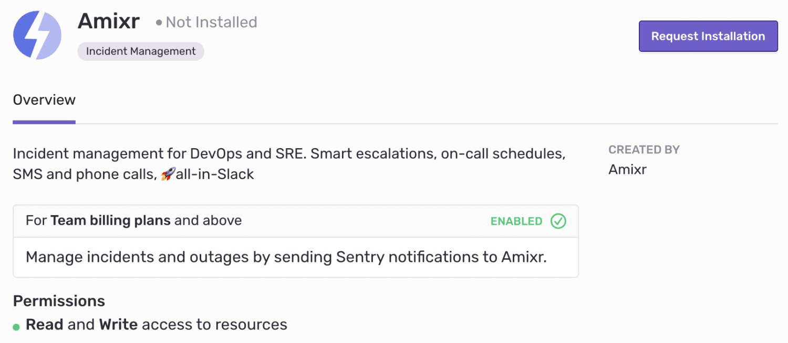

In Amixr, issues from Sentry get stored as well as alerts from other sources like Grafana or Alertmanager. The Amixr integration synchronizes issue statuses between Amixr and Sentry. Issues get posted to your Slack, and users can change the statuses of those issues by clicking on buttons within the message.

This integration needs to set up only once per organization, then it is available for _all_ projects. It is maintained and supported by the company that created it. For more details, see [Integration Platform](/product/integrations/integration-platform/).

## Install and Configure

<Note>

Sentry owner or manager permissions permissions are required to install this integration.

Amixr **won't** work with self-hosted Sentry.

</Note>

1. Navigate to **Settings > Integrations > Amixr**

   

2. Follow the full [Amixr installation instructions](https://docs.amixr.io/#/integrations/sentry).
