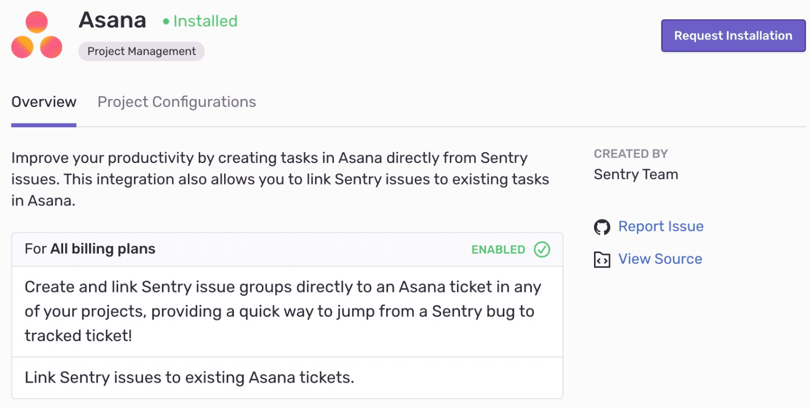

Create or link issues in Asana based on Sentry events.

This integration needs to be set up in each project for which you wish to use it. It is maintained and supported by the [Sentry community](https://forum.sentry.io/).

## Install and Configure

<Note>

Sentry owner or manager permissions permissions are required to install this integration.

</Note>

1. Navigate to **Settings > Integrations > Asana**

   

2. Link your Asana account and select an organization or workspace.
3. Click "Enable Plugin".
4. The option to create or link Asana issues will be displayed from your Sentry issue pages.
