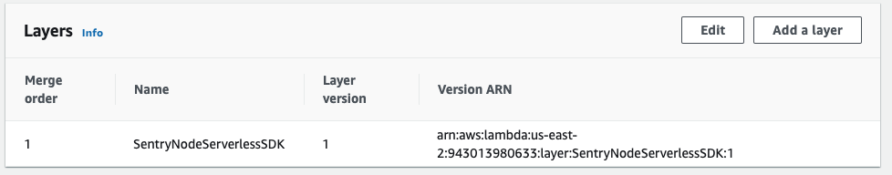
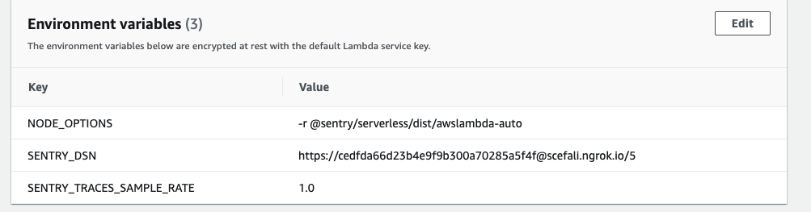

## How it Works

When Sentry is added to a Lambda function, the following modifications are made to your Lambda functions:
* The layer for Sentry is added to your Lambdas. Any existing layers are honored and the Sentry layer is appended to the end.

   
   
* Sentry adds the following environment variables
  * `NODE_OPTIONS`: This is to preload the `awslambda-auto` module which will automatically initialize Sentry
  * `SENTRY_DSN`: This is set to the DSN of your project
  * `SENTRY_TRACES_SAMPLE_RATE`: This sets the sampling rate for transactions. You can manually edit your environment variables if you want a different sampling rate.

  
