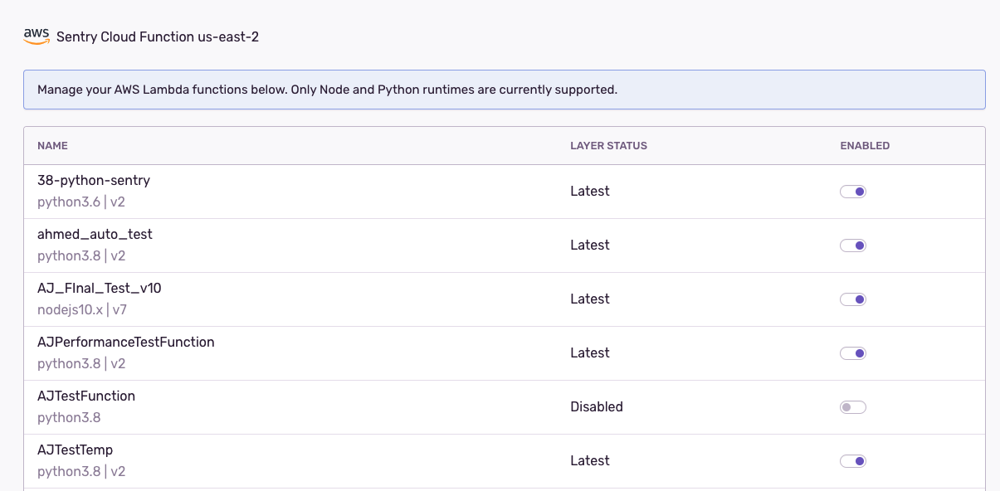

<Alert title="Note" level="info">

Looking for instructions to set up the Node serverless SDK manually? [Check out these docs instead.](/platforms/node/guides/aws-lambda/)

</Alert>

Connect Sentry to your AWS account to automatically add Sentry error and performance monitoring to your Node Lambda functions.

## Install

1. Navigate to **Settings > Integrations > AWS Lambda**.

   

1. Press **Add Installation** to open the installation modal.

   

1. Select the project for your Lambda integration. **Note:** This project cannot be changed later. If you only have a single project, you'll skip this step.

   

1. Click on the button that says **Configure AWS**.

   
  
1. Scroll to the bottom of the Create Stack page, check the box, then press **Create Stack** to create a CloudFormation stack in your current region. This stack allows Sentry to automatically instrument your Lambda functions.

   

1. Wait a minute or two for the stack to be created. When you see the status change to **Create Complete**, copy your AWS account number, select the region you want to use, and finally press **Next** in the installation modal.

   
   
<Alert title="Note" level="info">

You only need to create the CloudFormation stack once per account even when installing the integration on multiple regions. If you are setting up the integration on a second region, verify that the externalId in the form matches the one for the existing CloudFormation stack on the "Parameters" tab.

</Alert>

   
1. Review the Lambda functions you want instrumented with Sentry. Lambda functions which are selected will get the Sentry layer and necessary environment variables automatically added when you press **Finish Setup**. Note that you can enable/disable Sentry on Lambda functions after installation as well.

   

1. Depending on how many Lambda functions you enable, you might need to wait a few minutes for this step to complete. If any functions failed to instrument, follow the troubleshooting guide below.
   
### Troubleshooting

#### Error `SentryRole already exists`

The stack already exists on your account so you can go to the next step of adding your AWS account information.

#### Error `Invalid existing layer`

Your Lambda function has a layer that no longer exists. Please remove the problematic layer, then enable Sentry on the Lambda in the configuration view for the integration.

#### Error `Please validate the CloudFormation stack was created successfully` 

Sentry is unable to access your AWS account through your CloudFormation stack. This means either the stack has not been created or the external ID used doesn't match the one in your installation. You can go to the Parameters tab of the CloudFormation stack to copy the value of the external ID and paste it into the form field.

## Configure

The integration configuration view allows you to do the following with your Lambda functions:

* Enable Sentry
* Disable Sentry
* Update the Sentry Lambda Layer to the latest version

In the table view, you will also see the version of the Lambda layer below the name.

   
   
   
## Uninstallation

Note that when the integration is uninstalled, your Lambda functions will still be instrumented with Sentry and you will continue to receive errors. If you want to disable Sentry for all your Lambda functions, you should disable Sentry for each function before uninstalling.

## How it Works

When Sentry is added to a Lambda function, the following modifications are made to your Lambda functions:
* The layer for Sentry is added to your Lambdas. Any existing layers are honored and the Sentry layer is appended to the end.

   
   
* Sentry adds the following environment variables
  * `NODE_OPTIONS`: This is to preload the `awslambda-auto` module which will automatically initialize Sentry
  * `SENTRY_DSN`: This is set to the DSN of your project
  * `SENTRY_TRACES_SAMPLE_RATE`: This sets the sampling rate for transactions. You can manually edit your environment variables if you want a different sampling rate.

  
