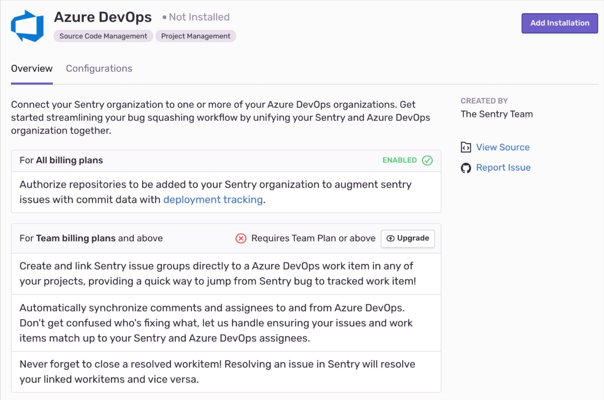
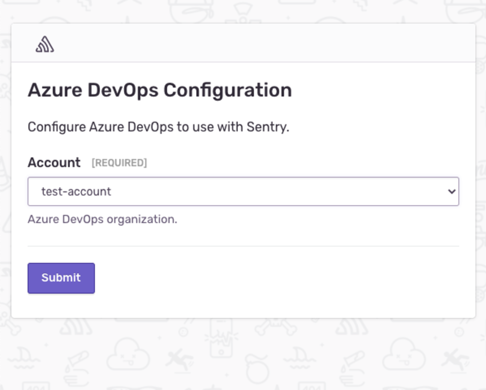
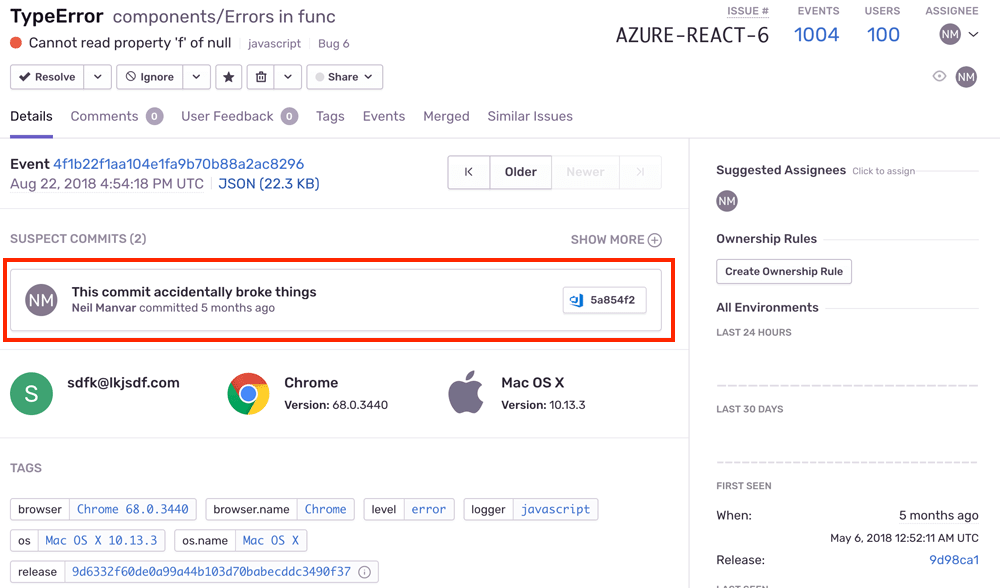
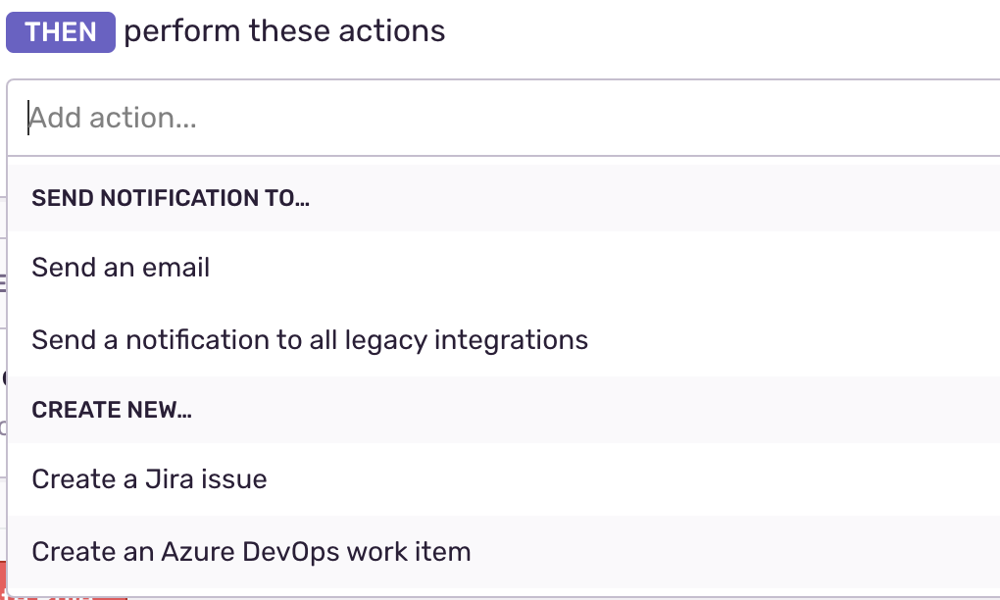
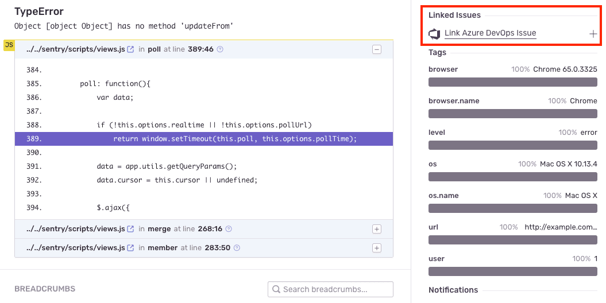
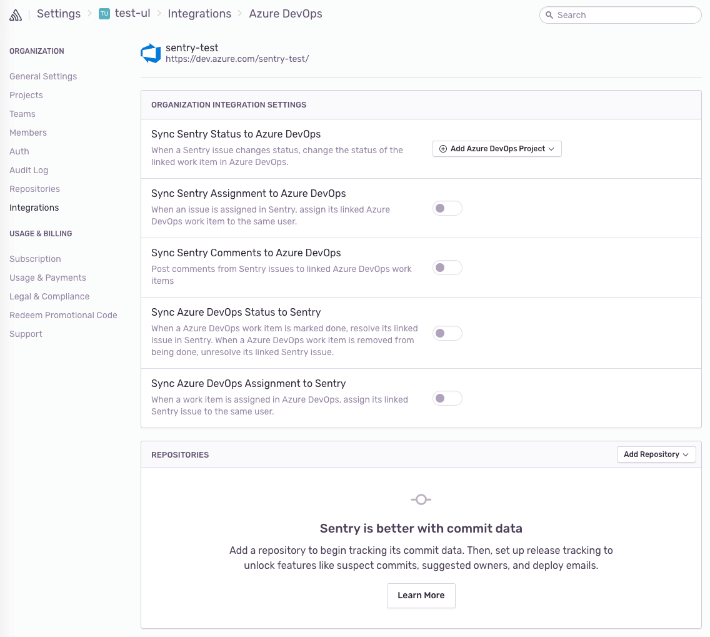

Track and resolve bugs faster by using data from your Azure DevOps (formerly known as Visual Studio Team Services, VSTS) commits.

This integration needs to set up only once per organization, then it is available for _all_ projects.

## Install

<Note>

Sentry organization owner or manager permissions and Azure organization owner permissions are required to install this integration.

</Note>

1. Navigate to **Settings > Integrations > Azure DevOps** and click "Add Installation".

   

2. An Azure DevOps install window should pop up. Select the Azure DevOps account you'd like to link with Sentry, and press **Submit**.

   

Azure DevOps should now be enabled for all projects under your Sentry organization, but you'll need to configure the features below.

## Configure

Use Azure DevOps to [track commits](#commit-tracking), identify [suspect commits](#suspect-commits-and-suggested-assignees), and [issue management](#issue-management).

### Commit Tracking

Commit tracking allows you to hone in on problematic commits. Uncover which commits likely caused an issue, and allow your team to resolve issues by referencing the issue number in a commit message.

For more details, see the full documentation on [commit tracking and releases](/product/releases/setup/).

### Suspect Commits and Suggested Assignees

Once you set up commit tracking, you’ll be able to see the most recent changes to files found in the issue’s stack trace with suspect commits.

For issues where the files in the stack trace match files included in commits sent to Sentry, you’ll see the suspect commit, with a link to the commit itself.



You’ll also see that the author of the suspect commit will be listed as a suggested assignee for this issue. To assign the issue to the suggested assignee, click on their icon.

### Issue Management

Issue tracking allows you to create Azure DevOps issues from within Sentry, and link Sentry issues to existing Azure DevOps Issues.

<Alert title="Note" level="info">
  Issue management is available for organizations on the Team, Business, and
  Enterprise plans.
</Alert>

Issue management can be configured in two ways - automatically or manually.

#### Automatically

To configure issue management automatically, create an [**Issue Alert**](/product/alerts-notifications/issue-alerts/). When selecting the [**action**](/product/alerts-notifications/issue-alerts/#actions), choose **Create a new Azure DevOps work item**.



An Azure DevOps work item will be created automatically when the alert has been triggered.

#### Manually

Once you’ve navigated to a specific issue, you’ll find the **Linked Issues** section on the right hand panel. Here, you’ll be able to create or link Azure DevOps issues.



### Issue Sync

Sync comments, assignees, and status updates for issues in Sentry to Azure DevOps, to minimize duplication. When you delegate an issue to an assignee or update a status on Azure DevOps, the updates will also populate in Sentry. When you resolve an issue in Sentry, the issue status will automatically update in Azure DevOps.

<Alert title="Note" level="info">
  Issue sync is available for organizations on the Team, Business, and
  Enterprise plans.
</Alert>

To configure Issue sync, navigate to ** Organization Settings > Integrations**, and click "Configure" next to your Azure DevOps instance. On the following page, you’ll see options of what information you’d like synced between Sentry and Azure DevOps.



### Resolve in Commit

Once you send commit data, you can start resolving issues by including `fixes <SENTRY-SHORT-ID>` in your commit messages. For example, a commit message might look like:

```
Prevent empty queries on users

Fixes MYAPP-317
```

When Sentry sees this, we’ll automatically annotate the matching issue with reference to the commit, and later, when that commit is part of a release, we’ll mark the issue as resolved.

## Troubleshooting

### No accounts during installation


If you reach the account selection page during the Azure Devops installation process (step 4 in the instructions above) and see that there are no accounts available to select, please check the following possibilities:

- Ensure you are logged into the account connected to your Azure DevOps organization.
- Double-check that your account is a Microsoft Account (MSA).
- For Single Sign-On, see [Azure Active Directory SSO](/product/accounts/sso/azure-sso/).
