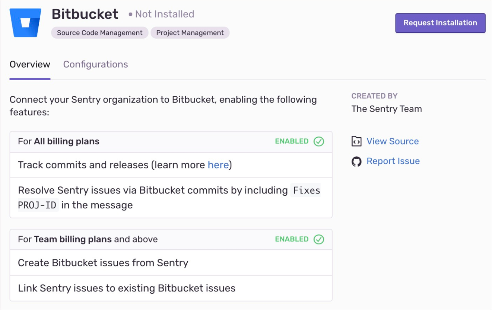
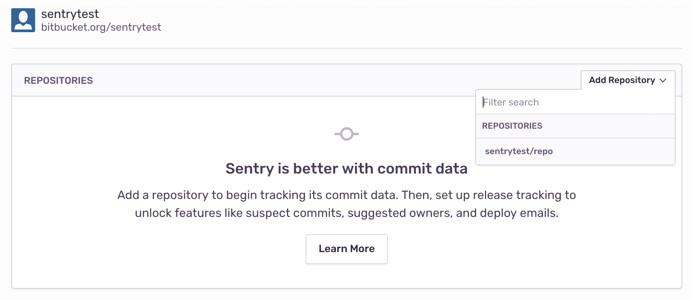

Track and resolve bugs faster by using data from your BitBucket commits.

This integration needs to set up only once per organization, then it is available for _all_ projects.

## Install

<Note>

Sentry owner or manager permissions, and Bitbucket admin permissions are required to install this integration.

</Note>

1. Navigate to **Settings > Integrations > Bitbucket**.



2. If you have the legacy Bitbucket integration installed, use the button next to Bitbucket to **Upgrade**. If you don't have the legacy Bitbucket integration installed, use the button to **Install**.

3. In the resulting modal, click "Add Installation".

4. A Bitbucket install window should pop up. Select the Bitbucket account you'd like to grant Sentry access to, and click "Grant Access".
5. On your new Bitbucket instance in Sentry, click "Configure".

   

6. Add any repositories from which you want to collect commit data.

   

Bitbucket should now be enabled for all projects under your Sentry organization.

### Bitbucket Server

#### Generate an RSA public/private key pair

To generate an RSA public/private key pair, run the following commands in your terminal window one by one.

```
openssl genrsa -out bitbucket_privatekey.pem 1024
openssl req -newkey rsa:1024 -x509 -key bitbucket_privatekey.pem -out bitbucket_publickey.cer -days 365
openssl pkcs8 -topk8 -nocrypt -in bitbucket_privatekey.pem -out bitbucket_privatekey.pcks8
openssl x509 -pubkey -noout -in bitbucket_publickey.cer  > bitbucket_publickey.pem
```

#### Create a new application link in Bitbucket

1. In Bitbucket, click the gear icon, then **Applications > Application Links**.
2. Enter the following as the application URL:
   `https://sentry.io/extensions/bitbucket_server/setup/`
3. Click "Create New Link". If you see a warning that “No response was received from the URL you entered,” ignore and click "Continue".
4. In the resulting dialog, fill out the form as follows:

   <table>
     <tr>
       <th>Application Name</th>
       <td>Sentry</td>
     </tr>
     <tr>
       <th>Application Type</th>
       <td>Generic Application</td>
     </tr>
     <tr>
       <th>Service Provider Name</th>
       <td>Sentry</td>
     </tr>
     <tr>
       <th>Consumer Key</th>
       <td>(your choice, but keep this handy for the next step)</td>
     </tr>
     <tr>
       <th>Shared Secret</th>
       <td>sentry</td>
     </tr>
     <tr>
       <th>Request Token URL</th>
       <td>https://sentry.io</td>
     </tr>
     <tr>
       <th>Access Token URL</th>
       <td>https://sentry.io</td>
     </tr>
     <tr>
       <th>Authorize URL</th>
       <td>https://sentry.io</td>
     </tr>
     <tr>
       <th>Create Incoming Link</th>
       <td>No</td>
     </tr>
   </table>

5. Click "Continue". This will return you to the **Configure Application Links** page, where you'll see an application called Sentry.
6. Click the pencil icon next to the Sentry application.
7. On the lefthand side of the resulting modal, click "Incoming Authentication". Fill out the form as follows, and click "Save":

   <table>
     <tr>
       <th>Consumer Key</th>
       <td>(the consumer key from Step II.4)</td>
     </tr>
     <tr>
       <th>Consumer Name</th>
       <td>Sentry</td>
     </tr>
     <tr>
       <th>Public Key</th>
       <td>(the public key you created in Section I)</td>
     </tr>
     <tr>
       <th>Consumer Callback URL</th>
       <td>https://sentry.io/extensions/bitbucket_server/setup/</td>
     </tr>
     <tr>
       <th>Allow 2-Legged OAuth</th>
       <td>no</td>
     </tr>
   </table>

#### Connect your Bitbucket Server application with Sentry

Note: Confirm [Sentry's IP ranges](/product/security/ip-ranges/) are allowed.

1. In Sentry, navigate to **Organization Settings** > **Integrations**.
2. Next to Bitbucket Server, click "Install".
3. In the resulting modal, click "Add Installation".
4. In the resulting window, enter the base URL for your Bitbucket Server instance, your consumer key, and your private key. Click "Submit". Then, complete the OAuth process as prompted.
5. In Sentry, you’ll see a new Bitbucket Server instance appear on the Integrations page.

Bitbucket should now be authorized for all projects under your Sentry organization.

## Configure

Use BitBucket to [track commits](#commit-tracking), identify [suspect commits](#suspect-commits-and-suggested-assignees), [resolve in commit](#resolving-in-commit), and [issue management](#issue-management).

### Commit Tracking

Commit tracking allows you to hone in on problematic commits. Uncover which commits likely caused an issue, and allow your team to resolve issues by referencing the issue number in a commit message.

For more details, see the full documentation on [commit tracking and releases](/product/releases/setup/).

### Suspect Commits and Suggested Assignees

Once you set up commit tracking, you’ll be able to see the most recent changes to files found in the issue’s stack trace with suspect commits.

For issues where the files in the stack trace match files included in commits sent to Sentry, you’ll see the suspect commit, with a link to the commit itself.

You’ll also see that the author of the suspect commit will be listed as a suggested assignee for this issue. To assign the issue to the suggested assignee, click on their icon.

### Issue Management

Issue tracking allows you to create Bitbucket issues from within Sentry, and link Sentry issues to existing Bitbucket Issues.

Once you’ve navigated to a specific issue, you’ll find the **Linked Issues** section on the right hand panel. Here, you’ll be able to create or link Bitbucket issues.


### Resolving in Commit

Once you are sending commit data, you can start resolving issues by including `fixes <SENTRY-SHORT-ID>` in your commit messages. For example, a commit message might look like:

```
Prevent empty queries on users

Fixes MYAPP-317
```

When Sentry sees this, we’ll automatically annotate the matching issue with reference to the commit, and later, when that commit is part of a release, we’ll mark the issue as resolved.

## Troubleshooting

If you're having trouble setting up Sentry with your on-premises integration, verify the following:

- The provided installation URL is a fully qualified domain name (FQDN), which is resolvable on the internet.
- The IP addresses Sentry uses to make outbound requests are [allowed](/product/security/ip-ranges/).
- Sentry's access to your installation URL is not path restricted.
