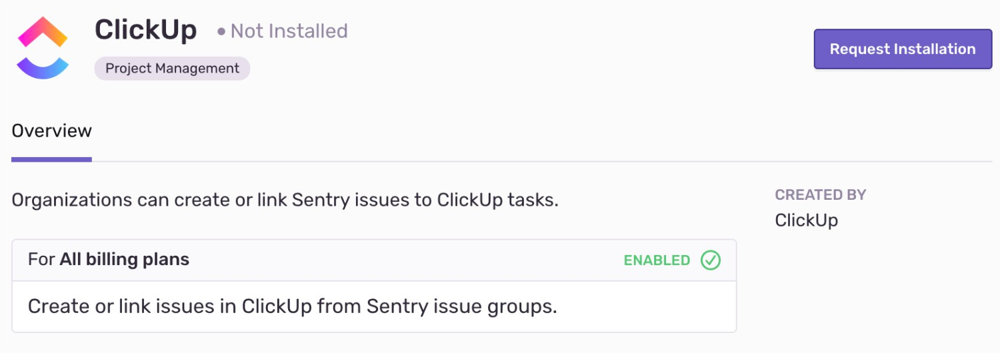

ClickUp’s core focus is about removing frustrations, inefficiencies, and disconnect caused by current project management solutions. You can create an issue in ClickUp from a Sentry issue or link it to an existing issue.

This integration needs to set up only once per organization, then it is available for _all_ projects. It is maintained and supported by the company that created it. For more details, see [Integration Platform](/product/integrations/integration-platform/).

## Install and Configure

<Note>

Sentry owner or manager permissions permissions are required to install this integration.

ClickUp **won't** work with self-hosted Sentry.

</Note>

1. Navigate to **Settings > Integrations > ClickUp**

   

2. Follow the full [ClickUp installation instructions](https://docs.clickup.com/en/articles/3420285-sentry-io).
