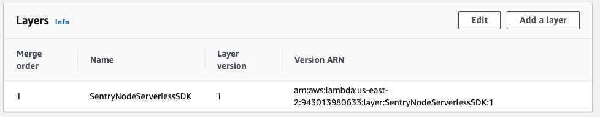
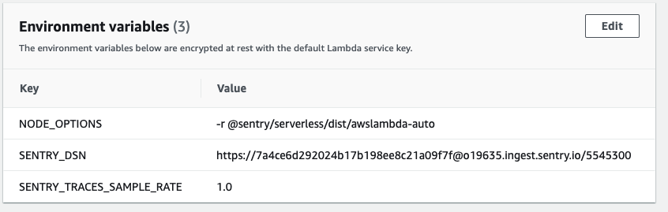
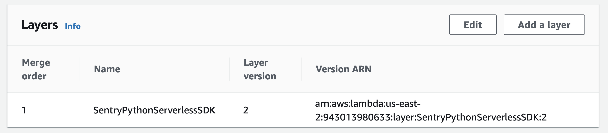
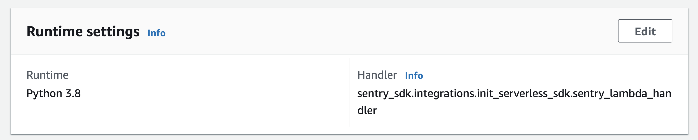
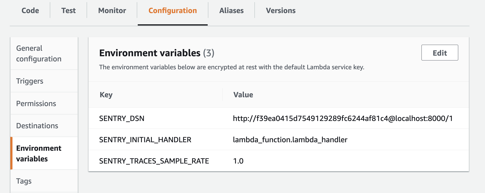

## Node

When Sentry is added to a Lambda function, the following modifications are made to your Lambda functions:

- The layer for Sentry is added to your Lambdas. Any existing layers are honored and the Sentry layer is appended to the end.

  

- Sentry adds the following environment variables

  - `NODE_OPTIONS`: This is to preload the `awslambda-auto` module which will automatically initialize Sentry
  - `SENTRY_DSN`: This is set to the [DSN](/product/sentry-basics/dsn-explainer/) of your project
  - `SENTRY_TRACES_SAMPLE_RATE`: This sets the [sampling rate](/platforms/node/configuration/sampling/#sampling-transaction-events) for transactions. You can manually edit your environment variables if you want a different sampling rate.

  

## Python

When Sentry is added to a Lambda function, the following modifications are made to your Lambda functions:

- The layer for Sentry is added to your Lambdas. Any existing layers are honored and the Sentry layer is appended to the end.

  

  And your Runtime handler will point to Sentry's handler that will initialize the SDK for you, and then call your Runtime handler to invoke your function

  

- Sentry adds the following environment variables

  - `SENTRY_INITIAL_HANDLER`: This stores the value of your Runtime handler. If you choose to disable the Sentry layer, this value will be used to set the Runtime handler.
  - `SENTRY_DSN`: This is set to the [DSN](/product/sentry-basics/dsn-explainer/) of your project
  - `SENTRY_TRACES_SAMPLE_RATE`: This sets the [sampling rate](/platforms/python/configuration/sampling/#sampling-transaction-events) for transactions. You can manually edit your environment variables if you want a different sampling rate.

  
