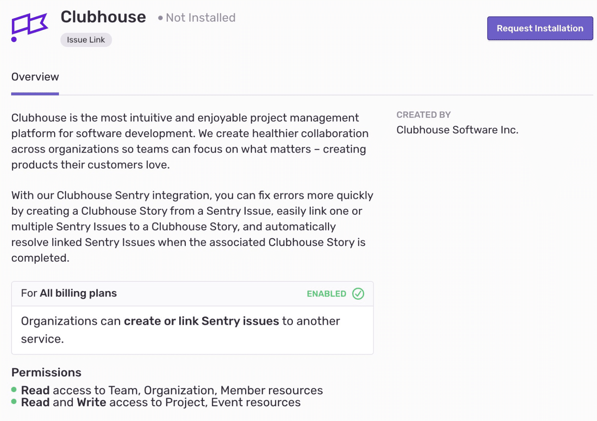

Create a more efficient workflow by linking your Sentry Issues with your Clubhouse Stories. Errors, features, and anything else you track in Clubhouse can now live side by side. The new Clubhouse integration has feature parity with the Clubhouse plugin. If you're choosing between the two, we recommend installing the Clubhouse integration.

This integration needs to set up only once per organization, then it is available for _all_ projects. It is maintained and supported by the company that created it. For more details, see [Integration Platform](/product/integrations/integration-platform/).

## Install and Configure

<Alert title="Note" level="info">
Sentry owner or manager permissions permissions are required to install this integration.

Clubhouse **won't** work with self-hosted Sentry.
</Alert>

1. Navigate to **Settings > Integrations > Clubhouse**

2. Follow the full [Clubhouse installation instructions](https://help.clubhouse.io/hc/en-us/articles/360026979272-Setting-up-the-Sentry-Integration).
