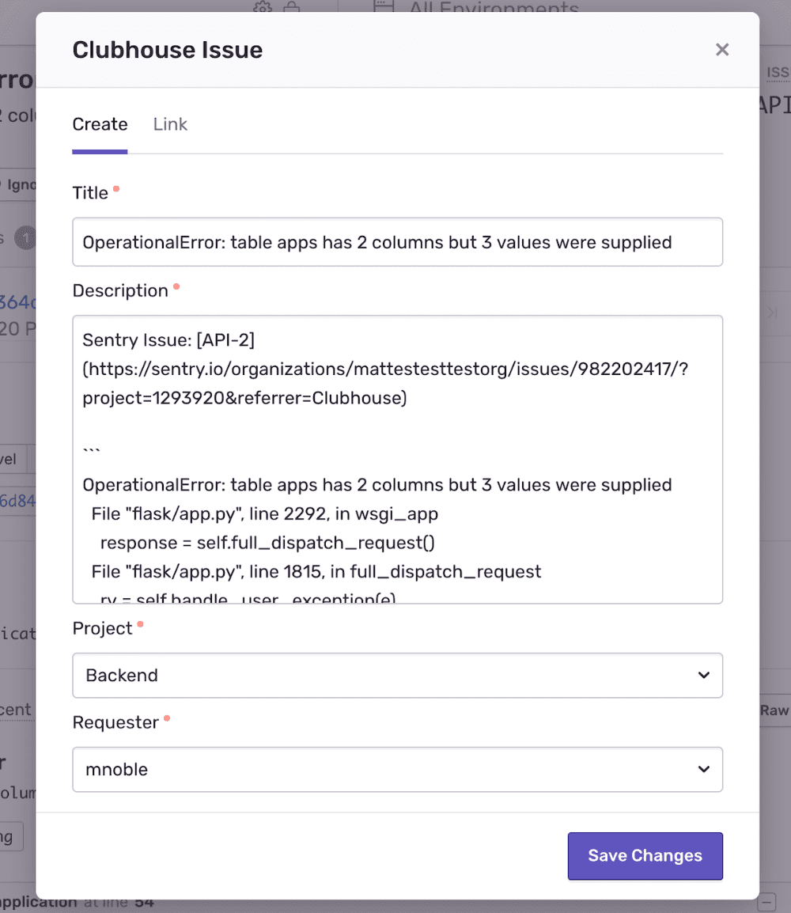

Create a more efficient workflow by linking your Sentry Issues with your Clubhouse Stories. Errors, features, and anything else you track in Clubhouse can now live side by side. The new Clubhouse integration has feature parity with the Clubhouse plugin. If you're choosing between the two, we recommend installing the Clubhouse integration.

**Note:** This integration **won't** work with self-hosted Sentry.

#### Installation

1. In Sentry, navigate to Organization Settings > **Integrations**.

   

2. Find the Clubhouse Integration and click **Install**.
3. In the resulting modal, approve the permissions by clicking **Install**.

   

4. Your Clubhouse Integration is ready to use!

#### Configuration

##### Link an Issue

When linking an issue, you'll need either an existing Clubhouse Story or you'll need to create a Clubhouse Story.

###### Route 1: Clubhouse Story Exists

You can link a Sentry Issue to an existing Clubhouse Story.

1. In Sentry, navigate to the specific **Issue** you want to link.
2. Click on **Link Clubhouse Issue** under **Linked Issues**.

   

3. Select the **Issue** you want to link.

   

4. Click **Save Changes** to submit the form.

5. Click on the **Clubhouse Story** under **Linked Issues**. This will automatically take you to Clubhouse.

   

6. In Clubhouse, you can review your Clubhouse Story and the linked external ticket to Sentry.

   

###### Route 2: Create a Clubhouse Story Based on a Sentry Issue

You can take a Sentry Issue, create a Clubhouse Story, and link the two.

1. In Sentry, navigate to the specific Issue you want to link.
2. Click on **Link Clubhouse Issue** under **Linked Issues**.

   

3. Add information to the created Clubhouse Story.

   A) Title of Story - auto-filled from the Sentry Issue, but also editable

   B) Description of Story - auto-filled from Sentry Issue, but also editable

   C) Project - additional data about the Project

   D) Requester - the person who created the Clubhouse Story and linked it to the Sentry Issue

   

4. Click **Save Changes** to submit the form.

5. Click on the **Clubhouse Story** under **Linked Issues**. This will automatically take you to Clubhouse.

   

6. In Clubhouse, you can review your Clubhouse Story and the linked external ticket to Sentry.

   
