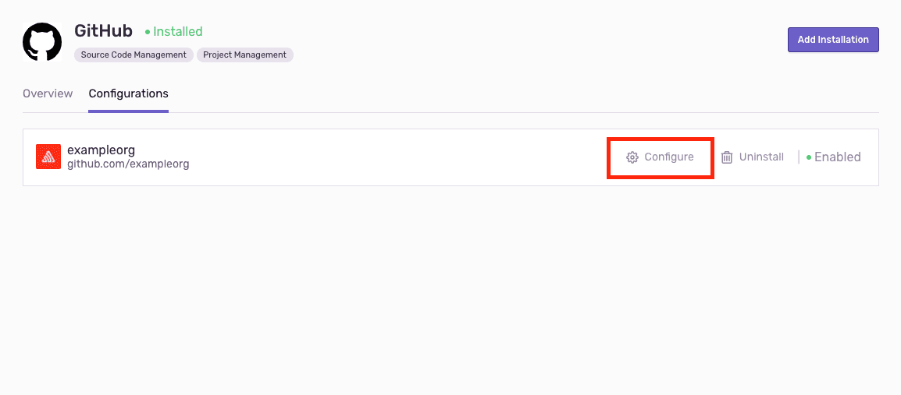
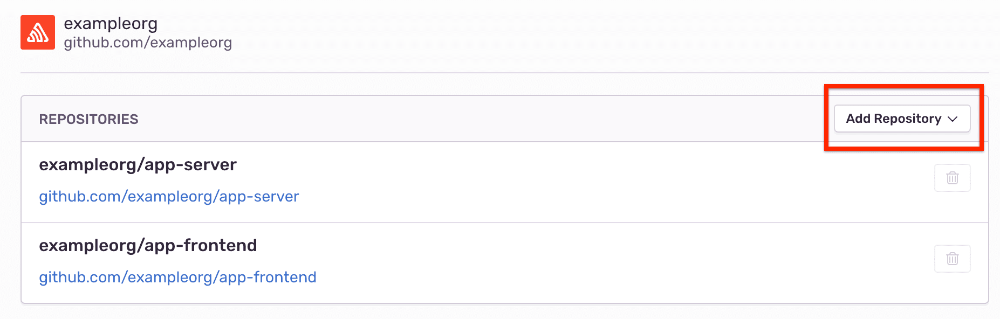
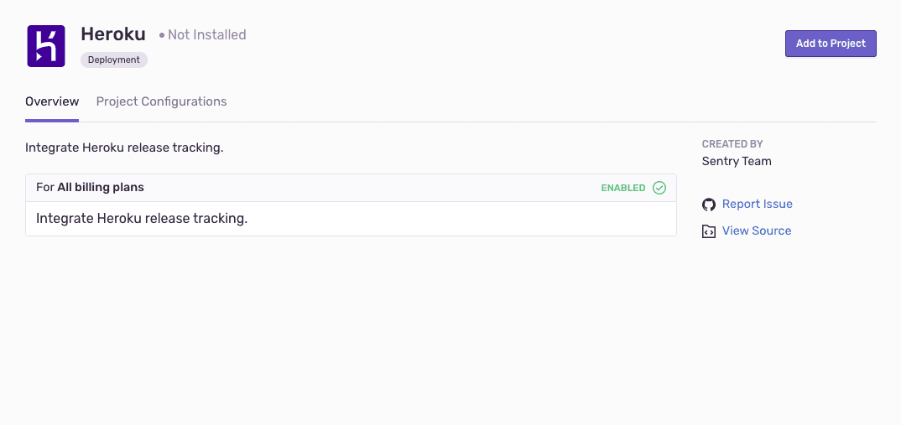
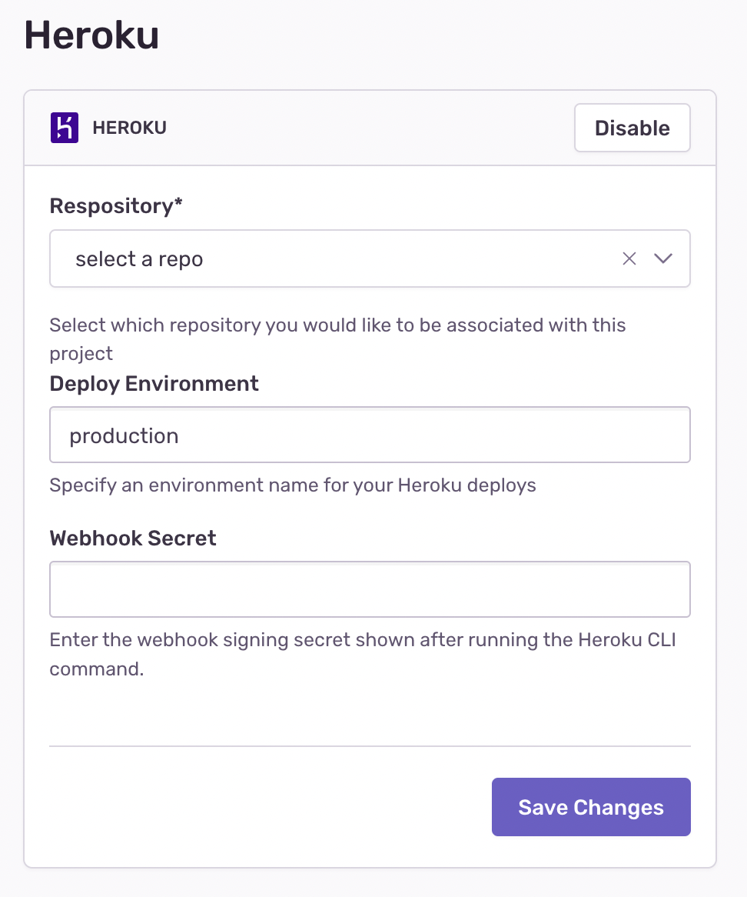
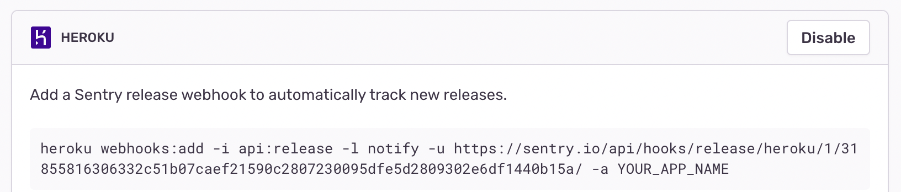

Create releases in Sentry when your Heroku app is deployed.

This integration needs to be set up in each project for which you wish to use it. It is maintained and supported by the [Sentry community](https://open.sentry.io/).

### Register the Add-on

Sentry provides a native add-on for Heroku. While this add-on is not required, it will allow you to maintain consolidated billing inside of Heroku, as well as enable easy configuration of your Sentry credentials.

To add Sentry to an existing Heroku app, head over to the [Sentry Heroku add-on](https://elements.heroku.com/addons/sentry) page.

Once done, you’ll be able to confirm that Sentry’s credentials are available via your config:

```bash
heroku config:get SENTRY_DSN
```

<Note>

If you’re not using the add-on, you can still bind the `SENTRY_DSN` environment variable which the SDK will automatically pick up.

</Note>

### Install the SDK

Whether you’re using the add-on or not, you’ll still need to [install the SDK](/platforms) per our standard platform-specific instructions.

### Configure Releases

Whether use the add-on or configure Sentry yourself, you’ll also likely want to grant quick access to your dyno metadata, which will allow Sentry to automatically pick up the git version of your application.

To do this, enable the `runtime-dyno-metadata` feature:

```bash
heroku labs:enable runtime-dyno-metadata -a <app name>
```

This exposes the `HEROKU_SLUG_COMMIT` environment variable, which most Sentry SDKs will automatically detect and use for configuration.

Next, you’ll want to add your repository and set up an app webhook:

1.  Start by connecting your repository to your Sentry organization so we automatically retrieve your commit data. Find your repository integration (GitHub, GitLab, Bitbucket, for example) in **Settings > Integrations**. From the Configurations tab, click "Configure".

    

    On the Configure page, click "Add Repository" then select the repository you want to use.

    

2.  Find the Heroku integration in **Settings > Integrations**, click "Add to Project", then select the project you want to use with Heroku.

    

3.  In the Heroku integration configuration, specify which repository and deploy environment to be associated with your Sentry project.

    

4.  Navigate to your project’s Release settings and copy the app webhook Heroku cli command to your Heroku configuration.

    

5.  After running the Heroku cli command you'll see a Webhooks Signing Secret. Copy and paste this into the "Webhook Secret" field in Sentry.

You’ll start getting rich commit information and deploy emails with each new release, as well as tracking of which release issues were seen within.
