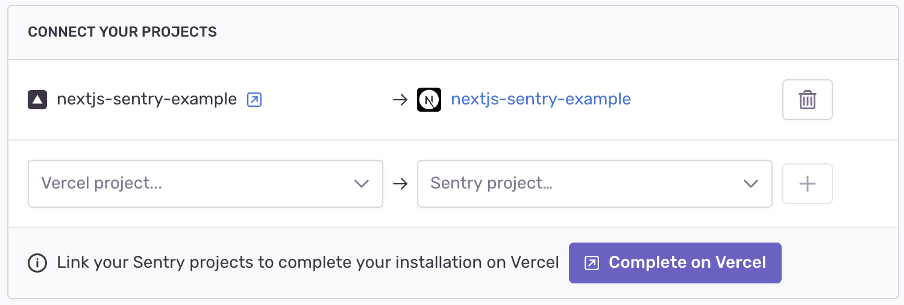

<Alert level="warning">

If you make changes to your organization slug, you'll need to update your configuration for this integration. Learn more in our [troubleshooting guide](/product/integrations/troubleshooting).

</Alert>

Connect your Sentry and Vercel projects to automatically notify Sentry of every deployment and upload source maps for your Next.js application.
To learn more about using Sentry in your Next.js app, check out the [Next.js SDK](/platforms/javascript/guides/nextjs/).

## Install

<Note>

Sentry owner, manager, or admin permissions are required to install this integration.

</Note>

1. Visit <https://vercel.com/integrations/sentry>

2. Click "Add Integration" and follow the setup to select the Vercel scope, the Vercel projects, and review the app's permissions.

   

   <Alert title="Important" level="warning">
     The installation created an internal integration to generate an auth token
     used in building releases. If the Vercel internal integration is deleted,
     your Vercel integration will stop working.
   </Alert>

   

## Configure

Use Vercel to [link projects](#project-linking) for uploading source maps and notifiying Sentry of release deployment.

### Project Linking

1. When prompted by the installer, select a Sentry project and a Vercel project to link together.

   

   - This step will generate environment variables in the selected Vercel project. Having these set means you can skip the [CLI Configuration step](https://github.com/getsentry/sentry-webpack-plugin#cli-configuration) in the Sentry webpack plugin setup. You can see these in Vercel in **Project Settings > General > Environment Variables**.

   

   - `SENTRY_ORG` - the name of your Sentry organization
   - `SENTRY_PROJECT` - the name of your linked Sentry project
   - `SENTRY_AUTH_TOKEN` - the auth token from the Vercel Internal Integration that was created upon installation
   - `NEXT_PUBLIC_SENTRY_DSN` - the linked Sentry project's DSN for usage in the Next.js SDK

2. Redeploy your Vercel project in order to trigger a release.

## Usage

- If you have not already done so, [instrument your code with Sentry](/platforms/javascript/).
- Ensure you have [installed a repository integration](/product/releases/setup/release-automation/) and added the relevant repository.
- Add a Sentry bundler plugin to your bundler configuration ([webpack Plugin](https://www.npmjs.com/package/@sentry/webpack-plugin), [Vite Plugin](https://www.npmjs.com/package/@sentry/vite-plugin), [Esbuild Plugin](https://www.npmjs.com/package/@sentry/esbuild-plugin), [Rollup Plugin](https://www.npmjs.com/package/@sentry/rollup-plugin)). If you are using Sentry's Next.js, or SvelteKit SDKs this will already have been done for you.
- In case you already have a Vercel project integrated with Sentry, ensure the Sentry project you link is the one you're already using to report errors.

## Uninstallation

1. You can uninstall the integration from Vercel or Sentry. To do so in Sentry, navigate to **Settings > Integrations > Vercel > Configurations**, click "Uninstall", and confirm.

2. Delete the internal integration that was created by navigating to **Settings > Developer Settings** and clicking the trash can icon next to "Vercel Internal Integration". You will be prompted to confirm the deletion by entering a string provided in the modal. Enter the string and click "Confirm" to finalize the deletion:

   

## Troubleshooting

### Failed to fetch

This issue typically occurs if you have an ad blocker blocking the conversation between Vercel and Sentry during setup. To remediate the issue, disable your ad blocker and go through the installation flow again.
