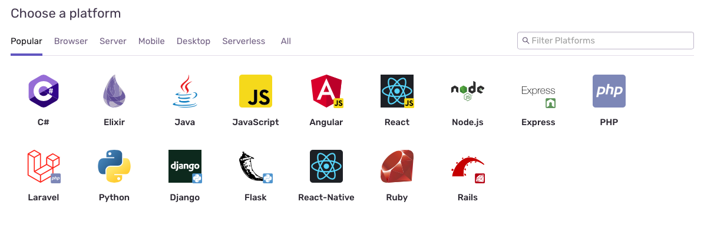

Cloud Run helps developers save time in building and deploying their applications. Sentry helps save time in resolving production issues by providing detailed debugging capabilities.

## Install and Configure

1. [Create an account](https://sentry.io/signup/) (or [Login](https://sentry.io/auth/login/)) on Sentry

2. Choose your application platform

    

3. Follow instructions to instrument your Cloud Run application. Detailed platform docs [here](/platforms/).

4. Deploy your Cloud Run application with GCP.
