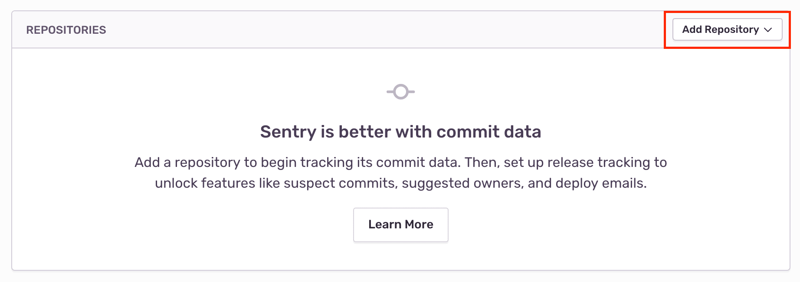
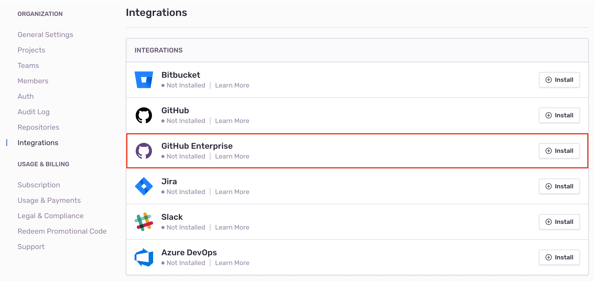
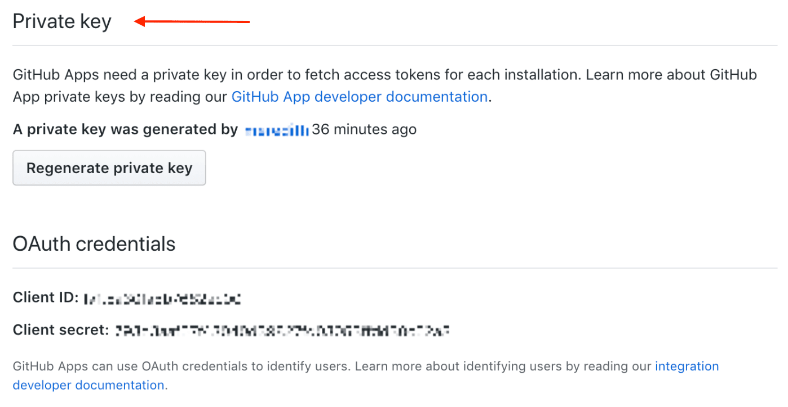

Track and resolve bugs faster by using data from your GitHub commits, and streamline your triaging process by creating a GitHub issue directly from Sentry.

This integration needs to set up only once per organization, then it is available for _all_ projects.

## Install

<Note><markdown>

Sentry owner or manager permissions, and GitHub owner permissions are required to install this integration.

</markdown></Note>

1. Navigate to **Settings > Integrations > GitHub**.

   

2. If you have the legacy GitHub integration installed, use the button next to GitHub to **Upgrade**. If you don't have the legacy GitHub integration installed, use the button to **Install**.

3. In the resulting modal, click "Add Installation".

4. A GitHub install window should pop up. Click "Install".
5. Select which repositories Sentry should have access to (or select all repositories).
6. You should then be redirected back to the Sentry Integrations page.
7. On your new GitHub instance in Sentry, click "Configure".
8. Add any repositories from which you want to collect commit data. _Make sure you have given Sentry access to these repositories in GitHub in the previous steps._

   

The GitHub integration is available for all projects under your Sentry organization. You can connect multiple GitHub organizations to one Sentry organization, but you **cannot** connect a single GitHub organization to multiple Sentry organizations.

### GitHub Enterprise

#### Add new GitHub App

1. Confirm [Sentry's IP ranges](/product/security/ip-ranges/) are allowed for your GitHub Enterprise instance.
2. In your GitHub Enterprise organization, navigate to Settings > Developer Settings > **GitHub Apps** and click to add a new **New GitHub App**.

   

#### Register new GitHub App

1. First, you'll need to generate a webhook secret. For example, in terminal:

   ```
   openssl rand -base64 500 | tr -dc 'a-zA-Z0-9' | fold -w 64 | head -n 1
   ```

2. Then in GitHub, fill out the form as follows and click "Create GitHub App".

   <table>
     <tr>
       <th>GitHub App Name </th>
       <td>sentry-app </td>
     </tr>
     <tr>
       <th>Homepage URL </th>
       <td>https://sentry.io </td>
     </tr>
     <tr>
       <th>User authorization callback URL </th>
       <td>https://sentry.io/extensions/github-enterprise/setup/ </td>
     </tr>
     <tr>
       <th>Setup URL </th>
       <td>https://sentry.io/extensions/github-enterprise/setup/ </td>
     </tr>
     <tr>
       <th>Webhook URL </th>
       <td>https://sentry.io/extensions/github-enterprise/webhook/ </td>
     </tr>
     <tr>
       <th>Webhook secret </th>
       <td>`Input your secret from the previous step` </td>
     </tr>
     <tr>
       <th>Repository Administration </th>
       <td>Read-only </td>
     </tr>
     <tr>
       <th>Commit Statuses </th>
       <td>No Access </td>
     </tr>
     <tr>
       <th>Deployments </th>
       <td>No Access </td>
     </tr>
     <tr>
       <th>Issues </th>
       <td>Read & Write </td>
     </tr>
     <tr>
       <th>Pages </th>
       <td>No Access </td>
     </tr>
     <tr>
       <th>Pull Requests </th>
       <td>Read-only </td>
     </tr>
     <tr>
       <th>Repository Contents </th>
       <td>Read-only </td>
     </tr>
     <tr>
       <th>Single File </th>
       <td>No Access </td>
     </tr>
     <tr>
       <th>Repository Projects </th>
       <td>No Access </td>
     </tr>
     <tr>
       <th>Organization members </th>
       <td>Read-only </td>
     </tr>
     <tr>
       <th>Organization projects </th>
       <td>No Access </td>
     </tr>
   </table>

   **Subscribe to Events**

   <table>
     <tr>
       <th>Pull Request </th>
       <td>Yes </td>
     </tr>
     <tr>
       <th>Push </th>
       <td>Yes </td>
     </tr>
   </table>

#### Install your GitHub App

1. In Sentry, navigate to Organization Settings > **Integrations**.
2. Next to GitHub Enterprise, click "Install".

   

3. Click "Add Installation".

   

4. Fill out the following form with information from your GitHub apps configuration page.

   

   You'll need to generate a private key on your GitHub apps configuration page, and paste the entire contents into the **GitHub App Private Key** field.

   

   For example, in terminal:

   ```
   cat <YOUR_PRIVATE_KEY_FILE> | pbcopy
   ```

5. Click "Configure" and then a GitHub install window will pop up. Select which repositories Sentry should have access to (or select all repositories) and click "Install".

   

6. You will then be redirected back to Sentry. On your new GitHub Enterprise instance, click "Configure".

   

7. Add any repositories that you want to collect commit data from. _Make sure you have given Sentry access to these repositories in GitHub in the previous steps._

   

GitHub Enterprise should now be enabled for all projects under your Sentry organization.

## Configure

Use GitHub to [track commits](#commit-tracking), identify [suspect commits](#suspect-commits-and-suggested-assignees), [resolve via commit or PR](#resolve-via-commit-or-pull-request) and [manage issues](#issue-management).

### Commit Tracking

Commit tracking allows you to hone in on problematic commits. Learn more about [commit tracking](/workflow/releases/#link-repository).

### Suspect Commits and Suggested Assignees

Once you set up commit tracking, you’ll be able to see the most recent changes to files found in the issue’s stack trace with suspect commits.

For issues where the files in the stack trace match files included in commits sent to Sentry, you’ll see the suspect commit, with a link to the commit itself.


You’ll also see that the author of the suspect commit will be listed as a suggested assignee for this issue. To assign the issue to the suggested assignee, click on their icon.

### Issue Management

Issue tracking allows you to create GitHub issues from within Sentry, and link Sentry issues to existing GitHub Issues.

Once you’ve navigated to a specific issue, you’ll find the **Linked Issues** section on the right hand panel. Here, you’ll be able to create or link GitHub issues.


### Resolve via Commit or Pull Request

Once you are sending commit data, you can start resolving issues by including `fixes <SENTRY-SHORT-ID>` in your commit messages. For example, a commit message might look like:

```
Prevent empty queries on users

Fixes MYAPP-317
```

You can also resolve issues with pull requests by including `fixes <SENTRY-SHORT-ID>` in the title or description.

When Sentry sees this, we’ll automatically annotate the matching issue with a reference to the commit or pull request, and, later, when that commit or pull request is part of a release, we’ll mark the issue as resolved.

### GitHub Single Sign-On

Single Sign-On (or SSO) allows you to manage your organization’s entire membership via a third-party provider.

For more details, see the full documentation for [Single Sign-on](/product/accounts/sso/).

## Troubleshooting

If you're having trouble setting up Sentry with your on-premise integration, verify the following:

- The provided installation URL is a fully qualified domain name (FQDN), which is resolvable on the internet.
- The IP addresses Sentry uses to make outbound requests are [allowed](/product/security/ip-ranges/).
- Sentry's access to your installation URL is not path restricted.
