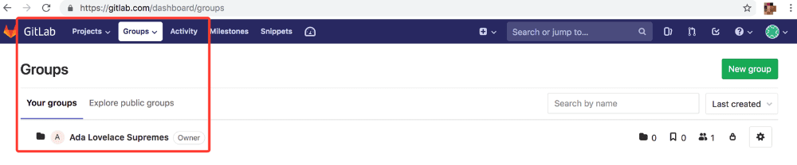
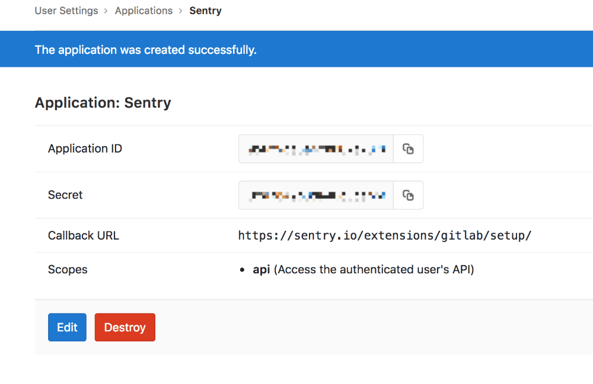
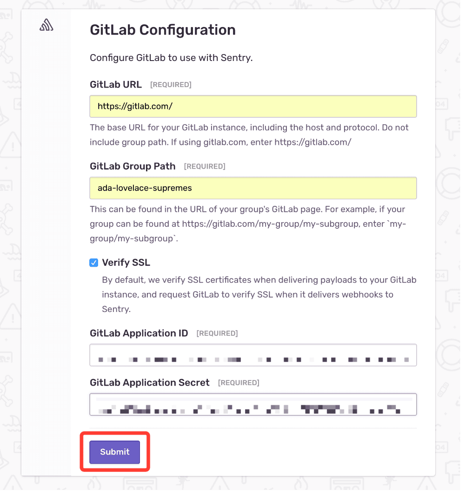
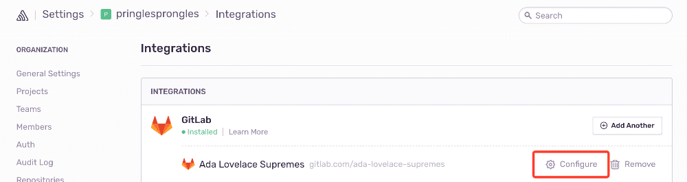
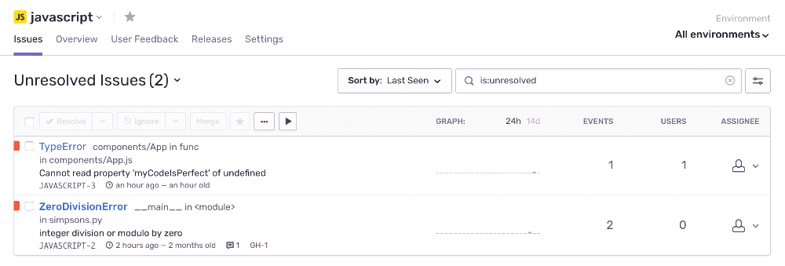
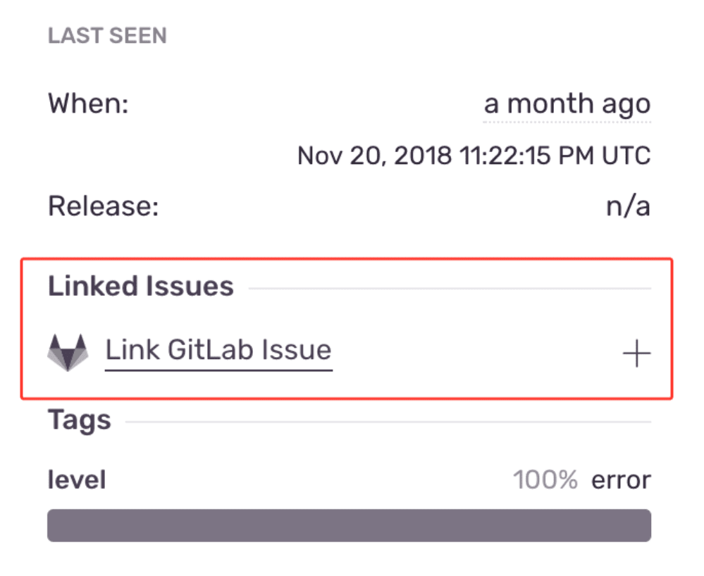
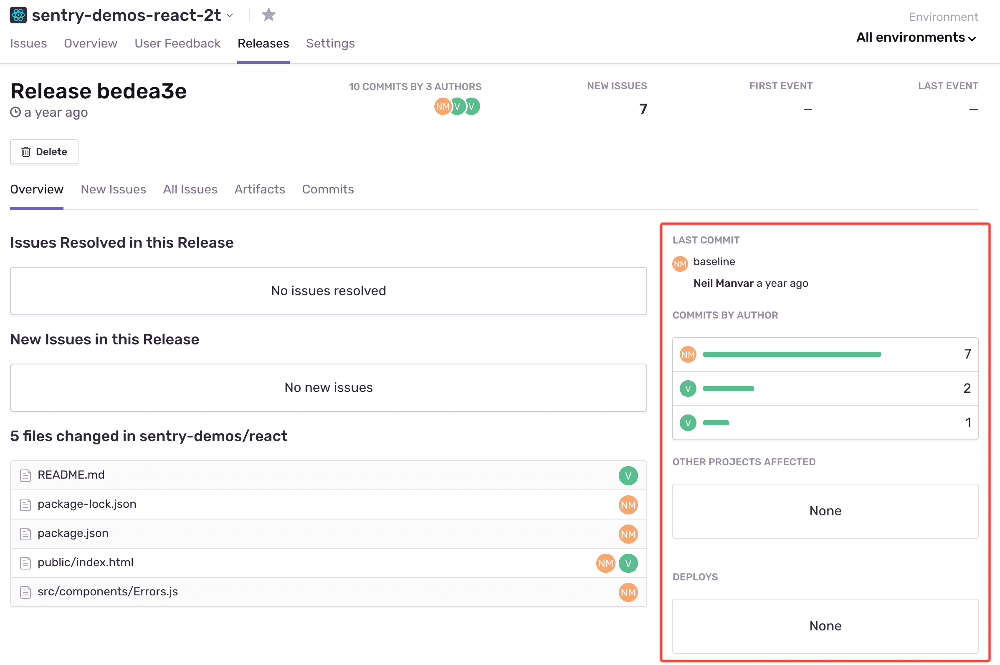
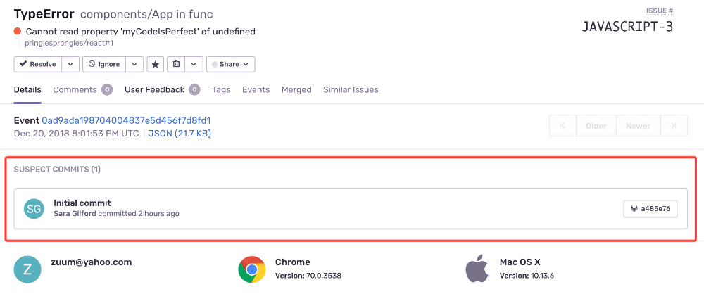
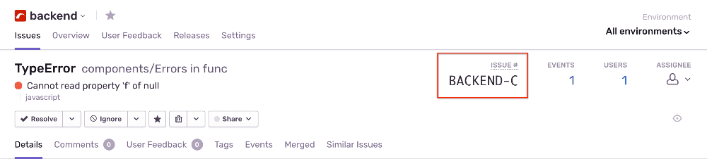

Sentry’s GitLab integration helps you track and resolve bugs faster by using data from your GitLab commits. Additionally, you can streamline your triaging process by creating a GitLab issue directly from Sentry.

This integration needs to set up only once per organization, then it is available for _all_ projects.

## Install

<Note><markdown>

Sentry owner or manager permissions and GitLab owner or maintainer permissions are required to install this integration.

</markdown></Note>

1. Navigate to **Settings > Integrations > GitLab**.

   

1. In the resulting modal, click "Add Installation".

   

1. In the pop-up window, complete the instructions to create a Sentry app within GitLab. Once you’re finished, click "Next".

   

1. Fill out the resulting GitLab Configuration form with the following information:

   1. The GitLab URL is the base URL for your GitLab instance. If using gitlab.com, enter https://gitlab.com/.

   2. Find the GitLab Group Path in your group’s GitLab page.

      

   3. Find the GitLab Application ID and Secret in the Sentry app within GitLab.

      

   4. Use this information to fill out the GitLab Configuration and click "Submit".

      

1. In the resulting panel, click "Authorize".

1. In Sentry, return to Organization Settings > **Integrations**. You’ll see a new instance of GitLab underneath the list of integrations.

1. Next to your GitLab Instance, click "Configure". _It’s important to configure to receive the full benefits of commit tracking._

   

1. On the resulting page, click "Add Repository" to select which repositories in which you’d like to begin tracking commits.

   

## Configure

Use GitLab to [track commits](#commit-tracking), identify [suspect commits](#suspect-commits), [resolve via commit or PR](#resolve-via-commit-or-pull-request) and [manage issues](#issue-management).

### Issue Management

Issue tracking allows you to create GitLab issues from within Sentry and link Sentry issues to existing GitLab issues.

1. Select your issue

   

1. Navigate to Linked Issues on the right panel of the issue's page and click "Link GitLab Issue".

   

1. You have two options to complete the issue link:

   1. In the pop-up, you can fill out the appropriate details in the _Create_ tab, and then click "Create Issue".

      

   1. Or, in the pop-up, you can click the Link tab, search the issue by name, and then click "Link Issue". _Issues aren't currently searchable by number._

      

1. To unlink an issue, click on the "X" next to its name under Linked Issues.

   

### Commit Tracking

Commit tracking allows you to hone in on problematic commits. With commit tracking, you can better isolate what might be problematic by leveraging information from releases like tags and metadata.

Once you've configured both [release and commit tracking](/product/releases/), you'll be able to see more thorough information about a release: who made commits, which issues were newly introduced by this release, and which deploys were impacted.

When you investigate deeper into that commit, you can leverage information from metadata like tags.

Broadly, this lets you isolate problems in order to see which commits might be problematic.

Learn more about [release and commit tracking](/product/releases/).

### Suspect Commits

Once you are tracking the commits, the 'suspect commit' is the commit that likely introduced the error.

One special benefit of using Sentry's Commit Tracking is the ability to know the suspect commit that likely caused the error, with a suggested plan of action for how to rectify the error. For example, after pinpointing the suspect commit, you can also identify the developer who made the commit and assign them the task of fixing the error.

Here is where you can find info for [suspect commit setup](/product/releases/#install-repo-integration).

### Resolve via Commit or Pull Request

Once you've added a repository (see configuration step 8), you can start resolving issues by including `fixes <SHORT-ID>` in your commit messages. You might want to type something in the commit like: "this fixes MyApp-AB12" or "Fixes MyApp-317". The keyword to include is **fixes**. You can also resolve issues with pull requests by including `fixes <SHORT-ID>` in the title or description. This will automatically resolve the issue in the next release.

A `<SHORT-ID>` may look something like 'BACKEND-C' in the image below.

## Troubleshooting

- I'm using GitLab on-premise. Do I need to allow Sentry's IP addresses?
  - Yes. You can find our IP ranges [ here ](/product/security/ip-ranges/).
  - Verify the provided installation URL is a fully qualified domain name (FQDN), which is resolvable on the internet.
  - Make sure that Sentry's access to your installation URL is not path restricted.
- Do you support subgroups?
  - Currently, we only support subgroups for users using GitLab 11.6 or higher.
- My repositories are hosted under my user account, not a group account. Can I still use this integration?
  - Unfortunately, not. The GitLab integration only works for repositories that are hosted under group accounts.
- Are there pricing restrictions?
  - This integration is available for organizations on the [Team, Business, or Enterprise plan](https://sentry.io/pricing/).
- Who has permission to install this?
  - You must have both owner/manager permissions in Sentry and owner permissions in GitLab to successfully install this integration.
