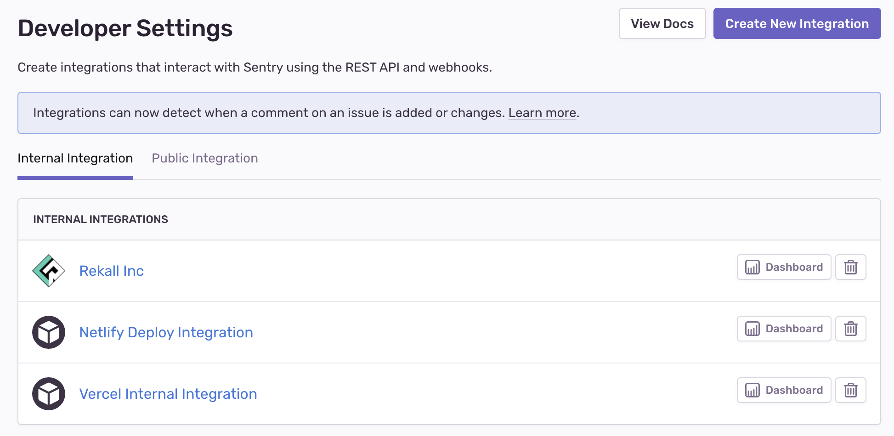
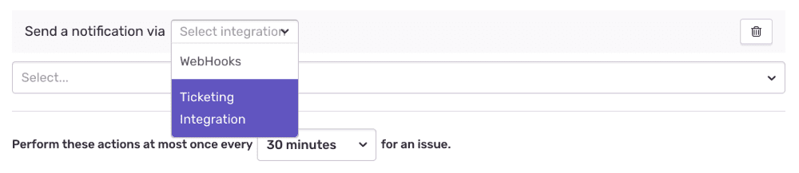

Sentry’s integration platform provides a way for external services to interact with Sentry using [webhooks](/product/integrations/integration-platform/webhooks/), [UI components](/product/integrations/integration-platform/ui-components/), and the [REST API](/api). Integrations using this platform are first-class actors within Sentry.

## Quick Start

If you're new to the integration platform, it may help to get started with an example project to demo the different features and data avaiable your application. To help out, we've built a [reference implementation](https://github.com/getsentry/integration-platform-example) which you can use as a starting point.

It's a simple kanban application that leverages many of the features available to Sentry integrations and provides starter code in both Python and TypeScript. It also includes a step-by-step guide to setting up your first integration, a wealth of docs and testing advice, and will have your app safely consuming live Sentry data in minutes!

## Creating an Integration

In [sentry.io](https://sentry.io), navigate to **Settings > Developer Settings**. From here, you can choose to create an [internal](/product/integrations/integration-platform/internal-integration) or [public](/product/integrations/integration-platform/public-integration) integration. Internal integrations can only be used by your organization, whereas public integrations can be published and are available for all Sentry users.

There are several configuration options for your integration, which are described briefly below. Each section provides links to more detailed information.

## Webhooks

Webhooks allow your service to get requests about specific resources, depending on your selection. For more information, check out the [full Webhooks documentation](/product/integrations/integration-platform/webhooks/).

## UI Components

The Sentry integration platform provides the ability to add rich UI components to [sentry.io](https://sentry.io) itself through a simple, declarative syntax. For more information, check out the [full UI Components documentation](/product/integrations/integration-platform/ui-components/).

## Alerts

You can make any integration available as an action in [issue alerts](/product/integrations/integration-platform/webhooks/issue-alerts) and [metric alerts](/product/integrations/integration-platform/webhooks/metric-alerts) by enabling the "Alert Rule Action" toggle. The integration will then show
up as a service in the action section when creating or updating an alert rule:

For your service to receive webhooks for alert rules, users must add to existing rules or create new ones that have `Send a notification via <your service>` as an action in the rule. Once that's set up, you'll start receiving webhook requests for triggered alerts. For more information about the request and payload, check out the [full Webhooks documentation](/product/integrations/integration-platform/webhooks/). If you'd like users to provide more app-specific information to handle these webhooks (e.g. assignees, teams, notification channels), consider implementing the [alert rule action UI component](/product/integrations/integration-platform/ui-components/alert-rule-action).

## Permissions

Permissions specify what level of access your service requires of Sentry resources. The scopes are directly applied to any API tokens issued to the application. For public integrations, Sentry will prompt users to approve these permissions upon installation. For more information, check out the [full documentation on Permissions](/api/permissions/).

You can't create an integration or change an existing integration to have permissions greater than your own user settings. Permissions are scoped to the organization, so adding scopes for issues and events, projects, or teams will enable access to issues and events, projects, or teams across the organization.

## Auth Tokens

Auth tokens are passed using an auth header, and are used to authenticate as a user account with the API. [Public integrations](/product/integrations/integration-platform/public-integration) require an OAuth flow for tokens. [Internal integrations](/product/integrations/integration-platform/internal-integration) automatically generate tokens after installation. For more information, check out the [full Authentication documentation](/api/auth/).

## Learn More

<PageGrid />
