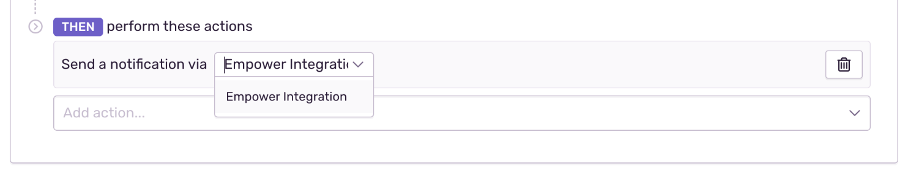
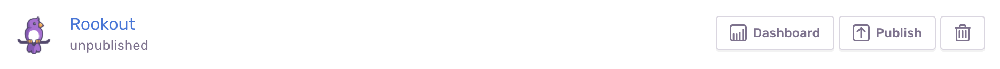

Sentry’s Integration Platform provides a way for external services to interact with Sentry using the REST API and webhooks. Integrations utilizing this platform are first-class actors within Sentry, and you can build them for [public](#public-integrations) as well as [internal](#internal-integrations) use cases.

## Creating an Integration

In Sentry, navigate to Organization Settings > Developer Settings. From here, you can choose to create a New Internal Integration or New Public Integration.


### Permissions

Permissions specify what level of access your service requires of Sentry resources. For public integrations, Sentry will prompt users to approve of these permissions upon installation. For more information, see the [full documentation on Permissions](/api/permissions/).


You cannot create an integration or change an existing integration to have permissions greater than your own user settings.

### Using Auth Tokens

Auth Tokens are passed using an auth header, and are used to authenticate as a user account with the API. The [Public Integration](#public-integrations) requires an OAuth flow for tokens. The [Internal Integration](#internal-integrations) automatically generates tokens after installation. For more information, see the [full documentation on Authentication](/api/auth/).

### Integration Webhooks

Webhooks allow your service to get requests about specific resources, depending on your selection. For more information, see the [full documentation on Webhooks](/product/integrations/integration-platform/webhooks/).

## Public Integrations

Sentry built public integrations for the 'general public' of Sentry users. Public integrations start in an unpublished state for development purposes and can later be submitted for approval to publish. For more information, see the [section on Publishing](#published-state).

The code examples in the sections below demonstrate a potential use-case that involves a Flask app receiving new issue webhooks from Sentry, calling the Sentry API for more data about the issue, and pushing it to Pushover as a generator of desktop/mobile notifications.

### Installation

Users will have the option to install your integrations on the Integrations Page in Sentry. If your integration is still in an unpublished state, the only Sentry organization that will be able to install that integration will be the organization that created the integration. Clicking "Install" will allow users to see a description of your integration and the permissions that will be granted should the user choose to install.


#### OAuth Process

After installation, if your user has approved of all permissions, Sentry will generate a grant code and an installation ID. This information, the grant code, and the installation ID are sent via the `installation.created` webhook to the Webhook URL specified in your configuration.

However, if your integration has a Redirect URL configured, the integration redirects the user’s browser to the configured URL with the grant code and installation ID in the query params.

Start your build by implementing the Redirect URL endpoint, /setup — typically where you exchange the grant code for a token that allows you to make API calls to Sentry.

```python
import requests
from flask import redirect, request

@app.route('/setup', methods=['GET'])
def setup():
    code = request.args.get('code')
    install_id = request.args.get('installationId')

    url = u'https://sentry.io/api/0/sentry-app-installations/{}/authorizations/'
    url = url.format(install_id)

    payload = {
        'grant_type': 'authorization_code',
        'code': code,
        'client_id': 'your-client-id',
        'client_secret': 'your-client-secret',
    }

    resp = requests.post(url, json=payload)
    data = resp.json()

    token = data['token']
    refresh_token = data['refreshToken']
    # ... Securely store the install_id, token and refresh_token in DB ...

    return redirect('https://sentry.io/settings/')
```

#### Auth Tokens

Auth Tokens are what the Integration Platform calls tokens. Auth Tokens are passed using an auth header and are used to authenticate as a user account with the API. In the case of the Integration Platform, these tokens are used to authenticate as an application (with access to a specific organization) instead of a user.

#### Token Exchange

Upon the initial installation, you'll need the grant code given to you in either the installation webhook request or the redirect URL, in addition to your integration's client ID and client Secret.

```python
url = u'https://sentry.io/api/0/sentry-app-installations/{}/authorizations/'
url = url.format(install_id)

payload = {
    'grant_type': 'authorization_code',
    'code': code,
    'client_id': 'your-client-id',
    'client_secret': 'your-client-secret',
}
```

Tokens expire after eight hours, so you'll need to refresh your tokens accordingly.

```python
url = u'https://sentry.io/api/0/sentry-app-installations/{}/authorizations/'
url = url.format(install_id)

refresh_token = retrieve_refresh_token_from_db(install_id)

payload = {
    'grant_type': 'refresh_token',
    'refresh_token': refresh_token,
    'client_id': 'your-client-id',
    'client_secret': 'your-client-secret',
}
```

The data you can expect back for both the initial grant code exchange and subsequent token refreshes is as follows:

```json
{
  "id": "38",
  "token": "ec48bf98637d44c294ead7566513686237e74ab67a074c64b3aaca2d93dbb8f1",
  "refreshToken": "c866f154a65841638d44ee26364409b0a1a67bd642bd46e7a476f34f810712d6",
  "dateCreated": "2019-08-07T20:25:09.870Z",
  "expiresAt": "2019-08-08T04:25:09.870Z",
  "state": null,
  "application": null
}
```

#### How to use for requests

When making requests to the Sentry API, you use the token just like you would when you're typically making [API requests](/api/auth/). Tokens are associated with the installation, meaning they have access to the Sentry organization that installed your integration.

#### Expiration

Tokens expire every eight hours.

#### Verifying Installations (optional)

Typically if you have the Redirect URL configured, there is work happening on your end to 'finalize' the installation. If this is the case, we recommend enabling the Verify Install option for your integration. Once enabled, you will need to send a request marking the installation as officially 'installed.'

```python
requests.put(
    u'https://sentry.io/api/0/sentry-app-installations/{}/'.format(install_id),
    json={'status': 'installed'},
)
```

#### Refreshing Tokens

The Tokens you receive from Sentry expire after eight hours. To retrieve a new token, you’ll make a request to the same Authorization endpoint used in the /setup endpoint above, but with a slightly different request body.

```python
def refresh_token(install_id):
    url = u'https://sentry.io/api/0/sentry-app-installations/{}/authorizations/'
    url = url.format(install_id)

    refresh_token = retrieve_refresh_token_from_db(install_id)

    payload = {
        'grant_type': 'refresh_token',
        'refresh_token': refresh_token,
        'client_id': 'your-client-id',
        'client_secret': 'your-client-secret',
    }

    resp = requests.post(url, json=payload)
    data = resp.json()

    new_token = data['token']
    new_refresh_token = data['refreshToken']
    # ... Securely update the token and refresh_token in DB...

    return new_token
```

Instead of keeping track of times and passively refreshing at the time a token expires, one painless way you can handle refreshing tokens is to actively capture exceptions raised by requests that receive a 401 Unauthorized response from Sentry, refresh the token, and remake the request.

### Uninstallation

When a user uninstalls your integration, you will receive a webhook request to your Webhook URL.

### Integration Webhooks

In addition to the [un]installation webhook requests, all of the webhooks that you selected when configuring your integration will be routed to your Webhook URL.

Continuing from our example, here we're implementing the Webhook URL endpoint, /webhook. In this case, that includes when an issue is created. In this method, you'll use the Sentry API to check if the issue belongs to a project called Backend, and if it does, you'll forward the issue to Pushover.

```python
@app.route('/webhook', methods=['POST'])
def webhook():
    data = json.loads(request.data)

    if data['action'] != 'created':
        return

    issue_id = data['data']['issue']['id']
    install_id = data['installation']['uuid']

    issue_details = get_sentry_issue(install_id, issue_id)

    if issue_details['project']['name'] != 'Backend':
        return

    event = data['data']['event']

    payload = {
        'user': 'pushover-user-key',
        'token': 'pushover-api-token',
        'message': event['message'][:1024],
        'title': event['message'][:250],
        'url': event['url'],
        'url_title': 'Issue Details',
        'priority': 0,
    }
    requests.post('https://api.pushover.net/1/messages.json', data=payload)

def get_sentry_issue(install_id, issue_id):
    token = retrieve_from_db(install_id)

    url = u'https://sentry.io/api/0/issues/{}/'.format(issue_id)
    headers = {'Authorization': u'Bearer {}'.format(token)}

    resp = requests.get(url, headers=headers)
    return resp.json()
```

For more information, see the [full documentation on Webhooks](/product/integrations/integration-platform/webhooks/).

### Alerts

You can make any integration available as an action in Issue Alert rules and
Metric Alert rules by enabling the Alert Rule Action toggle. It will then show
up as a service in the action section when creating or updating an alert rule.
For more information, see the
[full documentation on Alert Rules](/product/alerts-notifications/alerts/).



For your service to receive webhooks for alert rules, users must add to existing rules or create new ones that have `Send a notification via <your service>` as an action in the rule. Once that's set up, you'll start receiving webhook requests for triggered alerts. For more information about the request and payload, see the [full documentation on Webhooks](/product/integrations/integration-platform/webhooks/).

### Published State

When you're ready for the publication process, click "Publish" next to the integration you wish to submit. This will send an email to partners@sentry.io letting us know your integration is ready for review.



## Internal Integrations

Internal integrations are meant for custom integrations unique to your organization. They can also be as simple as an organization-wide token. Whether you are using just the API or all the Integration Platform features combined, internal integrations are for use within a single Sentry organization.

Internal integrations don't require an OAuth flow. You receive an org-wide Auth Token immediately after creation.


For an example of how to build an internal integration, see [our Round Robin Issue Assignment integration](https://blog.sentry.io/2019/11/21/customize-your-sentry-workflow-a-sample-internal-integration) (or jump straight to [the code on GitHub](https://github.com/getsentry/sentry-round-robin)).

### Installation

Creating an internal integration will automatically install it on your organization.

#### Auth Tokens

Auth Tokens are what the Integration Platform calls tokens. Auth Tokens are passed using an auth header and are used to authenticate as a user account with the API. In the case of the Integration Platform, these tokens are used to authenticate as an application (with access to a specific organization) instead of a user.

When you create an Internal Integration, a token is automatically generated. Should you need multiple, or you need to swap it out, you can go into your Developer Settings > Your Internal Integration and do so.

You can have up to 20 tokens at a time for any given internal integration.

#### How to use for requests

When making requests to the Sentry API, you use the token just like you would when you're typically making [API requests](/api/auth/). Tokens are associated with the Sentry organization that created the integration (and therefore was automatically installed).

#### Expiration

Tokens never expire, but you can manually revoke them.


### Webhooks and Alerts

Alerts are the same as public integrations -- see [Alerts](#alerts) for general information and see [Webhook Alerts](/product/integrations/integration-platform/webhooks/#webhook-alerts) for more detail on the request and payload.

### Integration Webhooks

Since internal integrations are automatically installed (and uninstallation is essentially deleting the whole integration), there are no [un]installation webhooks. For more information, see the [full documentation on Webhooks](/product/integrations/integration-platform/webhooks/).

## UI Components

The Sentry Integration Platform provides the ability to add rich UI components to Sentry itself through a declarative syntax that requires zero code.

Through a JSON-Schema based system, you can have Sentry render a way for Users to link Sentry Issues to Issues in your service or open a specific line of a stack trace in your tool. We'll be expanding the scope of what you can augment over time, as well.

```json
{
  "elements": [
    {
      "type": "stacktrace-link",
      "uri": "/debug"
    }
  ]
}
```

For more information, see the [full documentation on UI Components](/product/integrations/integration-platform/ui-components/).

## Webhooks

Webhooks allows your service to receive requests about specific resources, depending on your selection. For more information, see the [full documentation on Webhooks](/product/integrations/integration-platform/webhooks/).

## Authorized Origins

It is possible to use Auth Tokens from the browser if you allow the origins of the pages making the requests. In the field that is called `Authorized JavaScript Origins`, add each origin you want to be separated by a newline (for example, docs.sentry.io). You do not need the protocol in the origin (http or https). At this moment, you cannot use any wildcard characters (for example, `*.sentry.io`), so if you have multiple subdomains, you will need to add them individually.

## FAQ

#### How are Sentry Integrations different from Plugins?

Plugins (aka Legacy Integrations) are extensions of Sentry packaged as Python libraries. Plugins have been contributed both internally (for example, sentry-plugins) and externally by outside developers (for example, sentry-trello). Plugins are configured separately for each project.

<Note><markdown>

Going forward, writing a Sentry Integration is the preferred method of integrating with Sentry."

</markdown></Note>

#### How is the Sentry Integration different from OAuth Apps?

OAuth Applications allow an external developer to create an application which can authenticate as a Sentry user and take actions as the user within Sentry.

Sentry Integration apps are similar to OAuth apps, except Sentry Integration apps act as an independent entity. There is currently no way for Sentry Integration apps to act on behalf of a user.

#### How is the Sentry Integration different from personal Auth Tokens?

Personal Auth Tokens are tokens a user can use to invoke APIs directly and have access to all the resources tied to that user. Sentry Integration Apps do not represent a single user, but rather make requests as "itself."

#### We use the Sentry API internally at our company. Should we switch to the Sentry Integration Platform?

If you're looking for any of the new features below, we recommend you switch to the Sentry Integration Platform utilizing the [Internal Integrations](#internal-integrations).

**Permissions**

OAuth apps and Auth Tokens allow you to access Sentry as a specific user in your Sentry org. This means:

- If this user leaves the org or their permissions change, the integration can break. A Sentry Integrations App, on the other hand, is a separate, independent entity with its own permissions.
- OAuth apps and Auth Tokens permit the user to access other Sentry organizations they belong to, so there is limited isolation.
- Actions taken in Sentry will connect to this user rather than the integration/app. For example, if your alerting integration automatically assigns issues to a teammate, it will appear in the history as “Alice assigned Bob issue XYZ” rather than “&lt;Your Sentry Integration apps&gt; assigned Bob issue XYZ.”

**Managing Webhooks**

With Sentry Integration apps you can manage webhooks in the UI, as opposed to the current state where you need to make API calls to create/update/delete/retrieve webhooks. The latter is not only more cumbersome but also harder to keep track of and maintain visibility across your team.

**Scope**

Currently, webhooks must be configured per-project, which is unnecessary overhead especially when adding/removing projects. With Sentry Integration apps, you’ll receive notifications for all projects in your organization.

**New Event Types**

Sentry Integration apps expose a richer set of events that are not available via the legacy service hooks API. Currently, this includes Issue Created, Issue Resolved, Issue Ignored, and Issue Assigned. In the future, we’ll add more types of webhooks to Sentry Integration apps.

**Custom UI Components**

Sentry Integration apps will be able to augment Sentry’s UI in meaningful and feature-rich ways. For example, on the issue page, you could have a button that creates a task in your task-management tool, or open a line in the stack trace in another tool.

#### How can I build an Integration with Sentry?

You can visit Organization Settings > Developer Settings.
