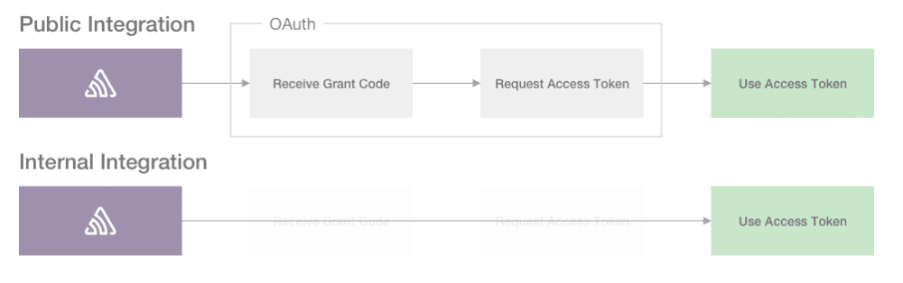

Internal integrations are meant for custom integrations unique to your organization. They can also be as simple as an organization-wide token. Whether you are using just the API or all the Integration Platform features combined, internal integrations are for use within a single Sentry organization.

Internal integrations don't require an OAuth flow. You receive an org-wide Auth Token immediately after creation.

For an example of how to build an internal integration, see [our Round Robin Issue Assignment integration](https://blog.sentry.io/2019/11/21/customize-your-sentry-workflow-a-sample-internal-integration) (or jump straight to [the code on GitHub](https://github.com/getsentry/sentry-round-robin)).

## Installation

Creating an internal integration will automatically install it on your organization.

## Auth Tokens

Auth Tokens are referred to as _tokens_ in the Integration Platform. Auth tokens are passed using an auth header and are used to authenticate as a user account with the API. In the case of the Integration Platform, these tokens are used to authenticate as an application (with access to a specific organization) instead of a user.

When you create an internal integration, a token is automatically generated. Should you need multiple tokens, or you need to get a new one, you can go to **Settings > Developer Settings > [Your Internal Integration]** and do so.

You can have up to 20 tokens at a time for each internal integration.

## Using Tokens for Requests

When making requests to the Sentry API, you use the token just like you would when you're typically making [API requests](/api/auth/). Tokens are associated with the Sentry organization that created the integration and are automatically installed for that org.

## Token Expiration

Tokens for internal integrations never expire, but you can manually revoke them.

