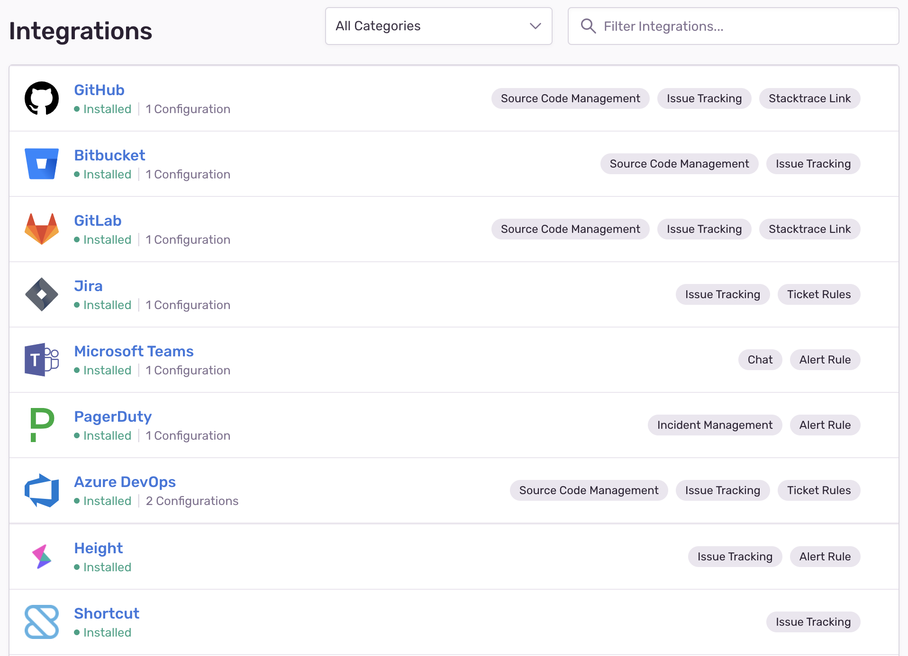

Public integrations are for the "general public" of Sentry users. These start in an unpublished state for development purposes and can be submitted later for approval to publish. For more information, check out the [section on Publishing](#published-state).

The code examples in the sections below demonstrate a potential use-case that involves a Flask app receiving new issue webhooks from Sentry, calling the Sentry API for more data about the issue, and pushing it to Pushover as a generator of desktop/mobile notifications.

## Installation

Users will have the option to install your integrations on the **Integrations** page in [sentry.io](https://sentry.io). If your integration is still in an unpublished state, the only Sentry organization that will be able to see or install it will be the organization that created the integration. Once published, clicking the name of the integration will allow users to see a description of your integration and the permissions that will be granted if the user chooses to install.



## OAuth Process

After installation, if your user has approved all permissions, Sentry will generate a grant code and an installation ID. This information is sent by way of the `installation.created` webhook to the webhook URL specified in your configuration.

However, if your integration has a redirect URL configured, the integration redirects the user’s browser to the configured URL with the grant code and installation ID in the query params.

Start building your integration by implementing the redirect URL endpoint, `/setup` — typically where you exchange the grant code for a token that allows you to make API calls to Sentry:

```python
import requests
from flask import redirect, request

@app.route('/setup', methods=['GET'])
def setup():
    code = request.args.get('code')
    install_id = request.args.get('installationId')

    url = u'https://sentry.io/api/0/sentry-app-installations/{}/authorizations/'
    url = url.format(install_id)

    payload = {
        'grant_type': 'authorization_code',
        'code': code,
        'client_id': 'your-client-id',
        'client_secret': 'your-client-secret',
    }

    resp = requests.post(url, json=payload)
    data = resp.json()

    token = data['token']
    refresh_token = data['refreshToken']
    # ... Securely store the install_id, token and refresh_token in DB ...

    return redirect('https://sentry.io/settings/')
```

## Token Exchange

In the initial installation, you'll need the grant code given to you in either the installation webhook request or the redirect URL, in addition to your integration's client ID and client Secret:

```python
url = u'https://sentry.io/api/0/sentry-app-installations/{}/authorizations/'
url = url.format(install_id)

payload = {
    'grant_type': 'authorization_code',
    'code': code,
    'client_id': 'your-client-id',
    'client_secret': 'your-client-secret',
}
```

Tokens expire after eight hours, so you'll need to refresh your tokens accordingly:

```python
url = u'https://sentry.io/api/0/sentry-app-installations/{}/authorizations/'
url = url.format(install_id)

refresh_token = retrieve_refresh_token_from_db(install_id)

payload = {
    'grant_type': 'refresh_token',
    'refresh_token': refresh_token,
    'client_id': 'your-client-id',
    'client_secret': 'your-client-secret',
}
```

The data you can expect back for both the initial grant code exchange and subsequent token refreshes is as follows:

```json
{
  "id": "38",
  "token": "ec48bf98637d44c294ead7566513686237e74ab67a074c64b3aaca2d93dbb8f1",
  "refreshToken": "c866f154a65841638d44ee26364409b0a1a67bd642bd46e7a476f34f810712d6",
  "dateCreated": "2019-08-07T20:25:09.870Z",
  "expiresAt": "2019-08-08T04:25:09.870Z",
  "state": null,
  "application": null
}
```

## Auth Tokens

Auth Tokens are referred to as _tokens_ in the Integration Platform. Auth tokens are passed using an auth header and are used to authenticate as a user account with the API. In the case of the Integration Platform, these tokens are used to authenticate as an application (with access to a specific organization) instead of a user.


## Using Tokens for Requests

When making requests to the Sentry API, you use the token just like you would when you're making typical [API requests](/api/auth/). Tokens are associated with the installation, meaning they have access to the Sentry organization that installed your integration.

## Token Expiration

Tokens for public integrations expire every eight hours.

## Refreshing Tokens

The tokens you receive from Sentry expire after eight hours. To retrieve a new token, make a request to the same Authorization endpoint used in the setup endpoint above, but with a slightly different request body:

```python
def refresh_token(install_id):
    url = u'https://sentry.io/api/0/sentry-app-installations/{}/authorizations/'
    url = url.format(install_id)

    refresh_token = retrieve_refresh_token_from_db(install_id)

    payload = {
        'grant_type': 'refresh_token',
        'refresh_token': refresh_token,
        'client_id': 'your-client-id',
        'client_secret': 'your-client-secret',
    }

    resp = requests.post(url, json=payload)
    data = resp.json()

    new_token = data['token']
    new_refresh_token = data['refreshToken']
    # ... Securely update the token and refresh_token in DB...

    return new_token
```

Instead of keeping track of times and passively refreshing when a token expires, another way you can handle refreshing tokens is to actively capture exceptions raised by requests that receive a 401 unauthorized response from Sentry, refresh the token, and remake the request.

### Verifying Installations (optional)

Typically, if you have the redirect URL configured, there is work happening on your end to "finalize" the installation. If this is the case, we recommend enabling the "Verify Install" option for your integration. Once enabled, you'll need to send a request marking the installation as officially "installed":

```python
requests.put(
    u'https://sentry.io/api/0/sentry-app-installations/{}/'.format(install_id),
    json={'status': 'installed'},
)
```


## Uninstallation

When a user uninstalls your integration, you'll receive a webhook request to your webhook URL.

## Integration Webhooks

In addition to the [un]installation webhook requests, all of the webhooks that you selected when configuring your integration will be routed to your webhook URL.

Continuing from our example, here we're implementing the webhook URL endpoint, `/webhook`. In this case, that includes when an issue is created. In this method, you'll use the Sentry API to check if the issue belongs to a project called "Backend", and if it does, you'll forward the issue to Pushover:

```python
@app.route('/webhook', methods=['POST'])
def webhook():
    data = json.loads(request.data)

    if data['action'] != 'created':
        return

    issue_id = data['data']['issue']['id']
    install_id = data['installation']['uuid']

    issue_details = get_sentry_issue(install_id, issue_id)

    if issue_details['project']['name'] != 'Backend':
        return

    event = data['data']['event']

    payload = {
        'user': 'pushover-user-key',
        'token': 'pushover-api-token',
        'message': event['message'][:1024],
        'title': event['message'][:250],
        'url': event['url'],
        'url_title': 'Issue Details',
        'priority': 0,
    }
    requests.post('https://api.pushover.net/1/messages.json', data=payload)

def get_sentry_issue(install_id, issue_id):
    token = retrieve_from_db(install_id)

    url = u'https://sentry.io/api/0/issues/{}/'.format(issue_id)
    headers = {'Authorization': u'Bearer {}'.format(token)}

    resp = requests.get(url, headers=headers)
    return resp.json()
```

For more information, check out the [full documentation on Webhooks](/product/integrations/integration-platform/webhooks/).

## Published State

When you're ready for the publication process, click "Publish" next to the integration you want to submit. This sends an email to partners@sentry.io, letting us know your integration is ready for review:


