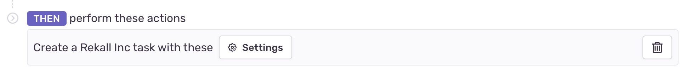
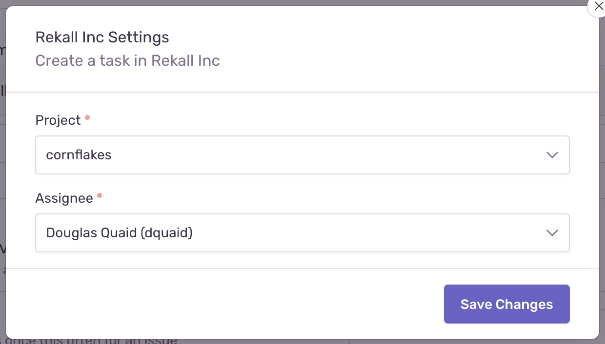

The alert rule action component gives you to access to parameters to define routing or configuration in alert rules for your service. When alert rules are triggered for a user, the configured service will receive [issue alert](/product/integrations/integration-platform/webhooks/issue-alerts) and [metric alert](/product/integrations/integration-platform/webhooks/metric-alerts) webhook events, with the specified settings for that service, to further route the alert.





## Schema

```json {filename:schema.json}
{
  "elements": [
    {
      "type": "alert-rule-action",
      "title": <String>,
      "settings": {
        "type": "alert-rule-settings",
        "uri": <URI>,
        "required_fields": <Array<FormField>>,
        "optional_fields": <Array<FormField>>,
        "description": <String>
      }
    }
  ]
}
```

## Attributes

- `title` - (Required) The title shown in the UI component.
- `uri` - (Required) Sentry will make a POST request to the URI when the User submits the form. If the services fails to process the request (status code >= 400), this component will bubble up the error to the User with the provided response text. Check out our [URI Guidelines](/product/integrations/integration-platform/ui-components/#uri-guidelines) documentation for formatting help.
- `required_fields` - (Required) List of [FormField](/product/integrations/integration-platform/ui-components/formfield) components the User is required to complete.
- `optional_fields` - (Optional) List of [FormField](/product/integrations/integration-platform/ui-components/formfield) components the User may complete.
- `description` - (Optional) Text that will be displayed above the form. Limited to 140 characters.

## Example

```json {filename:schema.json}
{
  "elements": [
    {
      "type": "alert-rule-action",
      "title": "Create a Rekall Inc task",
      "settings": {
        "type": "alert-rule-settings",
        "uri": "/sentry/alert-rule",
        "required_fields": [
          {
            "type": "select",
            "label": "Project",
            "name": "project",
            "options": [["1", "cornflakes"]]
          },
          {
            "type": "select",
            "label": "Assignee",
            "name": "assignee",
            "uri": "/sentry/alert-rule/options/users/"
          }
        ]
      }
    }
  ]
}
```

## Issue Alert Request Format

When an issue alert fires, your service will need to read the settings from the alert payload. The `settings` are in `data.issue_alert.settings`. Check out the full [Issue Alert webhook documentation](/product/integrations/integration-platform/webhooks/issue-alerts) for more information.

```json
{
  ...
  "data": {
    ...
    "issue_alert": {
      ...
      "settings": [
        {
          "name": "title",
          "value": "Ticket Title"
        },
        {
          "name": "description",
          "value": "Ticket Description"
        }
      ]
    }
  }
}
```

## Metric Alert Request Format

When a metric alert fires, your service will need to read the settings from the alert payload. The `settings` in this example are nested in `data.metric_alert.alert_rule.triggers[1].actions[0].settings`. You will have to identify which trigger and action contains your settings based on the webhook type, so `triggers[1]` and `actions[0]` may not be accurate in your case. Check out the full [Metric Alert webhook documentation](/product/integrations/integration-platform/webhooks/metric-alerts) for more information.

```json
{
  ...
  "data": {
    ...
    "metric_alert": {
      ...
      "alert_rule": {
        ...
        "triggers": [
          ...
          {
            ...
            "actions": [
              {
                ...
                "settings": [
                  {
                    "name": "title",
                    "value": "Critical Trigger"
                  },
                  {
                    "name": "description",
                    "value": "Critical Description"
                  }
                ]
              }
            ]
          }
        ]
      }
    }
  }
}
```

## Surfacing Errors

If a user setting up an alert rule action with your app tries to save an incorrect or malformed configuration, you can surface the errors to them directly in [sentry.io](https://sentry.io) by responding to the POST request with a JSON response in this shape:

```json
{ "message": "Channel no longer exists!" }
```

Alternately, if an error code (40x, 50x) is returned, we will show a generic error message. If an error occurs, the user will not be able to save the alert rule.
