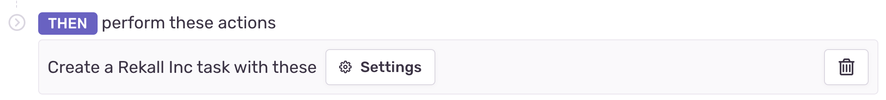

The Alert Rule Action component allows the developer to get parameters to define routing or configuration in alert rules for their service. When alert rules are triggered for a user, the configured service will receive [Issue Alert](/product/integrations/integration-platform/webhooks/#issue-alerts) and [Metric Alert](/product/integrations/integration-platform/webhooks/#metric-alerts) webhook events with the specified settings for that service to further route the alert.




## Schema

```json
{
  "type": "alert-rule-action",
  "title": <String>,
  "settings": {
    "type": "alert-rule-settings",
    "uri": <URI>,
    "required_fields": <Array<FormField>>,
    "optional_fields": <Array<FormField>>,
    "description": <String>
  }
}
```

## Attributes

- `title` - (Required) The title shown in the UI component.
- `uri` - (Required) Sentry will make a POST request to the URI when the User submits the form. If the services fails to process the request (status code >= 400), this component will bubble up the error to the User with the provided response text.
- `required_fields` - (Required) List of [FormField](/product/integrations/integration-platform/ui-components/formfield) components the User is required to complete.
- `optional_fields` - (Optional) List of [FormField](/product/integrations/integration-platform/ui-components/formfield) components the User may complete.
- `description` - (Optional) Text that will be displayed above the form. Limited to 140 characters.

## Example

```json

"elements": [
  {
    "type": "alert-rule-action",
    "title": "Send Alerts to",
    "settings": {
      "type": "alert-rule-settings",
      "uri": "/sentry/alert-rule",
      "required_fields": [
        {
          "type": "text",
          "label": "Channel",
          "name": "channel"
        }
      ]
    }
  }
]
```


## Issue Alert Request Format

When an issue alert fires, your service will need to read the settings from the alert payload. The `settings` are in `data.issue_alert.settings`. See the full [Issue Alert webhook documentation](/product/integrations/integration-platform/webhooks/#issue-alerts) for more information.

### Payload

```json
{
  ...
  "data": {
    ...
    "issue_alert": {
      ...
      "settings": [
        {
          "name": "title",
          "value": "Ticket Title"
        },
        {
          "name": "description",
          "value": "Ticket Description"
        }
      ]
    }
  }
}
```

## Metric Alert Request Format

When a metric alert fires, your service will need to read the settings from the alert payload. The `settings` in this example are nested in `data.metric_alert.alert_rule.triggers[1].actions[0].settings`. There may be multiple `actions` and the index may not be 0 in your case. See the full [Metric Alert webhook documentation](/product/integrations/integration-platform/webhooks/#metric-alerts) for more information.

### Payload

```json
{
  “data”: {
    ...
    “metric_alert”: {
      ...
      “alert_rule”: {
        ...
        “triggers”: [
          ...
          {
            ...
            “actions”: [
              {
                ...
                “settings”: [
                  {
                    “name”: “title”,
                    “value”: “Critical Trigger”
                  },
                  {
                    “name”: “description”,
                    “value”: “Critical Description”
                  }
                ],

              }
            ]
          },
        ],

      },
    },
  },
}
```

### Alert Rule Creation Error Handling

When surfacing errors, we need to receive a JSON response with this shape:

```json
{message: string}
```

If data is not received as expected, nothing will be shown.
