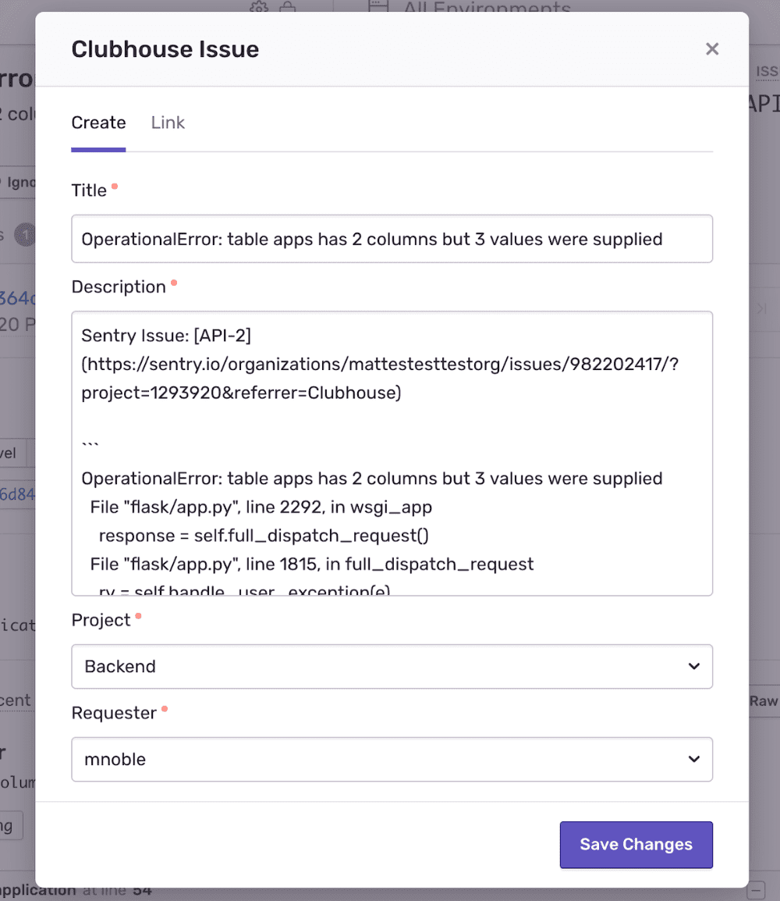
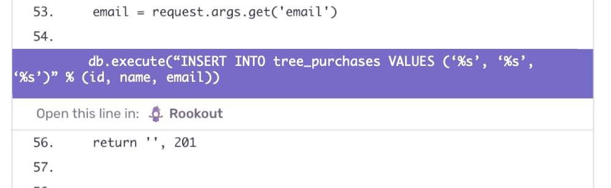
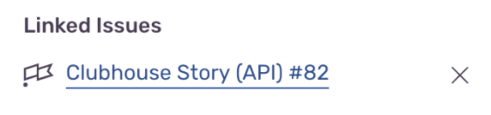

The Sentry Integration Platform provides developers with the ability to define User Interface components to render within specific parts of Sentry's UI, through a JSON-based schema. Two possible use-cases are [Issue Link](#issue-link) and [Stack Trace Link](#stack-trace-link).

# Schema

The UI components are specified in the schema section of integration details. The required form of this schema is:

```js
{
    "elements": [
        // Each element is a specification for a component the developer wants to use.
        ...
    ]
}
```

# Component Details

## Issue Link

With issue linking, the developer can connect Sentry issues with a task in their project management system. This functionality provides a way to use any project management tool the developer uses or develops.

The Issue Link component displays "Link &lt;Service&gt; Issue" in the Issue sidebar, which opens a modal allowing the user to create or link the issue to a task in the external service. For example, this is what our Clubhouse integration looks like.



### Schema

```js
{
    "type": "issue-link",
    "link": {
        "uri": <String>,
        "required_fields": <Array<FormField>>,
        "optional_fields": <Array<FormField>>
    },
    "create": {
        // Same as "link" schema
    }
}
```

### Attributes of the link and create fields

- uri - (Required) The URI to request when the User submits the Link/Create Issue form.
- required_fields - (Required) List of `FormField` components the User is required to complete.
- optional*fields - List of optional `Form Field` components the User \_may* complete.

A `FormField` can be one of three types (which behave like their HTML equivalents) — `Select`, `Text`, and `TextArea,` described below.

## Select

```js
{
    "type": "select",
    "label": <String>,
    "name": <String>,
    "uri": <URI>,
    "async": <Bool>,
    "options": <Array<String, String>>,
    "depends_on": <Array<String>> (optional)
}
```

### Attributes

- label - (Required) Label text to be rendered for the form field
- name - (Required) Value to use in `name` attribute of the field
- uri -(Required if developer doesn't provide `options`) URI to retrieve values from.
- async - (Optional) Used only if `uri` is present. If true (default), will query the URI as the user types, for autocomplete suggestions (see response format below). If false, will query the URI once initially to retrieve all possible options. This request _must_ succeed, and the response _must_ return data in the format Sentry expects, otherwise the entire component won't render.
- options - (Required if developer doesn't provide `uri`) Static list of options in the format of [label, value]
- depends_on - (Optional) If a field value depends on the value of another field, a request will be made to load those options when the dependent field is set.
- skip_load_on_open (Optional) If true, this field will not load options when the page loads. Instead, it will wait for the user to start typing before fetching options.

### URI Request Format

The request sent to the `uri` to load options is a `GET` request. The parameters are encoded into the query parameters as such:

```js
{
    "installationId": <String>,
    "projectSlug": <String>,
    "query": <String>,
    "dependentData": <String> (optional),
}
```

- installationId - The ID of the installation associated with the request
- projectSlug - The slug of the project in Sentry
- query - The search term the user is typing
- dependentData - A JSON encoded string of the dependent data if that field has `depends_on` set

### URI Response Format

Response from `uri`, when specified, _must_ be in the following format:

```js
[
    {
        "label": <String>,
        "value": <String>,
        "default": <Bool>, (optional)
    },
    ...
]
```

## Text

### Schema

```js
{
    "type": "text",
    "label": <String>,
    "name": <String>,
    (optional) default: <String>,
}
```

### Attributes

- label - (Required) Label text to be rendered for the form field
- name - (Required) Value to use in `name` attribute of the field
- default - default to pre-populate with. Options include `issue.title` and `issue.description`
  - `issue.title` - title of the Sentry issue
  - `issue.description` - description of the Sentry issue

## Textarea

### Schema

```js
{
    "type": "textarea",
    "label": <String>,
    "name": <String>,
    (optional) default: <String>,
}
```

### Attributes

- label - (Required) Label text to be rendered for the form field
- name - (Required) Value to use in `name` attribute of the field
- default - default to pre-populate with options include `issue.title` and `issue.description`
  - `issue.title` - title of the Sentry issue
  - `issue.description` - description of the Sentry issue

### Example of a complete issue-link schema

```js
{
    "elements": [
        {
            "type": "issue-link",
            "link": {
                "uri": "/sentry/issues/link",
                "required_fields": [
                    {
                        "type": "select",
                        "label": "Issue",
                        "name": "issue_id",
                        "uri": "/sentry/issues"
                    }
                ]
            },
            "create": {
                "uri": "/sentry/issues/create",
                "required_fields": [
                    {
                        "type": "text",
                        "label": "Title",
                        "name": "title"
                    }
                ],
                "optional_fields": [
                    {
                        "type": "select",
                        "label": "Owner",
                        "name": "owner",
                        "uri": "/sentry/members",
                        "async": true
                    }
                ]
            }
        }
    ]
}
```

## Stack Trace Link

This feature allows the developer to insert a link within a stack trace frame. The link contains details about the project, file, line number, etc. It can also be used to view the file on another website, continue debugging in a different monitoring tool, etc. For example, this is what our Rookout integration looks like using stack trace linking.



### Schema

```js
{
    "type": "stacktrace-link",
    "uri": <URI>,
}
```

### Attributes

- `uri` - (Required) The link destination. Sentry will automatically add the following query params to the link.
- `installationId` - Your integration's installation ID (helps you determine the requesting Sentry org)
- `projectSlug` - slug of the project the issue belongs to
- `filename` - full path of the stack frame file
- `lineNo` - line number of the stack trace in the file

### Example

```js
"elements": [
    {
        "type": "stacktrace-link",
        "uri": "/stacktrace-redirect",
    }
]
```

Any time a component supports a `uri` attribute, Sentry will make a request to the third-party service using the Base URL or their `webhook_url`.

For a more complete description of the grammar, see the [source code](https://github.com/getsentry/sentry/blob/master/src/sentry/api/validators/sentry_apps/schema.py).

# Create/Link Issue

If you have a UI component for issue linking and a user attempts to create or link an issue, it will send a request to your service based on the `uri` you provide.

## Request Format

The request that is sent is a `POST` request, so all the information is stored in the body.

### Schema

```js
{
    "fields": <Object>,
    "installationId": <String>,
    "issueId": <String>,
    "webUrl": <String>,
    "project": {"slug": <String>, "id": <String>},
    "actor": {"type": "user", "name": <String>, "id": <String>},
}
```

### Attributes

- `fields` - Key/value pairs of the data in the form fields
- `installationId` - The ID of the installation associated with the request
- `issueId` - The ID of the issue in Sentry
- `webUrl` - The URL of the issue in Sentry
- `project`:
  - `slug` - The slug of the project in Sentry
  - `id` - The ID of the project in Sentry
- `actor`:
  - `name` - The name of the user in Sentry
  - `id` - The ID of user in Sentry

## Response Format

When creating or linking an issue, the response format _must_ have the following schema:

### Schema

```js
{
    "webUrl": <String>,
    "project": <String>,
    "identifier": <String>,
}
```

### Attributes

- `webUrl`: The URL of the linked issue in your project management system
- `project`: The first part of the displayed issue that should probably be associated with a project in your system
- `identifier`: The second part of the displayed issue that should be unique to the project

When an external issue is created or linked in Sentry, Sentry shows a display name that links back to the service where it was either created or linked. The display name is composed of two pieces: the `project` and the `identifier`. A hash (#) connects each piece. Here's an example of what it looks like in Sentry:



# Supplementary Information

## Error Handling

Component rendering either 100% works or shows nothing. To protect the integration from looking chaotic due to errors we have no control over; if any part of the third-party component rendering fails, nothing will render.
