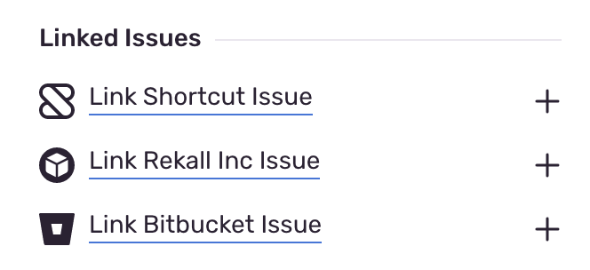
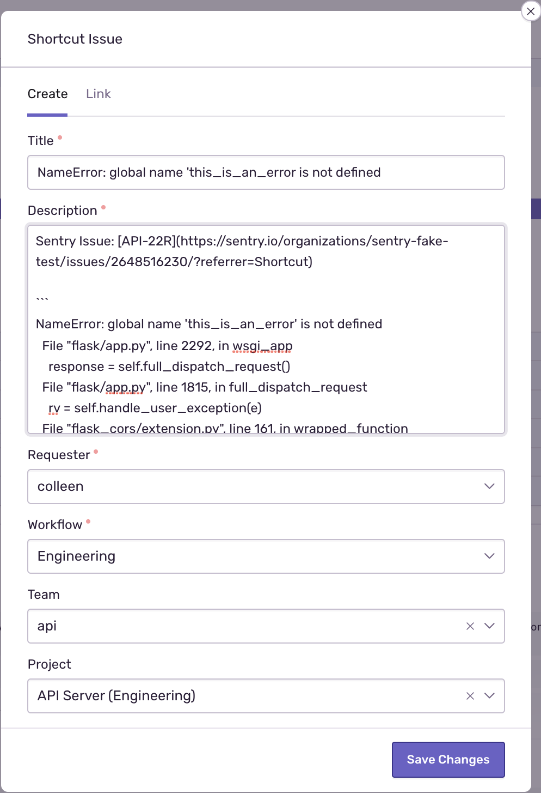
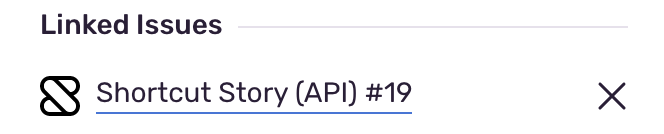

With an issue linking UI component, you can connect Sentry issues with a task in your project management system. This functionality provides a way to use any project management tool you use or develop.

The issue link component displays with the text "Link &lt;Service&gt; Issue" in the **Issue Details** sidebar:



Clicking the link opens a modal allowing the user to create or link the issue to a task in the external service:


When an external issue is created or linked in [sentry.io](https://sentry.io), a display name is shown that links back to the service where it was either created or linked. The display name is composed of two pieces: the `project` and the `identifier`. A hash (#) connects each piece. Here's an example of what it looks like in [sentry.io](https://sentry.io):



## Schema

```json {filename:schema.json}
{
  "elements": [
    {
      "type": "issue-link",
      "link": {
        "uri": <String>,
        "required_fields": <Array<FormField>>,
        "optional_fields": <Array<FormField>>
      },
      "create": {
        // Same as "link" schema
      }
    }
  ]
}
```

## Attributes

- `uri` - (Required) The URI to request when the User submits the Link/Create Issue form. Check out our [URI Guidelines](/product/integrations/integration-platform/ui-components/#uri-guidelines) documentation for formatting help.
- `required_fields` - (Required) List of [FormField](/product/integrations/integration-platform/ui-components/formfield) components the User is required to complete.
- `optional_fields` - (Optional) List of [FormField](/product/integrations/integration-platform/ui-components/formfield) components the User may complete.

## Example

```json {filename:schema.json}
{
  "elements": [
    {
      "type": "issue-link",
      "link": {
        "uri": "/sentry/issues/link",
        "required_fields": [
          {
            "type": "select",
            "label": "Issue",
            "name": "issue_id",
            "uri": "/sentry/issues"
          }
        ]
      },
      "create": {
        "uri": "/sentry/issues/create",
        "required_fields": [
          {
            "type": "text",
            "label": "Title",
            "name": "title"
          }
        ],
        "optional_fields": [
          {
            "type": "select",
            "label": "Owner",
            "name": "owner",
            "uri": "/sentry/members",
            "async": true
          }
        ]
      }
    }
  ]
}
```

## Request Format

When a user attempts to create or link an issue, we will send a request to your service based on the provided `uri`. We send a `POST` request, so all the information is stored in the body.

```json
{
  "fields": <Object>,
  "installationId": <String>,
  "issueId": <String>,
  "webUrl": <String>,
  "project": {"slug": <String>, "id": <String>},
  "actor": {"type": "user", "name": <String>, "id": <String>},
}
```

### Attributes

- `fields` - Key/value pairs of the data in the form fields
- `installationId` - The ID of the installation associated with the request
- `issueId` - The ID of the issue in Sentry
- `webUrl` - The URL of the issue in Sentry
- `project`
  - `slug` - The slug of the project in Sentry
  - `id` - The ID of the project in Sentry
- `actor`
  - `name` - The name of the user in Sentry
  - `id` - The ID of user in Sentry

## Response Format

When creating or linking an issue, the response format _must_ have the following schema:

```json
{
  "webUrl": <String>,
  "project": <String>,
  "identifier": <String>,
}
```

### Attributes

- `webUrl`- The URL of the linked issue in your project management system
- `project`- The first part of the displayed issue that should probably be associated with a project in your system
- `identifier`- The second part of the displayed issue that should be unique to the project
