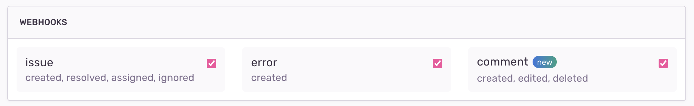

<Note>

We've built a [reference implementation](https://github.com/getsentry/integration-platform-example) to help you get started with building on Sentry's integration platform! Check it out for realistic code examples for these adding features in Python and TypeScript. See the [quick start](/product/integrations/integration-platform/#quick-start) for more info.

</Note>

Webhooks allow your service to receive requests about specific resources, depending on your selection, such as installation, issues, and alerts:



## Headers

All webhooks will contain the following set of request headers:

```json
{
  "Content-Type": "application/json",
  "Request-ID": "<request_uuid>",
  "Sentry-Hook-Resource": "<resource>",
  "Sentry-Hook-Timestamp": "<timestamp>",
  "Sentry-Hook-Signature": "<generated_signature>"
}
```

The `Sentry-Hook-Resource` and `Sentry-Hook-Signature` are described below.

### `Sentry-Hook-Resource`

This is the resource that triggered the action. The action will be in the payload. The possible resources are listed below:

- `installation`
- `event_alert`
- `issue`
- `metric_alert`
- `error`
- `comment`

### `Sentry-Hook-Signature`

A hash generated using your Client Secret and the request itself. Used to verify the authenticity of the request.

#### Verifying the Signature

```javascript
const crypto = require("crypto");

function verifySignature(request, secret = "") {
  const hmac = crypto.createHmac("sha256", secret);
  hmac.update(JSON.stringify(request.body), "utf8");
  const digest = hmac.digest("hex");
  return digest === request.headers["Sentry-Hook-Signature"];
}
```

```python
import hashlib
import hmac
import json

expected_digest = request.headers['sentry-hook-signature']
body = json.dumps(request.body)

digest = hmac.new(
    key=client_secret.encode('utf-8'),
    msg=body,
    digestmod=hashlib.sha256,
).hexdigest()


if digest != expected_digest:
    raise UnauthorizedError
```

## Request Structure

All webhook requests have some common elements.

`action`

: The action that corresponds with the [resource](#sentry-hook-resource) in the header. For example, if the resource is `issue` the action could be `created`.

`installation`

: An object with the `uuid` of the installation so that you can map the webhook request to the appropriate installation.

`data`

: The data object contains information about the [resource](#sentry-hook-resource) and will differ in content depending on the type of webhook. This payload may be able to be customized via [UI components](/product/integrations/integration-platform/ui-components).

`actor`

: The actor is who, if anyone, triggered the webhook. If a user in Sentry triggered the action, the actor is the user. If the Sentry integration itself triggers the action, the actor is the integration. If the action is triggered automatically within Sentry, the actor is "Sentry".

```python
# Sample cases:

# User installs Sentry integration
"actor": {
    "type": "user",
    "id": <user-id>,
    "name": <user-name>,
}

# Sentry integration makes request to assign an issue
"actor": {
    "type": "application",
    "id": <sentry-app-uuid>,
    "name": <sentry-app-name>,
}

# Sentry (sentry.io) auto resolves an issue
"actor": {
    "type": "application",
    "id": "sentry",
    "name": "Sentry",
}
```

## Event Types

- [Installation](/product/integrations/integration-platform/webhooks/installation/)

- [Issue Alerts](/product/integrations/integration-platform/webhooks/issue-alerts/)

- [Metric Alerts](/product/integrations/integration-platform/webhooks/metric-alerts/)

- [Issues](/product/integrations/integration-platform/webhooks/issues/)

- [Comments](/product/integrations/integration-platform/webhooks/comments/)

- [Errors](/product/integrations/integration-platform/webhooks/errors/)
