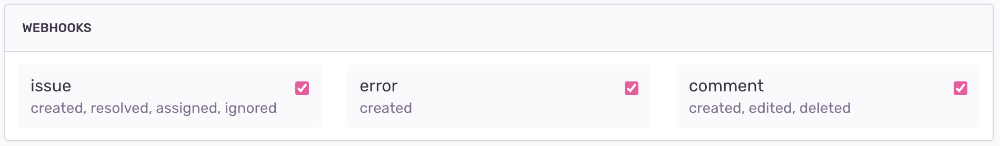

<Note>

We've built an [example application](https://github.com/getsentry/integration-platform-example) to help you get started with building on Sentry's integration platform. Check it out for useful code snippets for adding these features in Python and TypeScript. See the [docs](/product/integrations/integration-platform/#example-app) for more information.

</Note>

Webhooks are a mechanism for communication between two applications or services over the web. They allow one application to send automatic notifications or data updates to another application in near real-time. The concept is based on HTTP callbacks, where an HTTP POST request is sent to a specific URL (an HTTP endpoint in your tech stack) with a payload. Sentry offers JSON webhooks as a way to receive error notifications to your systems or services.



## Headers

Webhooks dispatched from Sentry encompass supplementary details that facilitate various functionalities. These webhooks consistently comprise four integral HTTP headers:

```json
{
  "Content-Type": "application/json",
  "Request-ID": "<request_uuid>",
  "Sentry-Hook-Resource": "<resource>",
  "Sentry-Hook-Timestamp": "<timestamp>",
  "Sentry-Hook-Signature": "<generated_signature>"
}
```

The `Content-Type` header specifies the media type of the payload, indicating that it is in JSON format. The `Request-ID` header provides a unique identifier for tracking and debugging specific events. The `Sentry-Hook-Resource` and `Sentry-Hook-Signature` are described below.

### `Sentry-Hook-Resource`

This header denotes the specific resource that instigated the corresponding action. The payload encapsulates the details of the action triggered. The potential resources capable of triggering webhooks are enumerated below.

- `installation`
- `event_alert`
- `issue`
- `metric_alert`
- `error`
- `comment`

### `Sentry-Hook-Signature`

This header represents a cryptographic hash generated by employing your *Client Secret* in conjunction with the request itself. The primary purpose of this signature is to ascertain the genuineness of the request and verify its origin from Sentry servers. 

**Signature Verification**

The below code snippet facilitates validation of the signature value with the event payload.

```javascript
const crypto = require("crypto");

function verifySignature(request, secret = "") {
  const hmac = crypto.createHmac("sha256", secret);
  hmac.update(JSON.stringify(request.body), "utf8");
  const digest = hmac.digest("hex");
  return digest === request.headers["sentry-hook-signature"];
}
```

```python
import hashlib
import hmac
import json

expected_digest = request.headers.get('sentry-hook-signature')  # returns None if header is missing
body = json.dumps(request.body)

digest = hmac.new(
    key=client_secret.encode('utf-8'),
    msg=body,
    digestmod=hashlib.sha256,
).hexdigest()

if not expected_digest:  # The signature is missing
    raise UnauthorizedError

if not hmac.compare_digest(digest, expected_digest):
    raise UnauthorizedError
```

## Request Structure

All webhook requests have some common elements.

`action`

: The action that corresponds with the [resource](#sentry-hook-resource) in the header. For example, if the resource is `issue` the action could be `created`.

`installation`

: An object with the `uuid` of the installation so that you can map the webhook request to the appropriate installation.

`data`

: The data object contains information about the [resource](#sentry-hook-resource) and will differ in content depending on the type of webhook. This payload may be able to be customized via [UI components](/product/integrations/integration-platform/ui-components).

`actor`

: The actor is who, if anyone, triggered the webhook. If a user in Sentry triggered the action, the actor is the user. If the Sentry integration itself triggers the action, the actor is the integration. If the action is triggered automatically within Sentry, the actor is "Sentry".

```python
# Sample cases:

# User installs Sentry integration
"actor": {
    "type": "user",
    "id": <user-id>,
    "name": <user-name>,
}

# Sentry integration makes request to assign an issue
"actor": {
    "type": "application",
    "id": <sentry-app-uuid>,
    "name": <sentry-app-name>,
}

# Sentry (sentry.io) auto resolves an issue
"actor": {
    "type": "application",
    "id": "sentry",
    "name": "Sentry",
}
```

## Event Types

- [Installation](/product/integrations/integration-platform/webhooks/installation/)

- [Issue Alerts](/product/integrations/integration-platform/webhooks/issue-alerts/)

- [Metric Alerts](/product/integrations/integration-platform/webhooks/metric-alerts/)

- [Issues](/product/integrations/integration-platform/webhooks/issues/)

- [Comments](/product/integrations/integration-platform/webhooks/comments/)

- [Errors](/product/integrations/integration-platform/webhooks/errors/)


## Developing and Testing Webhooks

If you are new to working with Sentry webhooks and wish to test the configuration and examine webhook payloads, you can utilize HTTP catch-all services. [Beeceptor](https://beeceptor.com/) is an example of such a free service, offering a designated URL where you can receive HTTP payloads and subsequently inspect the JSON payload of the event. This feature proves valuable for gaining insights and gathering relevant information prior to commencing your development process.

Once you have reviewed payloads for the relevant event types, you can start the development of your service. Local tunnels are particularly useful for testing and debugging webhooks in a local environment before deploying them to a production server. By creating a tunnel, you can receive incoming webhook requests from Sentry to your local machine, eliminating the need for publicly accessible server development. This facilitates faster iteration and debugging, as you can directly observe and analyze the webhook payloads in your local development environment. You can use tools like [Beeceptor](https://beeceptor.com/) or [ngrok](https://ngrok.com/), specify the desired application port or address (e.g. 3000 or 8080) to be tunneled, and it will provide you with a temporary public URL that forwards requests to your local server.

