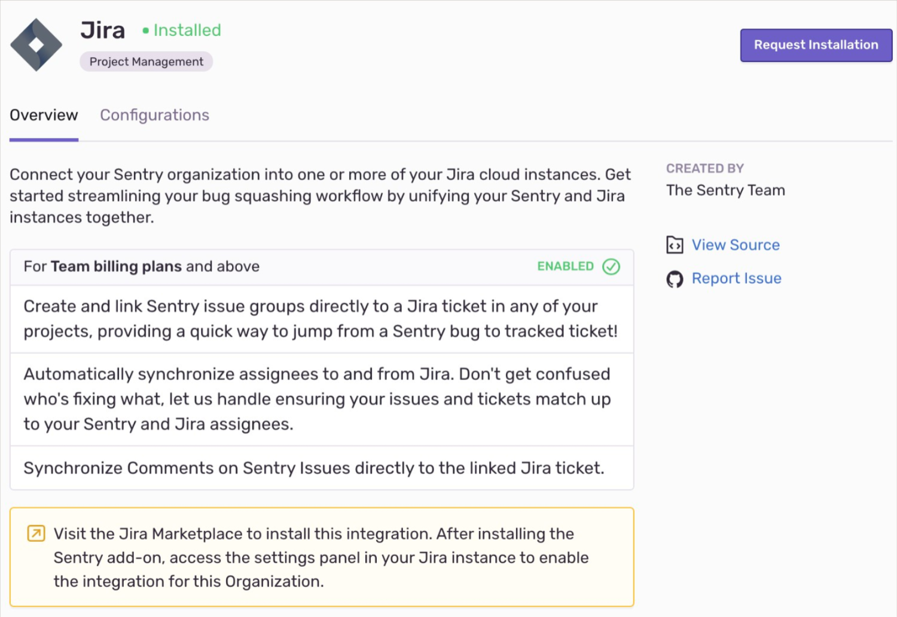
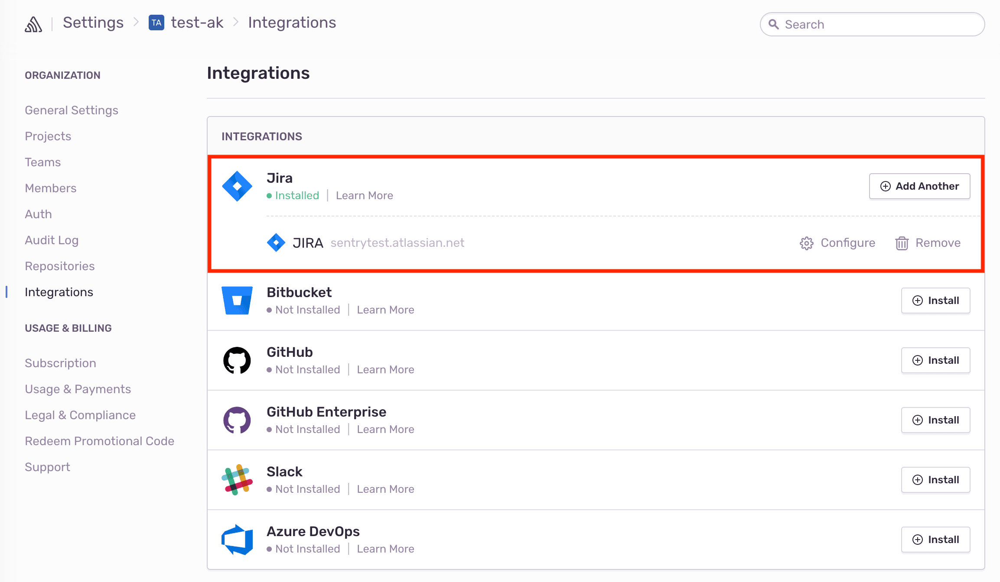
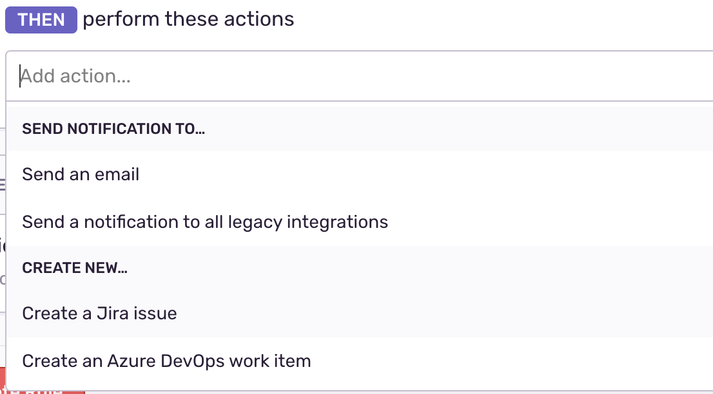
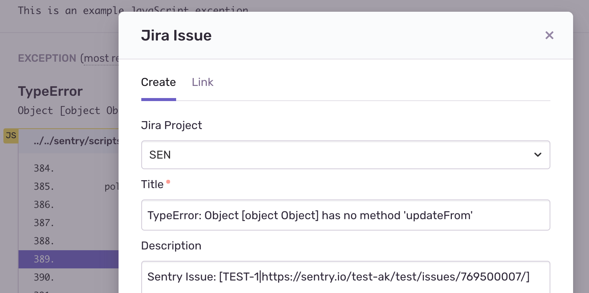
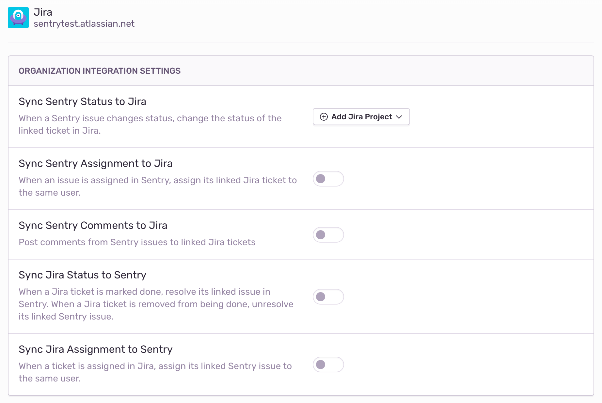
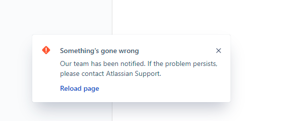

Track and resolve bugs faster by connecting errors from Sentry with Jira issues.

## Install

<Note>

Sentry owner, manager, or admin permissions, and Jira admin permissions are required to install this integration. This includes the following permissions: `read`, `write`, `act_as_user`, and `access_email_addresses`.

</Note>

1. Navigate to **Settings > Integrations > Jira**.



2. Install the Sentry app through the [Jira marketplace](https://marketplace.atlassian.com/apps/1219432/sentry-for-jira?hosting=cloud&tab=overview).

3. If you have an ad-blocker enabled, disable it now or you won't be able to complete step number 4.

4. Select which Sentry organizations you’d like to use with Jira. Then click the presented link to return to Sentry.

5. In Sentry, you’ll see a new Jira instance appear on the Integrations page.

   

Jira should now be authorized for all projects under your Sentry organization.

### Jira Server

#### Generate an RSA public/private key pair

To generate an RSA public/private key pair, run the following commands in your terminal window one by one.

```bash
openssl genrsa -out jira_privatekey.pem 1024
openssl req -newkey rsa:1024 -x509 -key jira_privatekey.pem -out jira_publickey.cer -days 365
openssl pkcs8 -topk8 -nocrypt -in jira_privatekey.pem -out jira_privatekey.pcks8
openssl x509 -pubkey -noout -in jira_publickey.cer  > jira_publickey.pem
```

#### Create a new application link in Jira

1. In Jira, click the gear icon, then **Applications > Application Links**.
1. Enter the following as the application URL:
   `https://sentry.io/extensions/jira-server/setup/`
1. Click "Create New Link". If you see a warning that “No response was received from the URL you entered,” ignore and click "Continue".
1. In the resulting dialog, fill out the form as follows:

   <table>
     <tr>
       <th>Application Name </th>
       <td>Sentry </td>
     </tr>
     <tr>
       <th>Application Type </th>
       <td>Generic Application</td>
     </tr>
     <tr>
       <th>Service Provider Name</th>
       <td>Sentry</td>
     </tr>
     <tr>
       <th>Consumer Key </th>
       <td>(your choice, but keep this handy for the next step)</td>
     </tr>
     <tr>
       <th>Shared Secret </th>
       <td>sentry</td>
     </tr>
     <tr>
       <th>Request Token URL </th>
       <td>https://sentry.io</td>
     </tr>
     <tr>
       <th>Access Token URL</th>
       <td>https://sentry.io </td>
     </tr>
     <tr>
       <th>Authorize URL </th>
       <td>https://sentry.io </td>
     </tr>
     <tr>
       <th>Create Incoming Link </th>
       <td>No </td>
     </tr>
   </table>

1. Click "Continue". This will return you to the **Configure Application Links** page, where you'll see an application called Sentry.
1. Click the pencil icon next to the Sentry application.
1. On the lefthand side of the resulting modal, click "Incoming Authentication". Fill out the form as follows, and press **Save**:

   <table>
     <tr>
       <th>Consumer Key </th>
       <td>(the consumer key from Step II.4) </td>
     </tr>
     <tr>
       <th>Consumer Name </th>
       <td>Sentry</td>
     </tr>
     <tr>
       <th>Public Key</th>
       <td>(the public key you created in Section I)</td>
     </tr>
     <tr>
       <th>Consumer Callback URL </th>
       <td>https://sentry.io/extensions/jira-server/setup/</td>
     </tr>
     <tr>
       <th>Allow 2-Legged OAuth </th>
       <td>no</td>
     </tr>
   </table>

#### Connect your Jira Server application with Sentry

<Note>

Confirm [Sentry's IP ranges](/product/security/ip-ranges/) are allowed.

</Note>

1. Navigate to **Organization Settings > Integrations**.
2. Next to Jira Server, click "Install".
3. In the resulting modal, click "Add Installation".
4. In the resulting window, enter the base URL for your Jira Server instance, your consumer key, and your private key. Click "Submit". Then, complete the OAuth process as prompted.
5. In Sentry, you’ll see a new Jira Server instance appear on the Integrations page.

Jira should now be authorized for all projects under your Sentry organization.

## Configure

Use Jira to leverage [issue management](#issue-management), [issue syncing](#issue-sync), and receive [notifications](#issue-notifications) about changes to issue status. Additionally, add [ignored fields](#ignored-fields) to hide specified fields in the issue creation form.

### Issue Management

Issue tracking allows you to create Jira issues from within Sentry, and link Sentry issues to existing Jira Issues.

<Alert title="Note" level="info">
  <p>
    Manual issue management is available to organizations on Team, Business, and
    Enterprise plans.
  </p>
  <p>
    Automatic issue management is available to organizations that include
    transactions in their Business and Enterprise plans.
  </p>
</Alert>

Issue management can be configured in two ways - automatically or manually.

#### Automatically

<Note>

This configuration method does not apply to Jira Server. Jira Server [requires manual configuration](#manually).

</Note>

To configure issue management automatically, create an [**Issue Alert**](/product/alerts-notifications/issue-alerts/). When selecting the [**action**](/product/alerts/create-alerts/issue-alert-config/#then-conditions-actions), choose **Create a new Jira issue**.



A Jira issue will be created automatically when the alert has been triggered.

#### Manually

To configure issue management manually, once you've navigated to a specific Sentry issue, you'll find the **Linked Issues** section on the right hand panel.


Here, you’ll be able to create or link Jira issues.



### Issue Sync

Sync comments, assignees, and status updates for issues in Sentry to Jira, to minimize duplication. When you delegate an issue to an assignee or update a status on Jira, the updates will also populate in Sentry. When you resolve an issue in Sentry, the issue status will automatically update in Jira.

<Alert title="Note" level="info">
  Issue sync is available for organizations on the Team, Business, and
  Enterprise plans.
</Alert>

To configure Issue sync, navigate to **Organization Settings** > **Integrations**, and click "Configure" next to your Jira Server instance. On the following page, you’ll see options of what information you’d like synced between Sentry and Jira.



<Alert title="Note" level="info">

If you hit a 4xx or 5xx error during or after setting up the Jira Server integration, see this [troubleshooting section](#receiving-a-4xx5xx-error-for-the-jira-server-integration).

</Alert>

### Issue Notifications

Alert notifications in Sentry can be routed to many supported integrations, but by default are aimed at email. You will need to configure a project’s [**Alert Rules**](/product/alerts-notifications/alerts/) to properly route notifications to a specific integration.

### Ignored Fields

Ignored fields are Jira fields that are hidden in the issue creation form. To add ignored fields, navigate to **Settings > Integrations** and click "Configure" next to your Jira instance. Then scroll down to “Ignored Fields” and enter a comma separated list of the Jira field IDs.

Field IDs are different from the labels on the issue creation form. If you need help finding a field's ID, check out the Atlassian docs [here](https://confluence.atlassian.com/jirakb/how-to-find-id-for-custom-field-s-744522503.html).

## Troubleshooting

### Trouble with Self-Hosted Sentry Installation

If you're having trouble setting up Self-Hosted Sentry, verify the following:

- The provided installation URL is a fully qualified domain name (FQDN), which is resolvable on the internet.
- The IP addresses Sentry uses to make outbound requests are [allowed](/product/security/ip-ranges/).
- Sentry's access to your installation URL is not path restricted.

### "Something went wrong" Message with JIRA on SaaS sentry.io Install



This issue typically occurs if you have an ad blocker blocking the conversation between JIRA and Sentry during setup. To remediate the issue, disable your ad blocker and go through the installation flow again.

### Can't Create Issues Using a Custom Required Field

We don’t support custom required fields for the Jira integration. The only required fields we support are the ones that are pre-populated by us. If possible, you can edit your required fields in Jira, or as a workaround, you can create a ticket in Jira first and then link it in Sentry.

### Receiving a 4xx/5xx Error for the Jira Server Integration

A `400` error is often generated because the Jira instance is not publicly accessible. Make sure your instance is routable (that is, our server can reach it!). If not, you’ll need to put your Jira instance on the internet so that we can reach it.

For a `500` error, unfortunately the reason can vary. This error means we couldn’t connect to your server from our server. For example, perhaps your proxy is not configured correctly, or not set to allow our IP. If you need to allow our IPs, you can find a list of our IP ranges [here](/product/security/ip-ranges/).

### Unable to find specific user when using Reporter field

Make sure the user has been added to the relevant project in Jira and has the [Assignable User permission](https://confluence.atlassian.com/jiracoreserver/permissions-overview-939937977.html).
