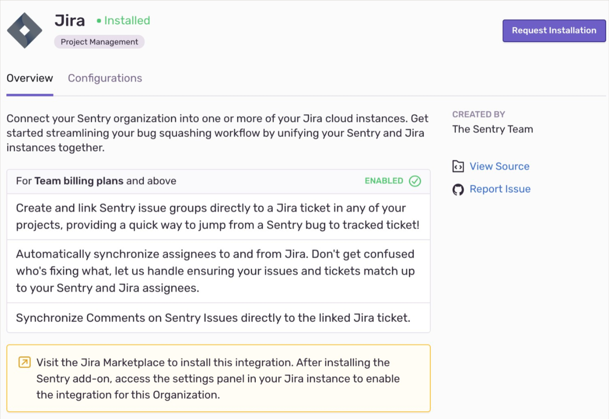
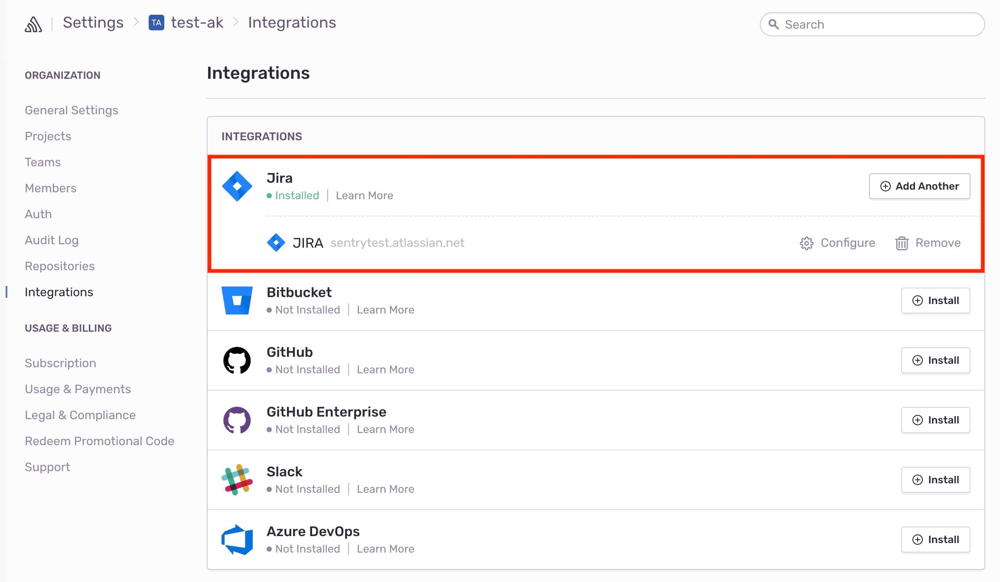
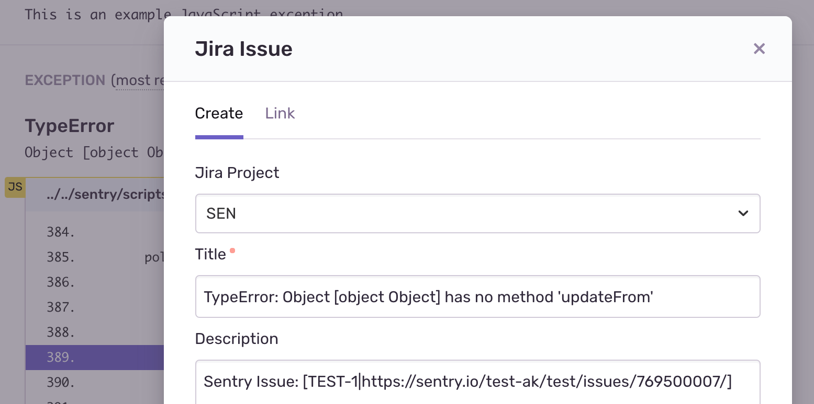
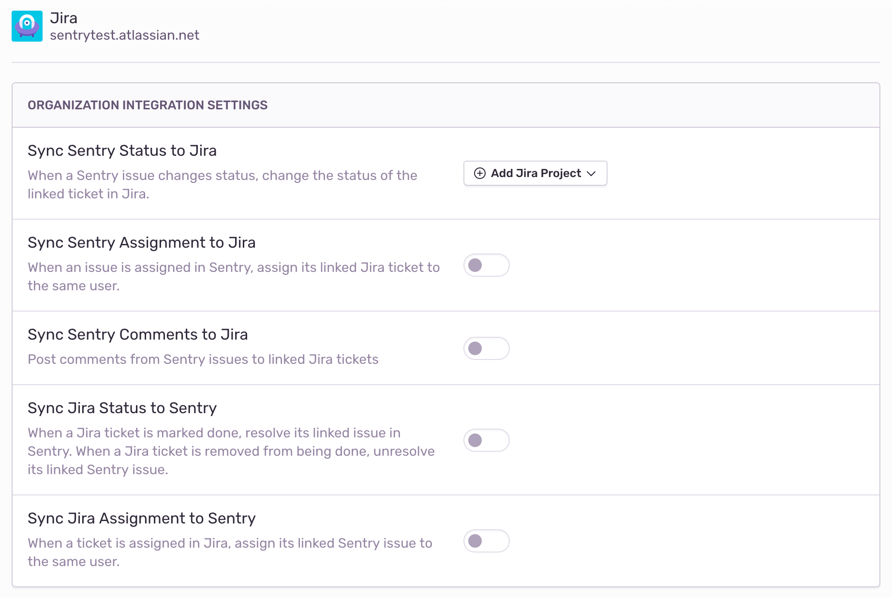

Track and resolve bugs faster by connecting errors from Sentry with Jira issues.

This integration needs to set up only once per organization, then it is available for _all_ projects.

## Install

<Alert title="Note" level="info">
Sentry owner or manager permissions, and Jira admin permissions are required to install this integration.
</Alert>

1. Navigate to **Settings > Integrations > Jira**.



2. Install the Sentry app through the [Jira marketplace](https://marketplace.atlassian.com/apps/1219432/sentry-for-jira?hosting=cloud&tab=overview).

3. Select which Sentry organizations you’d like to use with Jira, and **Save Settings**.

4. In Sentry, you’ll see a new Jira instance appear on the Integrations page.

   

Jira should now be authorized for all projects under your Sentry organization.

### Jira Server

#### Generate an RSA public/private key pair

To generate an RSA public/private key pair, run the following commands in your terminal window one by one.

```bash
openssl genrsa -out jira_privatekey.pem 1024
openssl req -newkey rsa:1024 -x509 -key jira_privatekey.pem -out jira_publickey.cer -days 365
openssl pkcs8 -topk8 -nocrypt -in jira_privatekey.pem -out jira_privatekey.pcks8
openssl x509 -pubkey -noout -in jira_publickey.cer  > jira_publickey.pem
```

#### Create a new application link in Jira

1. In Jira, click the gear icon, then **Applications > Application Links**.
1. Enter the following as the application URL:
   `https://sentry.io/extensions/jira_server/setup/`
1. Click "Create New Link". If you see a warning that “No response was received from the URL you entered,” ignore and click "Continue".
1. In the resulting dialog, fill out the form as follows:

   <table>
   <tr><th>Application Name                </th><td>Sentry       </td></tr>
   <tr><th>Application Type                  </th><td>Generic Application</td></tr>
   <tr><th>Service Provider Name</th><td>Sentry</td></tr>
   <tr><th>Consumer Key                      </th><td>(your choice, but keep this handy for the next step)</td></tr>
   <tr><th>Shared Secret                    </th><td>sentry</td></tr>
   <tr><th>Request Token URL                 </th><td>https://sentry.io</td></tr>
   <tr><th>Access Token URL</th><td>https://sentry.io   </td></tr>
   <tr><th>Authorize URL          </th><td>https://sentry.io   </td></tr>
   <tr><th>Create Incoming Link              </th><td>No   </td></tr>
   </table>

1. Click "Continue". This will return you to the **Configure Application Links** page, where you'll see an application called Sentry.
1. Click the pencil icon next to the Sentry application.
1. On the lefthand side of the resulting modal, click "Incoming Authentication". Fill out the form as follows, and press **Save**:

   <table>
   <tr><th>Consumer Key                </th><td>(the consumer key from Step II.4)       </td></tr>
   <tr><th>Consumer Name                  </th><td>Sentry</td></tr>
   <tr><th>Public Key</th><td>(the public key you created in Section I)</td></tr>
   <tr><th>Consumer Callback URL                      </th><td>https://sentry.io/extensions/jira_server/setup/</td></tr>
   <tr><th>Allow 2-Legged OAuth                    </th><td>no</td></tr>
   </table>

#### Connect your Jira Server application with Sentry

<Note>

Confirm [Sentry's IP ranges](/product/security/ip-ranges/) are allowed.

</Note>

1. Navigate to **Organization Settings > Integrations**.
2. Next to Jira Server, click "Install".
3. In the resulting modal, click "Add Installation".
4. In the resulting window, enter the base URL for your Jira Server instance, your consumer key, and your private key. Click "Submit". Then, complete the OAuth process as prompted.
5. In Sentry, you’ll see a new Jira Server instance appear on the Integrations page.

Jira should now be authorized for all projects under your Sentry organization.

## Configure

Use Jira to leverage [issue management](#issue-management), [issue syncing](#issue-sync), and receive [notifications](#issue-notifications) about changes to issue status.

### Issue Management

Issue tracking allows you to create Jira issues from within Sentry, and link Sentry issues to existing Jira Issues.

<Alert title="Note" level="info">
Issue management is available for organizations on the Team, Business, and Enterprise plans.
</Alert>

To configure Issue management, once you’ve navigated to a specific Sentry issue, you’ll find the **Linked Issues** section on the right hand panel.


Here, you’ll be able to create or link Jira issues.



### Issue Sync

Sync comments, assignees, and status updates for issues in Sentry to Jira, to minimize duplication. When you delegate an issue to an assignee or update a status on Jira, the updates will also populate in Sentry. When you resolve an issue in Sentry, the issue status will automatically update in Jira.

<Alert title="Note" level="info">
Issue sync is available for organizations on the Team, Business, and Enterprise plans.
</Alert>

To configure Issue sync, navigate to **Organization Settings** > **Integrations**, and click "Configure" next to your Jira Server instance. On the following page, you’ll see options of what information you’d like synced between Sentry and Jira.



<Alert title="Note" level="info">

If you hit a 4xx or 5xx error during or after setting up the Jira Server integration, please take a look at this [Help Center article](https://help.sentry.io/hc/en-us/articles/360034547794-Why-am-I-receiving-a-4xx-5xx-error-for-the-Jira-Server-Integration-).

</Alert>

### Issue Notifications

Alert notifications in Sentry can be routed to many supported integrations, but by default are aimed at email. You will need to configure a project’s [**Alert Rules**](/product/alerts-notifications/alerts/) to properly route notifications to a specific integration.

## Troubleshooting

If you're having trouble setting up Sentry with your on-premise integration, verify the following:

- The provided installation URL is a fully qualified domain name (FQDN), which is resolvable on the internet.
- The IP addresses Sentry uses to make outbound requests are [allowed](/product/security/ip-ranges/).
- Sentry's access to your installation URL is not path restricted.
