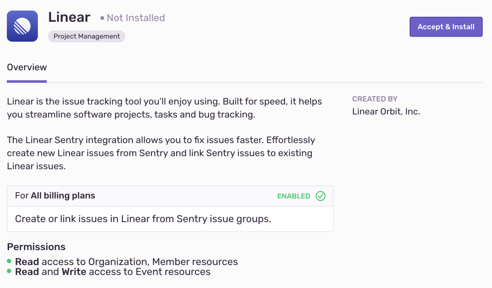

Linear is an issue tracking tool built for speed, streamlining software projects, tasks, and bug tracking. Effortlessly create new Linear issues from Sentry and link Sentry issues to existing Linear issues.

Linear needs to set up only once per organization, then it is available for _all_ projects. It is maintained and supported by the company that created it. For more details, see [Integration Platform](/product/integrations/integration-platform/).

## Install and Configure

<Alert title="Note" level="info">

Linear **won't** work with self-hosted Sentry.
</Alert>

1. Navigate to **Settings > Integrations > Linear**

   

2. Follow the full [Linear installation instructions](https://docs.linear.app/Sentry-76983298707d4820942840a235d6b651).
