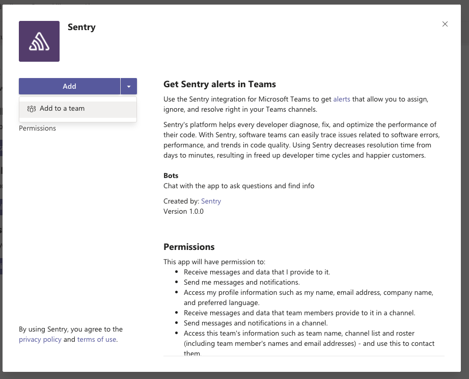

Microsoft Teams is a hub for teamwork in Office 365. Keep all your team's chats, meetings, files, and apps together in one place. Get alerts that let you assign, ignore, and resolve issues right in your Teams channels with the Sentry integration for Microsoft Teams. 

This integration needs to set up only once per organization, then it is available for _all_ projects.

## Install

1. Visit <https://teams.microsoft.com/l/app/5adee720-30de-4006-a342-d454317db1d4>

2. Press the "Add to Team" button and pick the Team you want for the integration

   
   
3. You should see a welcome message in the "General" within a few seconds and click "Complete Setup
   
   
   
The integration should be installed at this point.

In the next section, we'll walk you through configuring your notification settings.

## Configure

Use Microsoft Teams for [alerts](#alert-rules) regarding issues, environments, deployment, etc.

### Alert Rules

1. Confirm your Teams installation is configured globally for your Sentry organization by navigating to Organization Settings > **Integrations**. Click on **Configuration(s)** to go to the configuration details page.

   

2. Select the Teams installation to configure from the list, then click **Configure**.

   

3. Click **Add Alert Rule** for this project to navigate to Alert Rule settings.

   

   You can also access **Alerts** from your **Project Settings**. From here, you can configure when notifications are sent to your Microsoft Team(s).

   You can route notifications in a few ways: to a specific channel in your Team, to multiple channels in your Team, or to multiple Teams.

4. Add your Teams channel as an action under **Perform these actions**:

   

   After selecting **Send a Teams notification**, specify the team, channel(s).

   

   You can add Alert Rules routing to as many Microsoft Teams channels as you’d like.

1. Then once you receive a Teams notification, you can use the Resolve, Ignore, or Assign buttons to update the Issue in Sentry.

   