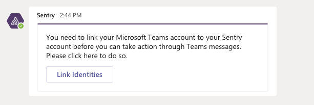

Microsoft Teams is a hub for teamwork in Office 365. Keep all your team's chats, meetings, files, and apps together in one place. Get alerts that let you assign, ignore, and resolve issues right in your Teams channels with the Sentry integration for Microsoft Teams.

Set this integration up once per organization, then it's available for _all_ projects.

## Install

1. Visit [the Microsoft Teams App Store](https://teams.microsoft.com/l/app/5adee720-30de-4006-a342-d454317db1d4)

2. Click the arrow to the right of "Add" to bring up the "Add to Team" button and pick the Team you want for the integration.

   

<Alert level="warning" title="Note">
If you click "Add" instead of "Add to Team", you won't get the welcome message to finish installation.
</Alert>

3. You should see a welcome message in the "General" channel within a few seconds and click "Complete Setup".

   

The integration should be installed at this point.

In the next section, we'll walk you through configuring your notification settings.

## Configure

Use Microsoft Teams for [alerts](#alert-rules) regarding issues, environments, deployment, etc.

### Alert Rules

1. Confirm your Teams installation is configured globally for your Sentry organization by navigating to **Organization Settings > Integrations**. Click "Configuration(s)" to go to the configuration details page.

   

2. Select the Teams installation to configure from the list, then click "Configure".

   

3. To navigate to Alert Rule settings, click "Add Alert Rule" for this project.

   

   You can also access **Alerts** from your **Project Settings**. From Project Settings, configure when notifications are sent to your Microsoft Team(s).

   You can route notifications in a few ways: to a specific channel in your Team, to multiple channels in your Team, or to multiple Teams.

4. Add your Team's channel as an action under **Perform these actions**:

   

   After selecting **Send a Teams notification**, specify the team, channel(s).

   

   You can add Alert Rules routing to as many Microsoft Teams channels as you’d like.

5. Once you receive a Teams notification, you can use the Resolve, Ignore, or Assign buttons to update the Issue in Sentry.

   

6. The first time you try to interact with a message, you will get a message from the Sentry bot asking you to link your identity. Click "Link Identities" to complete. Until you do this step, you cannot interact with messages!

   
