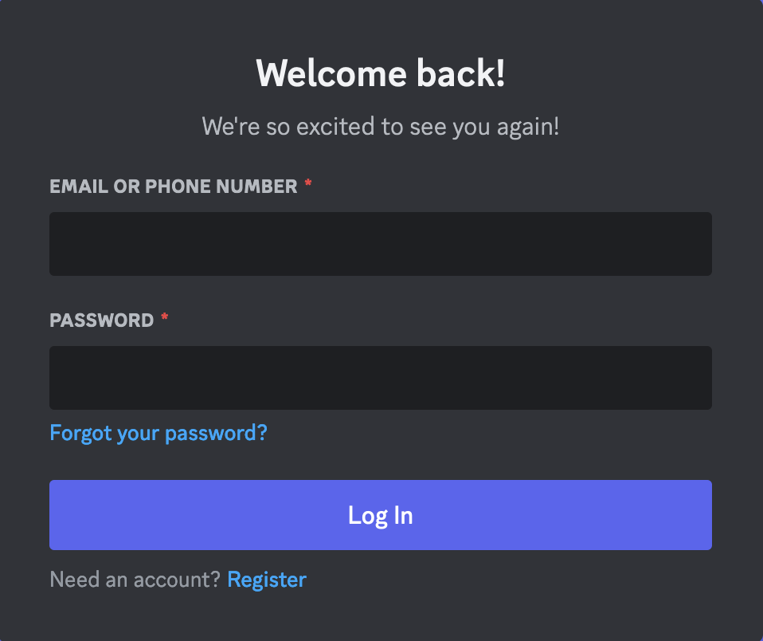
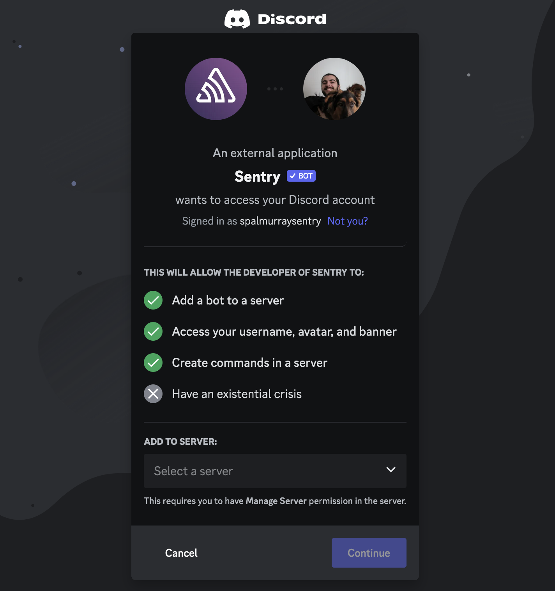
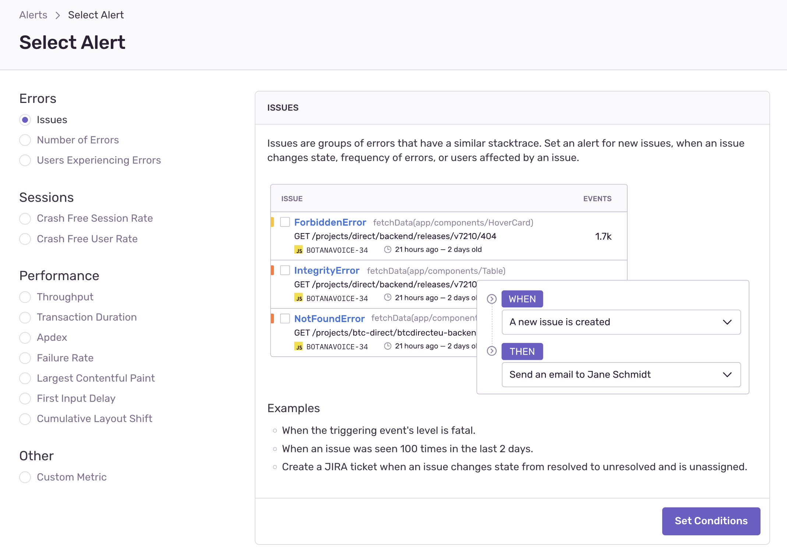
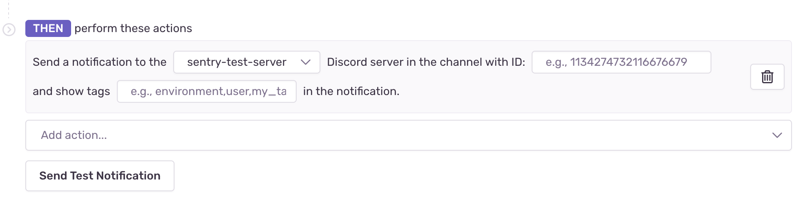
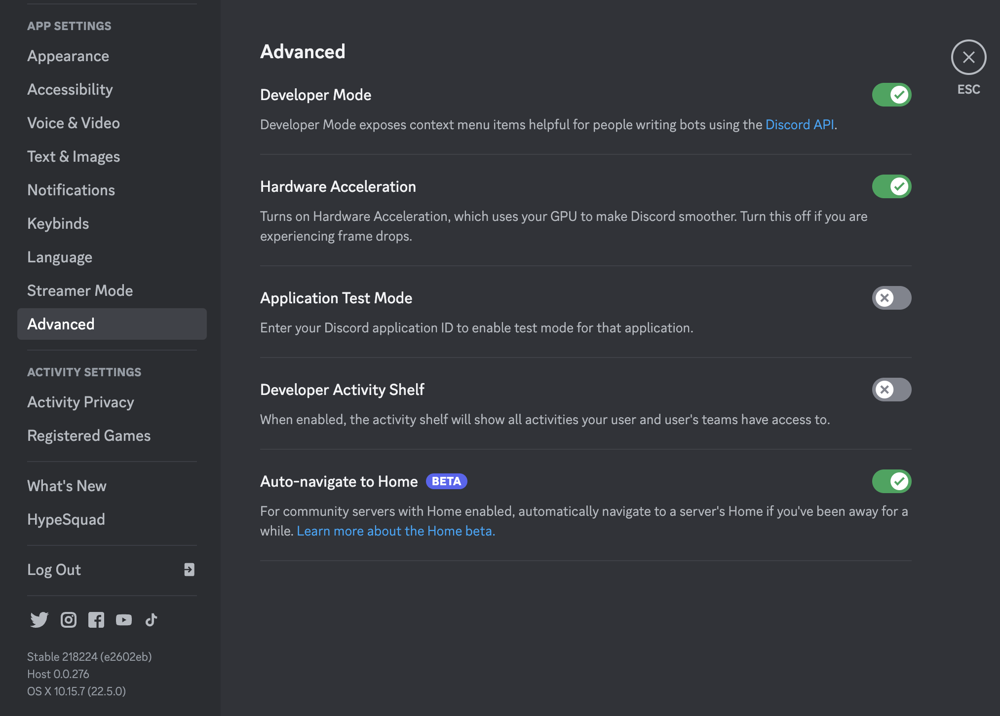
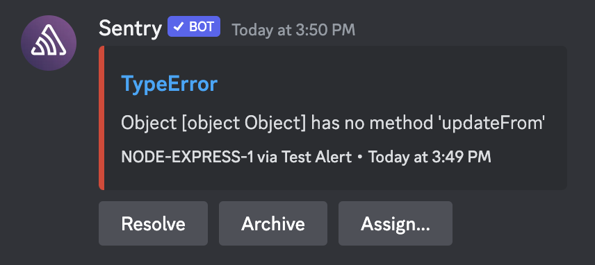

Get notified and manage issues right in Discord with Sentry's Discord integration.

## Install

<Note>

Sentry owner, manager, or admin permissions are required to install this integration.

</Note>

1. In [sentry.io](https://sentry.io), nagivate to **Settings > Integrations > Discord**.

1. Click "Add Installation".

   

1. A pop up window will open. If you're not logged in to Discord in your browser, you'll need to log in. If you're already logged in, you won't see this.

   

1. Use the dropdown menu to select the Discord server you'd like to add Sentry to and press continue.

    <Note>
    You will need to have the "Manage Server" permission enabled for your Discord account in the server you're trying to add the bot to.
    </Note>

    

1. Finally, once the server is selected, click authorize. The integration will be created and the Sentry Discord bot will join the selected server.

Your Discord integration is now available to all projects in your Sentry organization.

In the next section, we'll walk through configuring Discord notifications.

## Configure

Currently our Discord integration supports just issue alert rules, but metric alerts and personal notifications are planned for future updates to the integration.

### Issue Alerts

Set up an issue alert by going to **Alerts** and clicking "Create Alert". "Issues" is the default selection so you can just click "Set Conditions".

From here you can configure your issue alert conditions as desired. Discord is then added by selecting "Send a Discord notification" in the actions dropdown.

Select the Discord server and channel you'd like to send the alert to. You can optionally specify tags here to include in the notification.

The channel field must be filled in with a Discord channel ID, *not* a channel name (this is because multiple Discord channels can share a name). To get this channel ID, you must enable Discord's Developer Mode (Settings -> Advanced -> Developer Mode).

When Developer Mode is enabled, you'll be able to right click a channel and copy the channel's ID.

Once the channel ID is added, you can test your configuration by clicking "Send Test Notification".

If everything is working properly, you'll get a notification in Discord.

### Identity Linking

Having your Discord account linked to your Sentry account means that you will be able to resolve, archive, and assign issues right in Discord.

If you were the user who installed the Discord bot to your server, your identity should have been linked during the install process. If you were not the installer or want to change the Discord account linked to your Sentry account, you will need to use our Discord bot's `/link` and `/unlink` commands to link or unlink your accounts.

To link your Discord account to your Sentry account, type `/link` in a Discord channel that the Sentry bot has access to. The bot will reply with a link that takes you to our identity linking page.

To access this page, you must be signed in to the desired Sentry account in the browser you are trying to open the link in.

If you see the page as pictured above though, simply click the link button, and your accounts will be linked.

The process for unlinking is identical.
