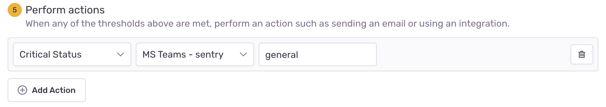

Microsoft Teams is a hub for teamwork in Office 365. Keep all your team's chats, meetings, files, and apps together in one place. Get alerts that let you assign, ignore, and resolve issues right in your Teams channels with the Sentry integration for Microsoft Teams.

Set this integration up once per organization, then it's available for _all_ projects.

## Install

<Note>

Sentry owner, manager, or admin permissions are required to install this integration.

</Note>

1. Visit [the Microsoft Teams App Store](https://teams.microsoft.com/l/app/5adee720-30de-4006-a342-d454317db1d4)

2. Click the arrow to the right of "Add" to bring up the "Add to Team" button and pick the Team you want for the integration.

   

<Alert level="warning" title="Note">
If you click "Add" instead of "Add to Team", you won't get the welcome message to finish installation.
</Alert>

3. You should see a welcome message in the "General" channel within a few seconds. Click "Complete Setup".

   

The integration should be installed at this point.

## Configure

Use Microsoft Teams for [alerts](/product/alerts/) regarding issues, environments, deployment, etc.

### Alert Rules

To set up an alert rule visit **Alerts > Create Alert**. From here you can route notifications to your Team's channels.

Select Microsoft Teams as an [issue alert](/product/alerts/alert-types/#issue-alerts) action:

Select Microsoft Teams as a [metric alert](/product/alerts/alert-types/#metric-alerts) action:

Once you receive a Teams notification, you can use the Resolve, Ignore, or Assign buttons to update the Issue in Sentry.

The first time you try to interact with a message, you will get a message from the Sentry bot asking you to link your identity. Click "Link Identities" to complete. Until you do this step, you cannot interact with messages!

