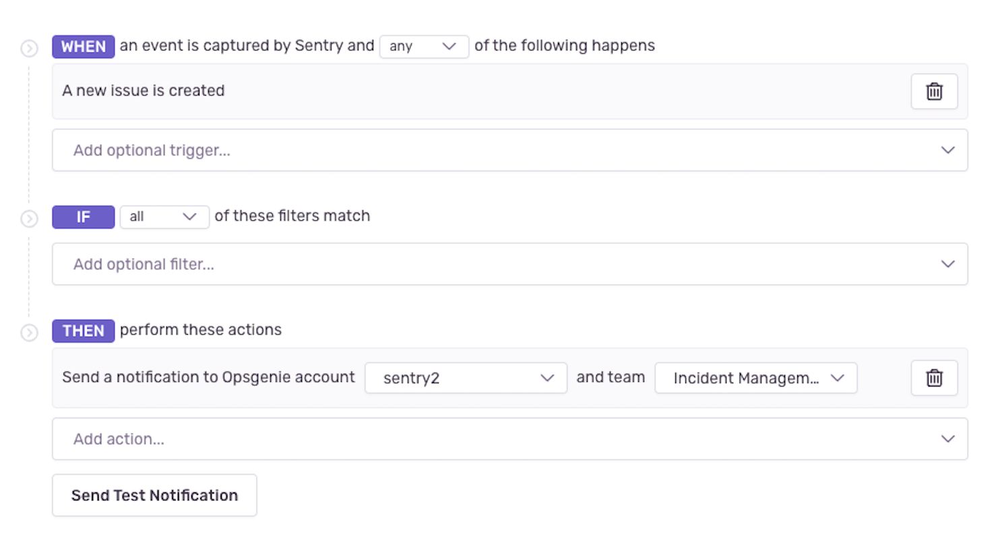

The Opsgenie integration allows you to connect your Sentry organization with one or more Opsgenie accounts. Once your accounts have been connected, you'll be able to configure issue and metric alerts in Sentry to be sent to the Opsgenie teams of your choice.

## Install

<Note>

You'll need Sentry owner, manager, or admin-level permissions to be able to install this integration.

</Note>

1. To get started, go to **Settings > Integrations > Opsgenie (Integration)** and click "Add Installation".

    

2. Select your base Opsgenie URL, type in your Opsgenie account name, and optionally add an integration key. Then, click 'Submit'. You'll be directed to the configuration page for your connected Opsgenie integration.

    

## Configure

The Opsgenie integration should now be installed. Go to the configuration page to manually add and update integration keys. (Keys have to be associated with a 'Sentry' integration in Opsgenie.)

If you added an integration key during installation, it will appear on the configuration page with the label 'my-first-key'. You may change this label if you wish.

### Set Up Alerts

You can set up a new alert rule via the Opsgenie integration configuration page clicking on the **Add Alert Rule** button in the **Project Configuration** section, or by going to the **Alerts** page in Sentry.

In [issue alerts](/product/alerts/alert-types/#issue-alerts), select "Send an Opsgenie notification" in the actions dropdown and then select your account and team:

In [metric alerts](/product/alerts/alert-types/#metric-alerts), select the Opsgenie option in the dropdown that corresponds to your account and the select your team:

If a Opsgenie incident is created from the critical trigger of a metric alert, it will be acknowledged when the Sentry metric alert is resolved.
