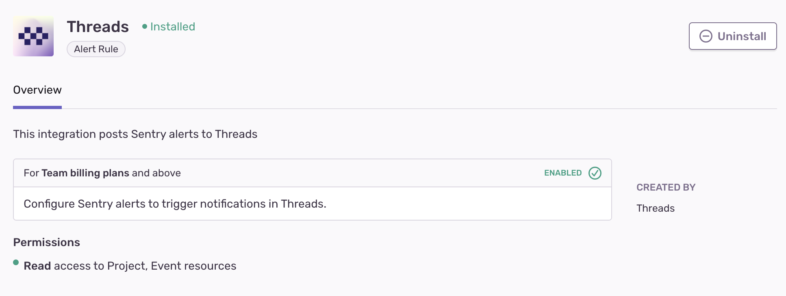
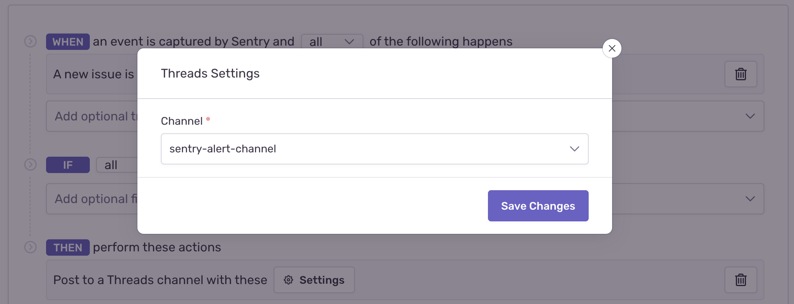
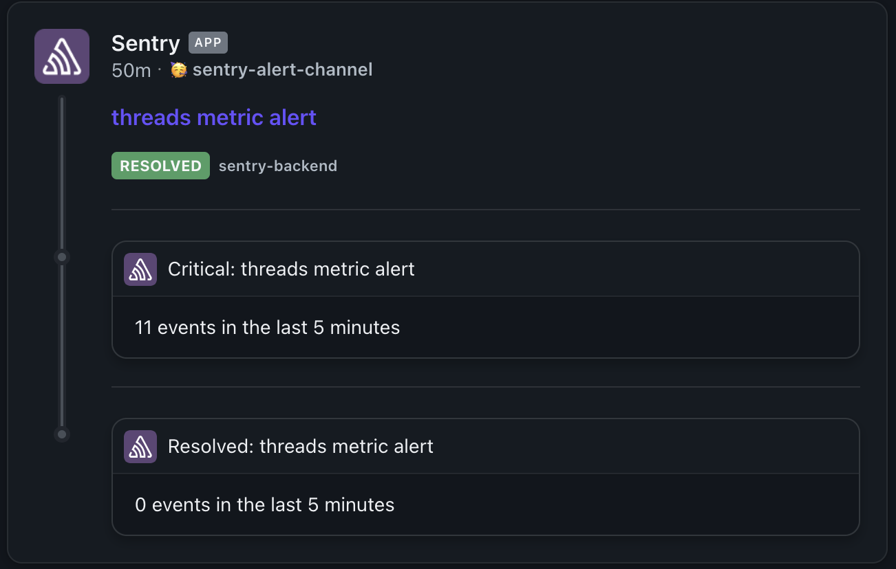
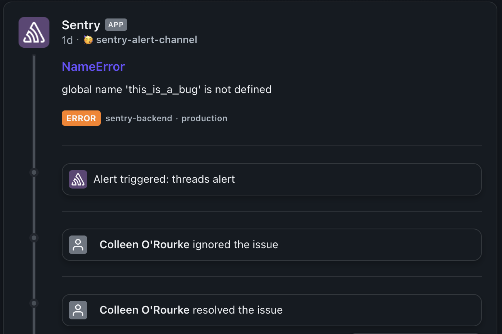

The Threads Sentry integration allows you to configure Threads as a destination for issue and metric alerts. Threads will keep you updated on the status of the Sentry issue, and let you know when a metric alert has been triggered and resolved.

This integration is maintained and supported by the company that created it. For more details, check out our [Integration Platform documentation](/product/integrations/integration-platform/).

## Install and Configure

<Note>

Sentry owner, manager, or admin permissions are required to install this integration.

Threads **won't** work with self-hosted Sentry.

</Note>

To add the Threads integration, navigate to **Settings > Integrations > Threads** and click "Install".

### Alert Rules

The Threads Sentry integration supports [issue alerts](/product/alerts/alert-types/#issue-alerts) and [metric alerts](/product/alerts/alert-types/#metric-alerts). When selecting the [action](/product/alerts/create-alerts/issue-alert-config/#then-conditions-actions), choose "Notify Integration" and then "Threads" for issue alerts, or select "Threads" from the action dropdown for metric alerts. Finally, choose the channel to be notified in:

A Threads notification will be created automatically when the alert is triggered.

Threads will notify you when a metric alert has been triggered, and again when it was resolved:

## Issue Statuses

Threads will keep your issue statuses in sync. The Threads notification will update when your issue is archived or resolved:

