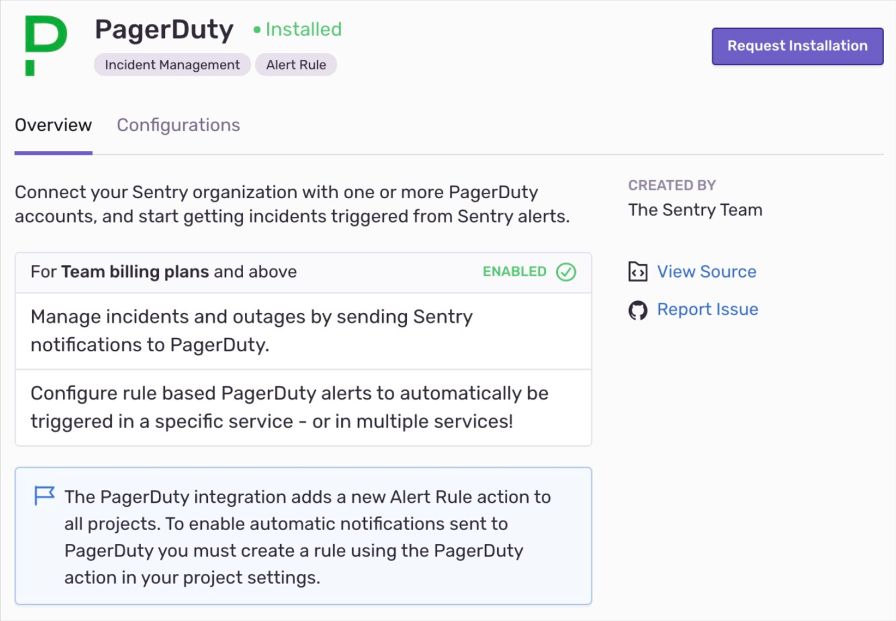
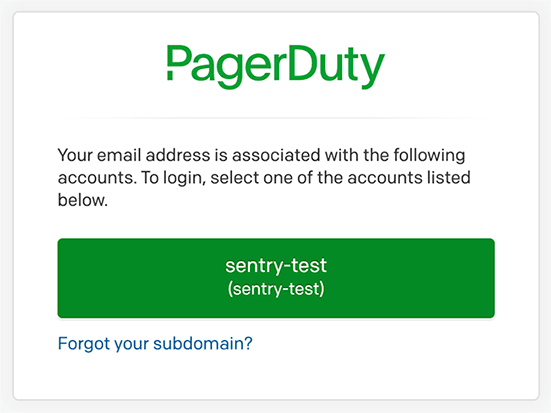
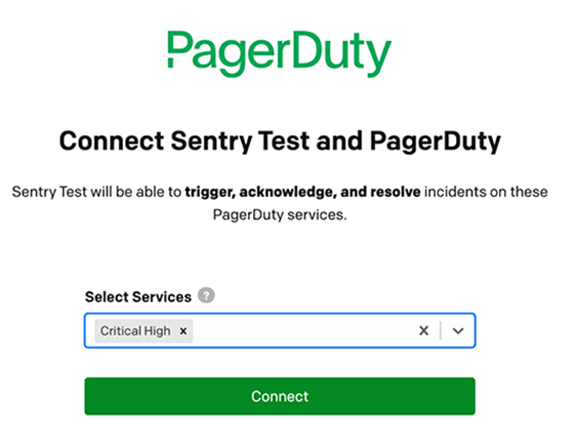
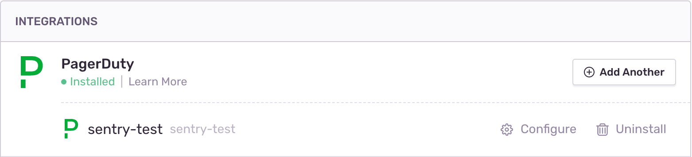
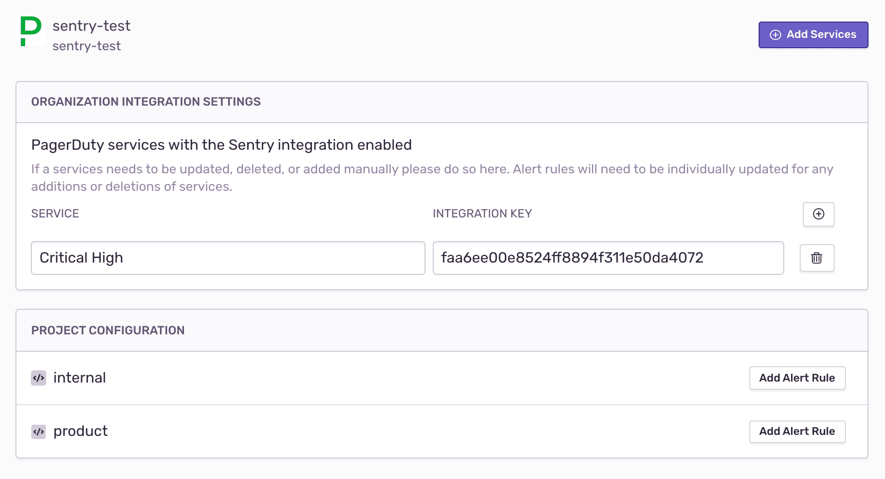
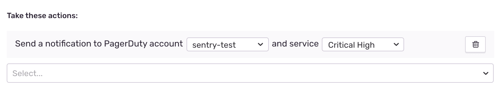

The PagerDuty integration allows you to connect your Sentry organization with one or more PagerDuty accounts, and start getting incidents triggered by Sentry alerts.

This integration needs to set up only once per organization, then it is available for _all_ projects.

## Install

1. Navigate to **Settings > Integrations > PagerDuty**

     

2. In the resulting modal, click "Add Installation".

3. You'll then be redirected to sign into PagerDuty and choose the account you'd like to connect to the current Sentry organization you are in.

   

4. After picking the account, you'll be prompted to add the PagerDuty services you want Sentry to send incidents to. Click "Connect" once you've added your services.

   

## Configure

The PagerDuty integration should now be installed. You'll be able to see the services connected by going to the **configure** page for your installation.

You can now set up rules to use the new integration under **Project Configuration** in the configure section of your installation.

If you re-generate an integration key for one of your services in PagerDuty you can manually update that value in configuration page for your PagerDuty installation. Additionally, you can add services by clicking "Add Services" in the top right. This will take you to the same page, as shown in step 5.

### Alert Rules

Click "Add Alert Rule" in the integration configuration page or go to the **Project Settings > Alerts** to set up a New Alert Rule for the PagerDuty Integration.

## Deleting the legacy PagerDuty integration

Once you configure the global PagerDuty integration and Alert Rules, you can disable the old PagerDuty integration. You’ll need to go to each project that has it enabled and disable it. We recommend disabling the legacy integration after setting up the global integration.
