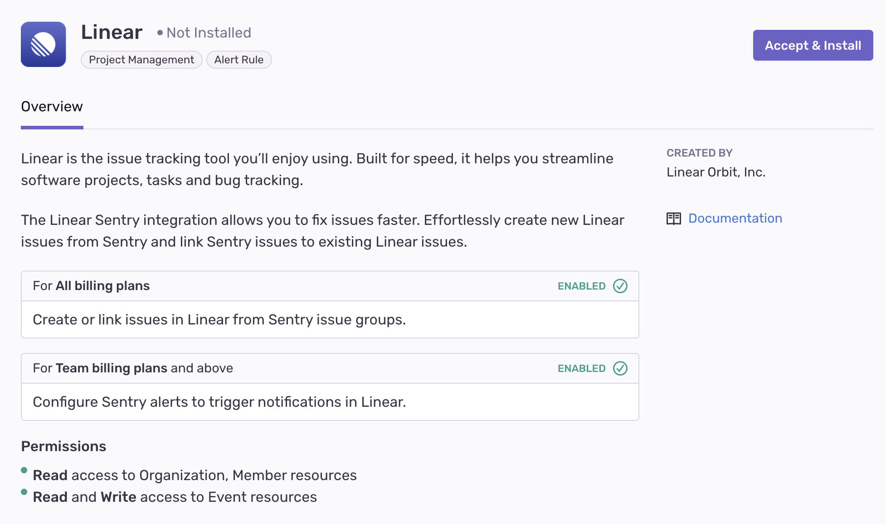
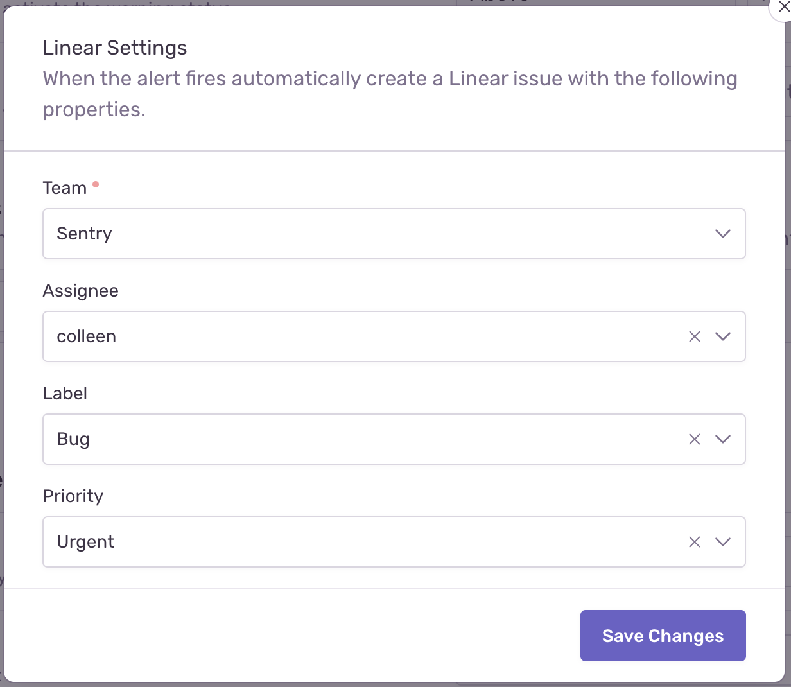
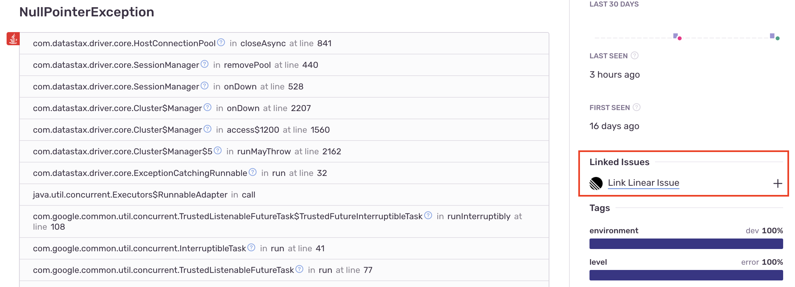
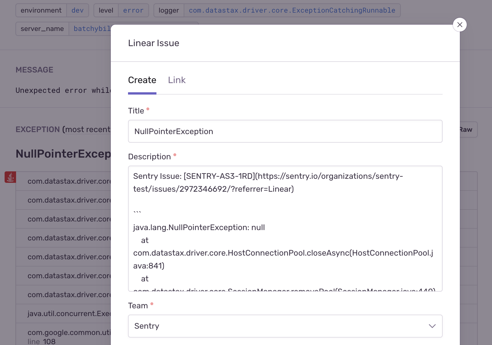

Linear is an issue tracking tool built for speed, streamlining software projects, tasks, and bug tracking. Effortlessly create new Linear issues from Sentry and link Sentry issues to existing Linear issues.

Linear needs to set up only once per organization, then it is available for _all_ projects. It is maintained and supported by the company that created it. For more details, see [Integration Platform](/product/integrations/integration-platform/).

## Install and Configure

<Note>

Sentry owner, manager, or admin permissions are required to install this integration.

Linear **won't** work with self-hosted Sentry.

</Note>

1. Navigate to **Settings > Integrations > Linear**

   

2. Follow the full [Linear installation instructions](https://linear.app/docs/sentry).

## Issue Management

Issue tracking allows you to create Linear issues from within Sentry, and link Sentry issues to existing Linear issues. Issue management can be configured in two ways - automatically or manually.

#### Automatically

To configure issue management automatically, create an [**Issue Alert**](/product/alerts/alert-types/#issue-alerts) or a [**Metric Alert**](/product/alerts/alert-types/#metric-alerts). When selecting the [**action**](/product/alerts/create-alerts/issue-alert-config/#then-conditions-actions), choose **Notify Integration** >> **Linear** for issue alerts, or select **Linear** from the action dropdown for metric alerts.

A Linear issue will be created automatically when the alert has been triggered.

#### Manually

To configure issue management manually, once you've navigated to a specific Sentry issue, you'll find the **Linked Issues** section on the right hand panel.

Here, you’ll be able to create or link Linear issues.

