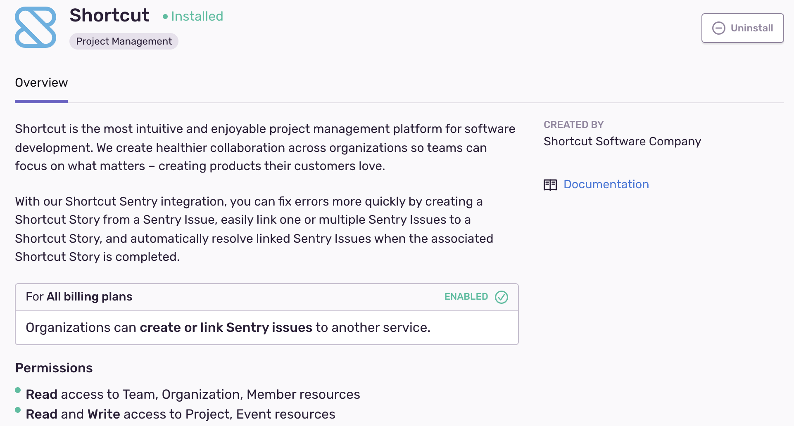

Create a more efficient workflow by linking your Sentry Issues with your Shortcut Stories. Errors, features, and anything else you track in Shortcut can now live side by side. The new Shortcut integration has feature parity with the Shortcut plugin. If you're choosing between the two, we recommend installing the Shortcut integration.

This integration needs to set up only once per organization, then it is available for _all_ projects. It is maintained and supported by the company that created it. For more details, see [Integration Platform](/product/integrations/integration-platform/).

## Install and Configure

<Note>

Sentry owner or manager permissions permissions are required to install this integration.

Shortcut **won't** work with self-hosted Sentry.

</Note>

1. Navigate to **Settings > Integrations > Shortcut**

2. Follow the full [Shortcut installation instructions](https://help.shortcut.com/hc/en-us/articles/360026979272-Setting-up-the-Sentry-Integration).
