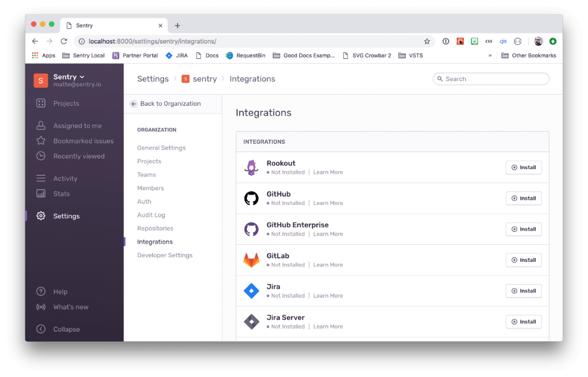
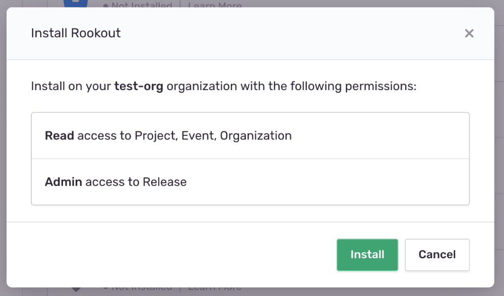
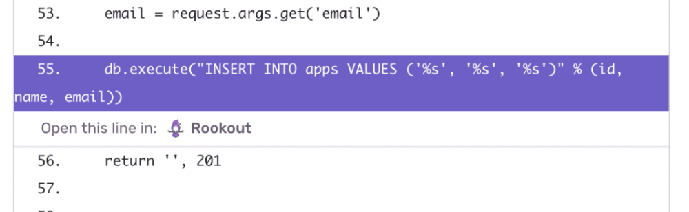
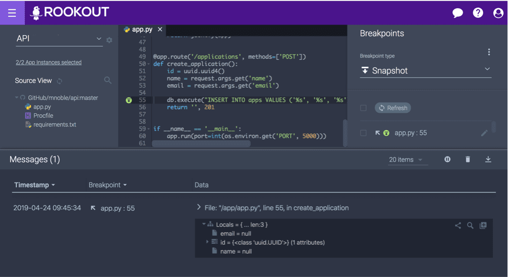

Rookout adds a layer of depth to Sentry Issues by allowing you to jump right from an Issue to a non-breaking breakpoint on the line that caused the error.

**Note:** This integration **won't** work with self-hosted Sentry.

## Installation

1. In Sentry, navigate to Organization Settings > **Integrations**.
2. Find the Rookout Integration and click **Install**.

   

3. In the resulting modal, approve the permissions by clicking **Install**.

   

4. Your Rookout Integration is ready to use!

## Use Integration in Stack Trace

After installing Rookout in Sentry, you can go straight to the line of code in your stack trace, and click the Rookout icon. That will take you directly to the same line of code in the same file inside Rookout.

1. In Sentry, navigate to the specific **Issue** you want to link and navigate to the **Stack Trace**.
2. In the Stack Trace, you'll see the option to open the line in Rookout by clicking on the Rookout icon.

   

3. Clicking on the Rookout icon takes you to Rookout's web UI where you can continue the debugging process. Rookout makes the best guess for the corresponding project and file in its web UI and will take you to the correct line of code in the file.

   
