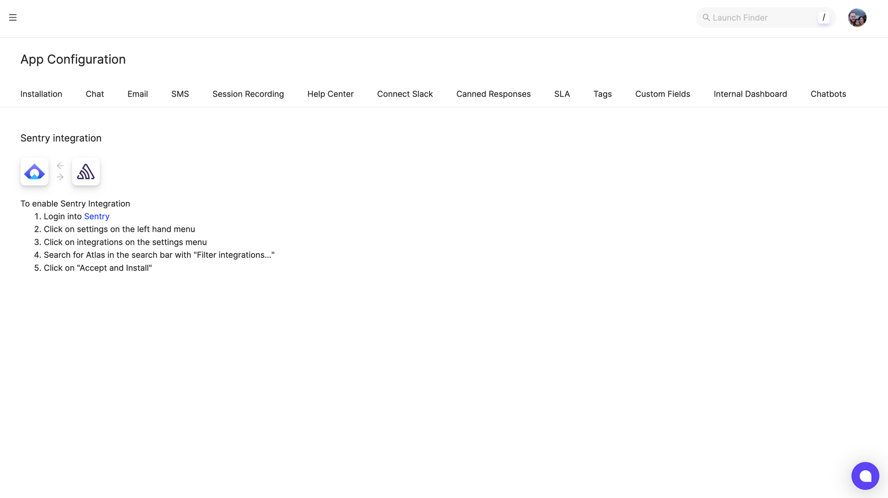
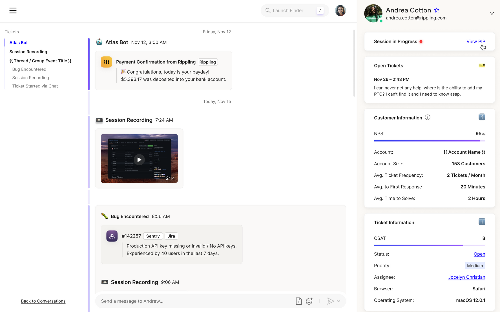
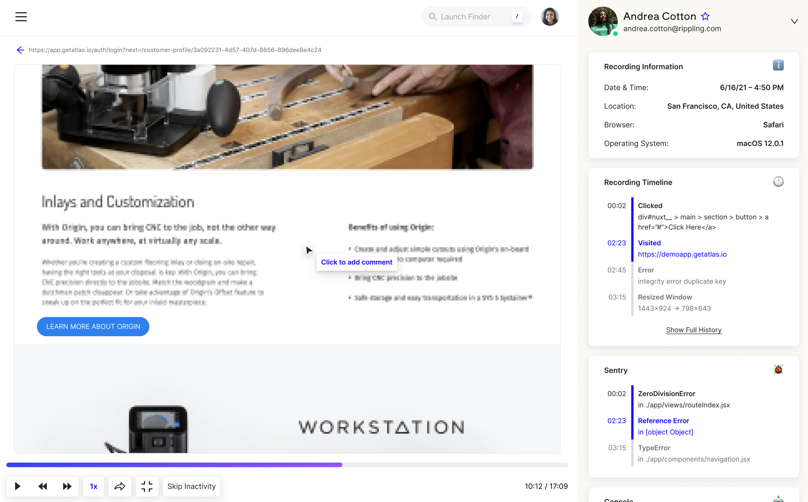

Atlas is all-in-one customer support software built to show your customers’ experience in a simple, timeline view. Easily link Atlas sessions to Sentry issues and link Sentry issues to existing Atlas sessions.

This integration is maintained and supported by the company that created it. For more details, check out our [Integration Platform documentation](/product/integrations/integration-platform/).

## Install and Configure

<Note>

Sentry owner, manager, or admin permissions are required to install this integration.

Atlas **won't** work with self-hosted Sentry.

</Note>

1. Navigate to **App Configuration > Sentry** in Atlas



2. Follow the instructions to install the Atlas app from within Sentry

## Session Linking

Session linking allows you to associate Sentry issues with sessions in Atlas so that they can be viewed by your support team when they are assisting your customers.

Session linking is automatically attempted if a user has been identified by Sentry. However, if there are multiple simultaneous sessions, disambiguation is needed. For this reason, the best practice is to always identify Atlas sessions from Sentry.

This can be done by first getting the session id from Atlas by calling the following from the client:

```javascript
apiAxios.interceptors.request.use(config => {
  config.headers[
    "X-Atlas-Session-Id"
  ] = window.Atlas?.recording?.getSessionId();
  return config;
});
```

You can send this to the Sentry via your Client SDK:

```javascript
Sentry.addGlobalEventProcessor(event => {
  event.tags = {
    ...(event.tags || {}),
    ["atlasSupport.sessionId"]: window.Atlas?.recording?.getSessionId(),
  };
  return event;
});
```

or from the Server SDK:

```python
sentry_sdk.set_tag("atlasSupport.sessionId", atlas_session_id)
```

Now, Sentry issues will appear in the customer’s timeline in Atlas:



As well as within the session recording:


